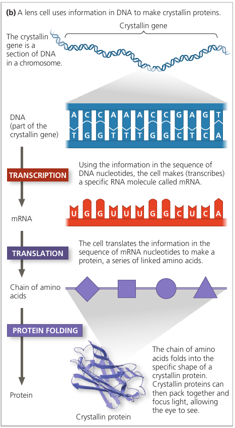

# Chapter 1. Evolution, the Themes of Biology and Scientific Inquiry

The phenomenon we call life defies a simple, one-sentence definition, even though a child can tell the difference between living and non-living things.

How we define life? We recognize life by what living things do:

* Order. Has ordered structures.
* Energy processing. Life uses fuel: chemical energy
* Growth and development. Life grows in size and develops patterns
* Response to environment. Life responds to stimuli.
* Reproduction. Life reproduces its own kind.
* Regulation. Living things maintain their internal environment.
* Evolutionary adaptation. Adapts over generations.

## 1.1. The study of life reveals unifying themes

We study life using the  reductionism approach: reducing complex systems to simpler components, at different levels: Biosphere, Ecosystem, Community, Population, Organism, Organ, Tissue, Cell, Organelle, Molecule.

As we move from lower levels to higher levels, *emergent properties* become obvious.

**"Emergent properties"**: new properties that emerge at each level that are absent from the preceding one (that arise with each step upward in the hierarchy of life), due to the arrangement and interactions of parts as complexity increases.

* For example: photosynthesis occurs in an intact chloroplast, but won't, if you break it up into molecules, because this process requires a specific organization of these molecules.

* For example: a box of bicycle parts will only transport you anywhere when arranged in a certain way.

### Evolutionary Adaptation

Example of Evolutionary adaptation: Camouflage: Can you find a fish?

Hint: You're looking for [a Pygmy sea horse](https://www.google.com/search?tbm=isch&q=pigmy+sea+horse).
Can you find it now? Had you been a fish, you would have stayed hungry for the day! :)

### The Cell: An Organism's Basic Unit of Structure and Function

A cell is the smallest unit of organization that can perform all activities required for life.

Cell theory: developed in the 1800s. Two types:

* "Eukaryotic cells": contain membrane-enclosed organelles;
* "Prokaryotic cells" lack a nucleus or other membrane-enclosed organelles.

Bacteria (singular, *bacterium*) and archaea (singular, *archaean*) are prokaryotic; all other forms of life are composed of eukaryotic cells.

### Theme: Genetic Information

Genetic information is contained in chromosomes, each having one very long DNA molecule. A chromosome has hundreds or thousands of genes: units of inheritance. You began as a single cell stocked with DNA inherited from your parents.

A DNA is molecule made up of two long chains ("strands") arranged in a double helix.

DNA encodes information using 4-letter alphabet: ATCG. For many genes, a sequence of nucleotides provide a blueprint for making a protein.

DNA controls protein production indirectly: the sequence is first transcribed into mRNA (messenger RNA, which is then translated into a sequence of protein building blocks called amino acids. The entire process is called "gene expression".

Every cell in your body contains the full set of instructions necessary to produce any protein. However, only particular cells express certain proteins: e.g. crystallin is used in the eye lens, but is not used in skin cells. Only the genes for proteins that are needed in a particular cell type are expressed.

All forms of life employ essentially the same genetic code: a particular sequence of nucleotides says the same thing in one organism as it does in another. Differences between organisms reflect differences between their nucleotide sequences rather than between their genetic codes. This universality of genetic code is a strong piece of evidence that all life is related.

A "genome" is the entire library of genetic instructions that an organism inherits. A typical human cell has two similar sets of chromosomes, and each set has approximately 3 billion nucleotide pairs of DNA. If the one-letter abbreviations for the nucleotides of a set were written in letters the size of those you are now reading, the genomic text would fill about 700 biology textbooks.

### Theme: Energy

The input of energy, primarily from the sun, and the transformation of energy from one form to another make life possible.

Plant leaves absorb sunlight -> convert to the chemical energy (sugars) -> are passed to "consumers": organisms that feed on plants.

Usually: energy *flows through* an ecosystem (in: sunlight, out: heat), while chemicals cycle within an ecosystem (plants, animals feed on them, they die, are decomposed, plants grow, ...).

### Theme: Interactions. Positive and Negative Feedback
At any level, there are interactions between components that ensures smooth integration of all parts.

Interactions within organisms. For instance, cells in the body must match the supply of fuel (sugar) to demand, regulating the opposing processes of sugar breakdown and storage.

**"Feedback regulation"**: the output or product of a process regulates that very process.

**"Negative feedback"**: a loop in which the response reduces the initial stimulus.

Example: insulin signaling. After a meal, the level of glucose rises -> stimulates pancreas to secrete insulin -> causes body cells to take up glucose, liver cells to store it -> decreases blood sugar levels -> eliminates the stimulus for insulin secretion, shutting off the pathway. Thus, the output of the process negatively regulates the process.

**"Positive feedback"**: in which an end product speeds up its own production. Less common.

Example: the clotting of your blood in response to injury: damaged blood vessel -> platelets begin to aggregate at the site -> platelets release chemicals to attract more platelets -> the pileup initiates a complex process that seals the wound with a clot.

