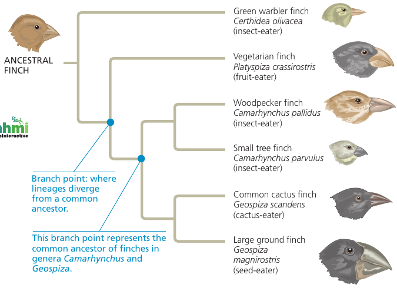

# Chapter 1. Evolution, the Themes of Biology and Scientific Inquiry

The phenomenon we call life defies a simple, one-sentence definition, even though a child can tell the difference between living and non-living things.

How we define life? We recognize life by what living things do:

* Order. Has ordered structures.
* Energy processing. Life uses fuel: chemical energy
* Growth and development. Life grows in size and develops patterns
* Response to environment. Life responds to stimuli.
* Reproduction. Life reproduces its own kind.
* Regulation. Living things maintain their internal environment.
* Evolutionary adaptation. Adapts over generations.

## 1.1. The study of life reveals unifying themes

We study life using the  reductionism approach: reducing complex systems to simpler components, at different levels: Biosphere, Ecosystem, Community, Population, Organism, Organ, Tissue, Cell, Organelle, Molecule.

As we move from lower levels to higher levels, *emergent properties* become obvious.

**"Emergent properties"**: new properties that emerge at each level that are absent from the preceding one (that arise with each step upward in the hierarchy of life), due to the arrangement and interactions of parts as complexity increases.

* For example: photosynthesis occurs in an intact chloroplast, but won't, if you break it up into molecules, because this process requires a specific organization of these molecules.

* For example: a box of bicycle parts will only transport you anywhere when arranged in a certain way.

### Evolutionary Adaptation

Example of Evolutionary adaptation: Camouflage: Can you find a fish?

Hint: You're looking for [a Pygmy sea horse](https://www.google.com/search?tbm=isch&q=pigmy+sea+horse).
Can you find it now? Had you been a fish, you would have stayed hungry for the day! :)

### The Cell: An Organism's Basic Unit of Structure and Function

A cell is the smallest unit of organization that can perform all activities required for life.

Cell theory: developed in the 1800s. Two types:

* "Eukaryotic cells": contain membrane-enclosed organelles;
* "Prokaryotic cells" lack a nucleus or other membrane-enclosed organelles.

Bacteria (singular, *bacterium*) and archaea (singular, *archaean*) are prokaryotic; all other forms of life are composed of eukaryotic cells.

### Theme: Genetic Information

Genetic information is contained in chromosomes, each having one very long DNA molecule. A chromosome has hundreds or thousands of genes: units of inheritance. You began as a single cell stocked with DNA inherited from your parents.

A DNA is molecule made up of two long chains ("strands") arranged in a double helix.

DNA encodes information using 4-letter alphabet: ATCG. For many genes, a sequence of nucleotides provide a blueprint for making a protein.

DNA controls protein production indirectly: the sequence is first transcribed into mRNA (messenger RNA, which is then translated into a sequence of protein building blocks called amino acids. The entire process is called "gene expression".

Every cell in your body contains the full set of instructions necessary to produce any protein. However, only particular cells express certain proteins: e.g. crystallin is used in the eye lens, but is not used in skin cells. Only the genes for proteins that are needed in a particular cell type are expressed.

All forms of life employ essentially the same genetic code: a particular sequence of nucleotides says the same thing in one organism as it does in another. Differences between organisms reflect differences between their nucleotide sequences rather than between their genetic codes. This universality of genetic code is a strong piece of evidence that all life is related.

A "genome" is the entire library of genetic instructions that an organism inherits. A typical human cell has two similar sets of chromosomes, and each set has approximately 3 billion nucleotide pairs of DNA. If the one-letter abbreviations for the nucleotides of a set were written in letters the size of those you are now reading, the genomic text would fill about 700 biology textbooks.

### Theme: Energy

The input of energy, primarily from the sun, and the transformation of energy from one form to another make life possible.

Plant leaves absorb sunlight -> convert to the chemical energy (sugars) -> are passed to "consumers": organisms that feed on plants.

Usually: energy *flows through* an ecosystem (in: sunlight, out: heat), while chemicals cycle within an ecosystem (plants, animals feed on them, they die, are decomposed, plants grow, ...).

### Theme: Interactions. Positive and Negative Feedback
At any level, there are interactions between components that ensures smooth integration of all parts.

Interactions within organisms. For instance, cells in the body must match the supply of fuel (sugar) to demand, regulating the opposing processes of sugar breakdown and storage.

**"Feedback regulation"**: the output or product of a process regulates that very process.

**"Negative feedback"**: a loop in which the response reduces the initial stimulus.

Example: insulin signaling. After a meal, the level of glucose rises -> stimulates pancreas to secrete insulin -> causes body cells to take up glucose, liver cells to store it -> decreases blood sugar levels -> eliminates the stimulus for insulin secretion, shutting off the pathway. Thus, the output of the process negatively regulates the process.

**"Positive feedback"**: in which an end product speeds up its own production. Less common.

Example: the clotting of your blood in response to injury: damaged blood vessel -> platelets begin to aggregate at the site -> platelets release chemicals to attract more platelets -> the pileup initiates a complex process that seals the wound with a clot.

## 1.2. The Core Theme: Evolution accounts for the unity and diversity of life
Evolution is the one idea that makes logical sense of everything we know about living organisms. As the fossil record clearly shows, life has been evolving on Earth for billions of years, resulting in a vast diversity of past and present organisms.

But along with the diversity there is also unity, in the form of shared features. For example, while seahorses, jackrabbits, hummingbirds, and giraffes all look very different, their skeletons are organized in the same basic way. The universal genetic language of DNA.

The scientific explanation for the unity and diversity of organisms — as well as for the adaptation of organisms to their particular environments — is "evolution" is the concept that the organisms living on Earth today are the modified descendants of common ancestors. As a result of descent with modification, two species share certain traits (unity) simply because they have descended from a common ancestor. Furthermore, we can account for differences between two species (diversity) with the idea that certain heritable changes occurred after the two species diverged from their common ancestor.

Evolution in detail will be discussed in Chapters 22-25.

To quote one of the founders of modern evolutionary theory, Theodosius Dobzhansky, "Nothing in biology makes sense except in the light of evolution".

### Classifying the Diversity of Life

Diversity is a hallmark of life: currently, 1.8 million species identified (100k fungi, 290k plants, 57k vertebrate, 1m insects, a myriad of single-celled organisms). Each species is given a two-part name: name of the genus (plural, genera) to which the species belongs, and a unique name for the species within the genus. Estimates of the total number range 10m – 100m.

Three domains:

* Bacteria
* Archaea
* Eukarya

Bacteria and Archaea are prokaryotic.

Eukarya are all eukaryotes, include: kingdom Plantae, kingdom Fungi, kingrom Animalia, and the protists.

The three kingdoms are distinguished partly by their modes of nutrition:

* Plants produce their own sugars;
* fungi absorb nutrients in dissolved form from their surroundings;
* animals obtain food by eating and digesting other organisms.

### Amoeba

Look at this amoeba; it's like she has a universe inside her!

### Unity

Unity is obvious: cell structure, bone structure, DNA language. How can we account for life's dual nature of unity and diversity? The process of evolution illuminates both the similarities and differences in the world of life.

Example of unity: cilia in eukaryotes. Cilia are extensions of cells that function in locomotion. Even organisms so different as a single-celled Paramecium and humans share a common architecture for their cilia: an elaborate system of tubules that is striking in cross-sectional views.

### The Theory of Evolution

Charles Darwin's *On the Origin of Species by Means of Natural Selection* was published in 1859.
Two main points: descent with modification, and natural selection.

He spotted that species generally are suited to their environments (adapted to their circumstances).
Birds eat mostly hard seeds have especially strong beaks. And because a population produces far more offspring than the environment is able to support, the better suited individuals are more likely to survive and reproduce. Over many generations, a higher and higher proportion of individuals in a population will have the advantageous traits. The unequal reproductive success of individuals ultimately leads to adaptation to their environment.

#### Supportive Evidence: Valley of Fires
In Mexico, in the valley of fires, the soil is sandy, and there lived a population of sand-colored mice.

Then, there was a volcanic eruption, and when lava cooled down, it left a long stretch of black rocks. Mice that live there are black in color, because predators have weeded out the individuals that stand out against the background. And the color change happened precisely where it would conceal them, leaving some of the underbelly white.

Black mice appeared through a random genetic mutation (a copying error, happens once in 100k births), and ultimately, survived better. Only 4 letters in one gene are different: a gene that controls the amount of dark pigment in hair follicles. Although the eruption happened just 1000 years ago, the whole population that lives on that lava is black. It's a perfect illustration of Darwin's process of natural selection.

Surprisingly, 100 miles away, there was another stretch of dark rocks. There lives a completely separate mouse population. And although they also adapted their fur to be dark, a completely different set of genes expresses that.

#### Supportive Evidence: Galapagos Finches with Darwin
On Galapagos islands, the area that Darwin used to study, the finches population has evolved to have beaks of different shapes, each being a tool for eating a certain kind of food. Two explanations are possible: either multiple species of finches migrated there originally, while the island was close to mainland; or one species evolved into many. Modern DNA evidence shows that Galapagos finches are much closer related to each other than to any mainland species of finches. This means that originally, it had to be one species.

#### Supportive Evidence: Galapagos Finches with draught
In 1977, there had been a team of scientists measuring the beaks of finches that lived there. They had measured over 1000 individuals when draught struck. Many birds died, and it turned out that one trait was most useful in surviving the circumstances: those with longer beaks were more successful in finding water. It was noted by the team that continued to make measurements, that in just one generation, the average beak length increased by some 4%.
That's natural selection in action.

Another year, a lot of rains fell, and the most abundant food were small seeds that grew on vines. Now, finches with smaller beaks were most successful... and natural selection has swung in the opposite direction. In a very short amount of time, evolution was measured — not once, but twice.

Now, how did finches with different beaks become distinct species? Species are defined as populations whose members don't interbreed. How does one species become two? A typical scenario when they become splitted geographically, and undergo enough change in respective habitats, so that when they meet again, they don't breed. For instance, because they sing different songs, and males only respond to songs of their own species. Or their appearance is different enough. With finches, males only court females who have the similar size and a similar beak (experiment with stuffed birds confirmed that).

The likely scenario: the original population of finches that had come from mainland were separated, and while they adapted to their surroundings, their traits changed. If the changes included traits involved in mating, and the populations came into contact again, they no longer mated. They had become distinct species. As a result, they both continue to accumulate ever more differing traits.

#### Supportive Evidence: Forelimbs
The bat's forelimbs, though adapted for flight, actually have all the same bones, joints, nerves, and blood vessels found in other limbs as diverse as the human arm, the foreleg of a horse, and the flipper of a whale. Indeed, all mammalian forelimbs are anatomical variations of a common architecture. Fossils and other evidence corroborate anatomical unity in supporting the Darwinian view of mammalian descent from a common ancestor.

## 1.3. Science: Make Observations and Test Hypotheses

### The Scientific Method
At the heart of science is **"inquiry"**: a search for information and explanations of natural phenomena.

The process of inquiry includes:

* making observations,
* forming logical, testable explanations (*hypotheses*),
* and testing them.

The process is necessarily repetitive, where new observations may lead to further testing.

Recorded observations are called **"data"**. Scientific inquiry is based on data.

Analyzing observations with the type of logic called **"inductive reasoning"**, we derive generalizations from a large number of specific observations.

A **"hypothesis"** is an explanation, based on observations and assumptions, that leads to a testable prediction.

A hypothesis is "an explanation on trial"; a rational accounting for a set of observations, based on the available data and guided by inductive reasoning.
A scientific hypothesis must lead to predictions that can be tested by making additional observations or by performing experiments. An "experiment" is a scientific test, carried out under controlled conditions.

#### Example: desk lamp
Example: your desk lamp is plugged in and turned on, but the bulb isn't lit. That's an observation.

Question: why doesn't the lamp work?

Two reasonable hypotheses:

1) the bulb is not screwed properly, or
2) the bulb is burned out.

Each of these alternative hypotheses leads to predictions you can test with experiments. Predictions:

1) if we reinstall it, it will work;
2) if we replace it, it will work.

By conducting one or two additional experiments, we find support for one hypothesis. Finding things out in this way by trial and error is a hypothesis-based approach.

**"Deductive reasoning"** involves logic that flows in the opposite direction: from general premises, we extrapolate to the specific results we should expect if the premises are true. Deductions usually take the form of predictions or results that will be found if a particular hypothesis (premise) is correct. We then test the hypothesis by carrying out experiments.

#### Hypothesis can't be proven
Note: we can never prove that a hypothesis is true. Testing a hypothesis does not prove it correct, but may fail to prove it incorrect. Although a hypothesis can never be proved beyond the shadow of a doubt, testing it in various ways can significantly increase our confidence in its validity. Rounds of hypothesis formulation and testing may lead to a scientific consensus: the shared conclusion of many scientists that it explains the known data well and stands up to experimental testing.

#### What can be addressed by sceience
Not all questions can be addressed by science.

A scientific hypothesis must be testable; there must be some observation or experiment that could reveal if such an idea is likely to be true or false.
Science only deals with natural, testable explanations for natural phenomena; it can neither support nor contradict some supernatural explanations, because those are simply outside the bounds of science. Science and religion are not mutually exclusive or contradictory; they are simply concerned with different issues.

#### Case Study:

## 1.4
