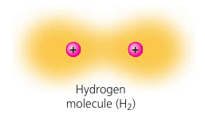

# Chapter 2. The Chemical Context of Life

Wood ants live in colonies. When threatened from above, the ants shoot volleys of formic acid into the air from their abdomens, and the acid bombards the potential predator, such as a hungry bird.

## 2.1. Matter consists of chemical elements in pure form and in combinations called compounds.

### Elements and Compounds
**Matter**: anything that takes up space and has mass.

**Element**: a substance that cannot be broken down to other substances by chemical reactions.

**Compound** is a substance consisting of two or more different elements.

Example: pure sodium is a metal, and pure chlorine is a poisonous gas. When chemically combined, however, NaCl is edible.

Example: water H₂O consists of two gases: H and O in a 2:1 ratio.

These are simplest examples of organized matter having emergent properties: a compound has characteristics different from those of its elements.

### The Elements of Life
Just 4 elements make up approximately 96% of living matter: O, C, H, N.
The following elements account for most of the remaining 4%: Ca, P, K, S.

**Trace elements** are required by an organism in only minute quantities. Example: humans need only 0.15mg of iodine (I).

## 2.2. An element's properties depend on the structure of its atoms
**Atom**: the smallest unit of matter that still retains the properties of an element.

Atoms are so small that it would take about a million of them to stretch across the period printed at the end of this sentence.

Atoms are made of protons, neutrons, electrons. **Protons** give the nucleus a positive charge. **Electrons** form a "cloud" of negative charge around the nucleus. This interaction keeps them together.

Atoms are mostly empty space. The nucleus of an atom is very small: if an atom of He were the size of a football stadium, the nucleus would be the size of a pencil eraser in the center of the field, and the electrons would be like tiny gnats buzzing around the stadium.

For atoms and subatomic particles, mass is measured in **daltons**. A dalton is the same as the *atomic mass unit*. Neutrons and protons have masses close to 1 dalton. Electrons are only about 1/2000-th that of a neutron, so we can ignore them.

### Atomic Mass and Number
An *electrically neutral atom* would have the number of its protons balanced by the number of electrons.

> 1123Na.

`11` is the **atomic number**. `23` is the **mass number**. This means that the atom has `11` protons, `23` particles in the nucleus. That is, it has `23-11 = 12` neutrons.

### Isotopes
**Isotopes**: atoms of an element that have different number of neutrons.

In nature, an element may occur as a mixture of its isotopes. 99% of carbon in nature is carbon-12. That is, 6¹²C. Most of the remaining 1% of carbon consists of 6¹³C with an extra neutron.

All carbon isotopes have 6 protons: otherwise, they would not be carbon. They behave identically in chemical reactions.

Both ¹²C and ¹³C are stable isotopes: their nuclei do not have a tendency to lose subatomic particles in a process called decay. ¹⁴C, however, is unstable, or radioactive.

A **radioactive isotope** is one in which the nucleus decays spontaneously, giving off particles and energy. It may lose protons (and transforms into a different element), or it may lose neutrons.

For instance, when ¹⁴C decays, it becomes ¹⁴N.

### Radioactive Tracers
Radioactive isotopes are often used as diagnostic tools.

Cells can use radioactive atoms just as they would use nonradioactive isotopes of the same element. These radioactive isotopes are incorporated into biologically active molecules, which are then used as tracers.

PET (positron-emission tomography) detects locations of intense chemical activity in the body, such as cancer.

### Radiometric dating
**Half-life** of the isotope: the time it takes for 50% of the isotope to decay. It's a fixed rate, unaffected by temperature, pressure, etc.

Half-life values range from very short (seconds) to extremely long (uranium-238: 4.5 billion years). Thus, each isotope can best measure a particular range of years.

Carbon-14 (¹⁴C) decays to ¹⁴N at a constant rate. ¹⁴C is present in the atmosphere in small amounts at a constant ratio with both ¹³C and ¹²C. When a plant is alive, these carbons are incorporated into the plant in the same proportions in which they were present in the atmosphere. The proportions remain the same in the tissues of an animal that eats the plant.

Once an organism dies, it stops taking in new ¹⁴C, and existing ¹⁴C continues to decay, while ¹²C remains the same because it is stable.

Thus, by measuring the ¹⁴C/¹²C ratio, and comparing it to the original ratio in the atmosphere, we can calculate how long the pool of original ¹⁴C has been decaying.

This ratio can be converted to years because we know that half of ¹⁴C decays every 5730 years.

Data: a particular neanderthal fossil had 0.7×10⁻³ as much ¹⁴C as the atmosphere. This means that the fossil is dated `-log₂(0.7×10⁻³) * 5730` = 41 625 years old.

Carbon dating works for fossils up to 75 000 years old. Older fossils contain too little ¹⁴C to be detected.

### The Energy Levels of Electrons
**Energy** is the capacity to cause change.

**Potential energy** is the energy matter possesses because of its location or structure.

Matter has a natural tendency to move toward the lowest possible state of potential energy. It takes work to restore its potential energy.

Electrons have potential energy due to their distance from the nucleus. It takes work to move a given electron farther away from the nucleus.

An electron can exist only at certain energy levels, not between them. These are called **electron shells**.

An electron can move from one shell to another, but only by absorbing or losing an amount of energy equal to the difference in potential energy between the shells. For example, light energy can excite an electron to a higher energy level.

Lost energy is usually released as heat. For example, sunlight excites electrons in the surface, and when they fall back to their original levels, the surface heats up.

### Electron Distribution and Chemical Properties

When atoms come close, only electrons are directly involved in chemical reactions. Nuclei do not come close enough to interact.

The checmical behavior of an atom is determined by the distribution of electrons in its electron shells, and depends moslty on the number of electrons in its *outermost* shell.

Electrons that occupy the outermost shell (**valence shell**) are called **valence electrons**.

Atoms with the same number of electrons in their valence shells exhibit similar chemical behavior.

Row: elements have the same number of electron shells.

Column: elements have the same number of electrons in their valence shells.

The first shell can only hold 2 electrons. The second and the third, 8.

An atom with a compete valence shell is *inert*: unreactive; it will not interact readily with other atoms.

### Electron Orbitals
We ca nnever know the exact location of an electron. Instead, we describe the sapce in which an electron spends 90% of its time: **orbitals**.

The first orbital is a sphere (*1s*). The second has one sphere (*2s*) and three dumbbell-shaped *p*-orbitals (*2p* orbitals).

No more than 2 electrons can occupy a single orbital. That's why max 2 on the first shell, and 8 on the second.

The reactivity of an atom arises from the presence of unpaired electrons in the valence shell.

## 2.3. The formation and function of molecules depend on chemical bonding between atoms
Atoms with incomplete valence shells can interact with certain other atoms in such a way taht each partner atom completes its valence shell: they either share or transfer valence electrons.

These interactions usually result in atoms staying close together, held by attractions called **chemical bonds**.

### Covalent Bonds
**Covalent bond**: sharing of a pair of valence electrons by two atoms.

Example: two Hydrogen atoms share 2 electrons. Together they constitute a **molecule** H₂.

*Molecular formula* simply indicates the number of atoms: H₂, H₂O, O₂.

*Lewis Dot Structure* represents the electrons in the outer shell: `H::H` , `H:O:H` , `O::O`.

*Structural Formula* represents bonds: `H ─ H` , `H ─ O ─ H` , `O ═ O`.
A **single bond** is when a pair of electrons is shared. A **double bond** is when two pairs are shared.

**Valence**: the bonding capacity of an atom. 1 for Hydrogen. 2 for Oxygen. 3 for Nitrogen. 4 for Carbon. Phospohorus can have a valence of 3 or 5 depending on the combination of single and double bonds it makes.

#### Polar Covalent Bonds
Atoms in a molecule attract shared bonding electrons to varying degrees. **Electronegativity** is the attraction of a particular atom for the electrons of a covalent bond. The more, the stronger it pulls shared electrons toward itself.

With pure elements, both atoms pull equally, so it is a **nonpolar covalent bond**.

A **polar covalent bond** forms when atoms pull differently.

Oxygen is one of the most electronegative elements. In H₂O, electrons spend more time near the oxygen nucleus => results in a partial negative charge, indicated by `δ–`.

### Ionic Bonds
In some cases two atoms are so unequal in their attraction for valence electrons that one is stripped completely. Two oppositely charged are called **Ions**: one **cation** (positive) and one **anion** (negative). They attract each other and form an **ionic bond**.

Here, a lone electron from Na is transferred to Cl, and both atoms complete their valence shells.

**Ionic compounds**: compounds formed by ionic bonds.

An ionic compound does not consist of molecules. The formula only indicates the ratio.

### Weak chemical interactions
Weaker interactions also contribute to the emergent properties of life. Many large biologival molecules are held in their functional form by weak interactions. Molecules may adhere temporarily by weak interactions. The reversibility of weak interactions may be an advantage: two molecules may interact and then separate.

#### Hydrogen Bonds
Hydrogen bonds are central to the chemistry of life.

When `H` is covalently bonded to an electronegative atom, `H` has a partial positive charge. This allows it to be attracted to a different electronegative atom nearby: **a hydrogen bond**.

In living cells, `H` is usually attracted to `O` or `N` atoms.

#### Van der Waals Interactions
Electrons are not always evenly distributed. At any instant, they may accumulate by chance in one part of a molecule or another. The results are even-changing regions of positive and negative charge that enables all atoms and molecules to stick to one another.

These **van der Waals interactions** are individually weak and occur only when atoms and molecules are very close together. When many such interactions occur simultaneously, they can be powerful.

Gecko's foot max many minuscule hairlike projections which increase its surface area. Van der Waals interactions are so numerous that together they can support the gecko's body weight!

### Molecular Shape and Function
Molecular shape is crucial: it determines how biological molecules recognize and respond to one another with specificity. They often bind to each other temporarily by forming weak interactions, but only if their shapes are complementary.

Consider opiates: they relieve pain and alter mood by weakly binding to specific receptor molecules on the surfaces of brain cells.

Why would brain cells carry receptors for opiates, compounds that are not made by the body, but by poppy plants?

In 1975, the discovery of endorphines answered this question.
Endorphines are signalling molecules made by the pituitary gland that bind to the receptors, relieving pain and producing euphoria during times of stress, such as intensive exercise.

Opiates have shapes similar to endorphines and mimic them by binding to endorphin receptors in the brain. That is why opiates and endorphins have similar effects.

This illustrates a match between structure and function.

## 2.4. Chemical reactions make and break chemical bonds

