# Chapter 3. Water and Life
Water is the only common substance on Earth to exist naturally in all three physical states of matter.
Furthermore, its solid form floats on the liquid form: a rare property emerging from the chemistry of the water molecule.

## 3.1. Polar covalent bonds in water molecules result in hydrogen bonding
Oxygen is more **electronegative**, so electrons spend more time closer to it, and **polar covalent bonds** are formed.

When two water molecules come close together, the partially positive `H` is attracted to the partially negative `O`, and a **hydrogen bond** holds the two molecules together.

When in liquid form, the hydrogen bonds are very fragile (each only about 1/20 as strong as a covalent bond) so they form, break, and re-form with great frequency, each bond lasting only a few trillionths of a second.

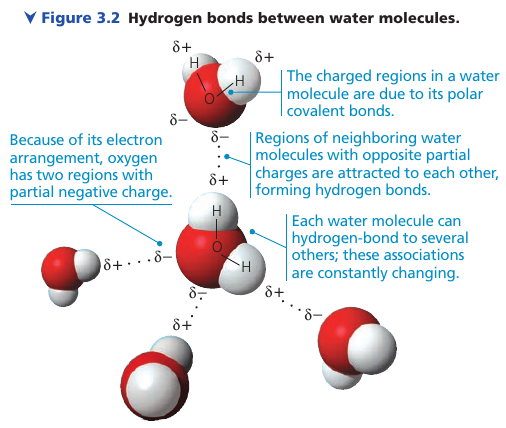

The extraordinary properties of water emerge from this hydrogen bonding.

## 3.2. Four emergent properties of water contribute to Earth's suitability for life

### Cohesion of Water Molecules

At any instant, most of the water molecules are hydrogen-bonded to their neighbors. These linkages make water more structured than most other liquids.

Collectively, the hydrogen bonds hold the substance together: a phenomenon called **cohesion**.

In plants, water from the roots reaches the leaves through a network of water-conducting cells. As water evaporates from a leaf, hydrogen bonds cause water molecules to tug on molecules father down, and the upward pull is transmitted through the water-conducting cells all the way to the roots. **Adhesion** of water molecules to cell walls also plays a role: it helps counter the downward pull of gravity.

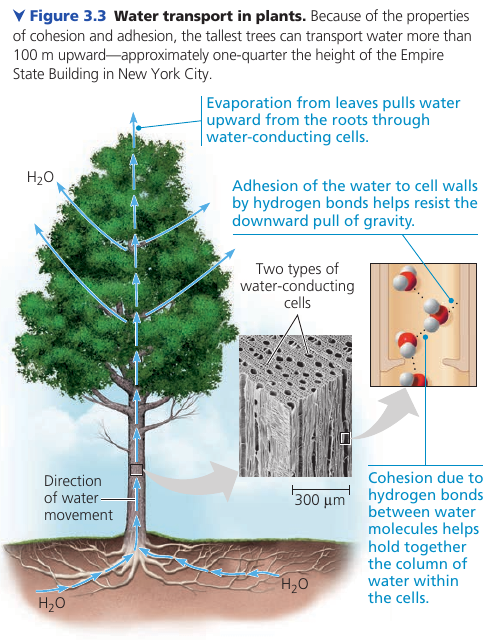

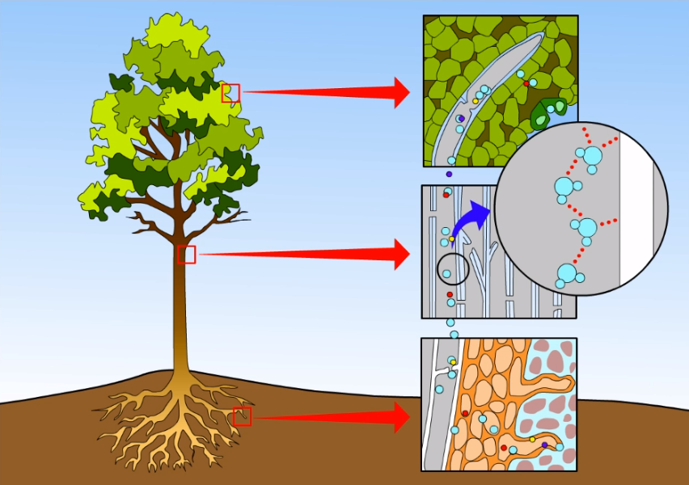

At the interface between water an air, water H-bonds to itself, but not to the air above. This assymetry gives water an unusually high **surface tension**: a measure of how difficult it is to stretch or break the surface of a liquid.

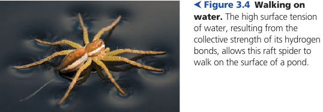

### Moderation of Temperature by Water
#### Thermal Energy
Water can absorb relatively large amount of heat with only a slight change in its own temperature. This heat is stored as kinetic energy of moving molecules: **thermal energy**.

Whenever two objects of different temperature are brought together, thermal energy passes from the warmer to the cooler object until the two are the same temperature: molecules in the cooler object speed up at the expense of the thermal energy of the warmer object.

An ice cube cools a drink not by adding coldness to the liquid, but by absorbing thermal energy from it.

One convenient unit: **calorie (cal)**: the amount of heat it takes to raise the temperature of 1g of water by 1℃. It also is the amount of heat

#### Water's High Specific Heat
**Specific heat**: the amount of heat a substance must absorb/lose to change its temperature by 1℃.

Water has an unusually high specific heat: for example, ethyl alcohol has `0.6 cal/(g×℃)`. Iron has `0.1 cal/(g×℃)`: that is, 10 times less.

In water, heat is released when hydrogen bonds form. Heat has to be absorbed to break hydrogen bonds.

Specific heat can be thought of as a measure of how well a substance resists changing its temperature when it absorbs/releases heat.

Water's high specific heat moderates air temperatures in coastal areas. A large body of water can absorb and store a huge amount of heat from teh sun during daytime and during summer while warming up only a few degrees. At night and during winter, the gradually cooling water can warm the air.

Also, because organisms are made primarily of water, they are better able to resist changes in their own temperature.

In argicultural areas, when overnight freeze is predicted, farmers spray water on crops to protect the plants. Water releases significant heat and may protect the plant cells from damage.

#### Evaporative Cooling
Molecules can depart the liquid and enter the air as a gas. Vaporization happens even at low temperatures with the speediest molecules escaping into the air.

**Heat of vaporization** is the quantity of heat a liquid must absorb for 1g of it to be converted to the gaseous state.

**Evaporative Cooling** occurs because the "hottest" molecules are most likely to leave as gas.

### Floating of Ice on Liquid Water
Water is one of the few substances that are less dense as a solid than as a liquid. In other words, ice floats on water.

* At temperatures above 4℃, water behaves like other liquids: it expands as it warms and contracts as it cools.
* At 4℃ water reaches its highest density
* From 4℃ to 0℃ water begins to freeze because more and more of its molecules are moving too slowly to break hydrogen bonds.
* At 0℃, the molecules become locked into a crystalline lattice, each water molecule H-bonded to four partners.

H-bonds keep the molecules at a distance that makes ice about 10% less dense than liquid water.

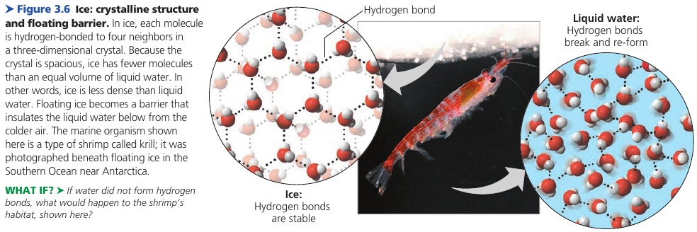

If ice sank, then eventually all ponds, lakes, and even oceans, would freeze solid, making life as we know it impossible on Earth. During summer, only the upper few inches of the ocean would thaw.

Instead, the floating ice insulates the liquid water below, allowing life to exist under its frozen surface.

### Water: the Solvent of Life
A **solution**: a completely homogeneous mixture of two or more substances. The dissolving agent is called the **solvent**, and the substance that is dissolved is the **solute**.

An **aqueous solution** is one in which the solute is dissolved in water.

When salt is dissolved, water molecules surround the individual ions, separating and shielding them from one another. The sphere of water molecules around each dissolved ion is called **hydration shell**.

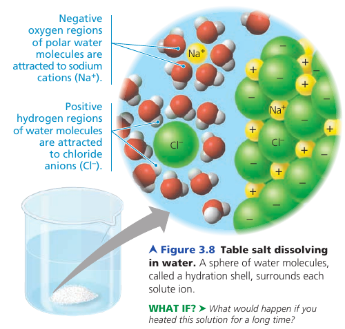

A compound does not have to be ionic. Even molecules as large as proteins can dissolve in water if they have ionic and polar regions on their surface:

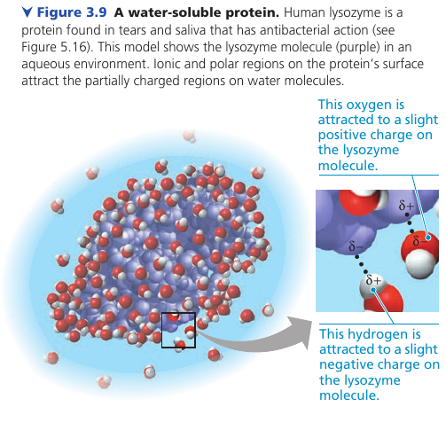

#### Hydrophilic and Hydrophobic Substances
Any substance that has an affinity for water is said to be **hydrophilic** (Gk. water-loving).

Some substances can be hydrophilic without actually dissolving. For example, cotton consists of giant molecules of cellulose, a compound with numerous partially charged regions that can form hydrogen bonds. Water adheres to the cellulose fibers; thus, a cotton towel does a great job of drying the body, yet it does not dissolve in the washing machine.

Substances that do not have an affinity for water, that are nonionic and nonpolar, are said to be **hydrophobic** (Gk. water-fearing). For example, vegetable oil, which, as you know, does not mix stably with water-based substances such as vinegar.

Hydrophobic molecules are major ingredients of cell membranes. Imagine what would happen to a cell if its membrane dissolved!

#### Solute Concentrations in Aqueous Solutions
**Molecular mass**: the sum of the masses of all the atoms in a molecule.

Example: table sugar (sucrose): `C₁₁H₂₂O₁₁` has a molecular mass of 342 daltons.

A **mole (mol)** represents an exact number of objects: NA = `6.022 × 10²³`, which is called *Avogadro's number*.

Because of how *dalton* and the *Avogadro's number* were defined, there are `6.022 × 10²³` daltons in 1 gram.

Therefore, to obtain 1 mole of sucrose, we weigh out 342g.

The practical advantage of measuring a quantity of chemicals in moles is that a mle of one substance has exactly the same number of molecules as a mole of any other substance. This property makes is convenient to combine substances in fixed ratios of molecules.

**Molarity**: the number of moles of solute per liter of solution -- is the unit of concentration.

## 3.3. Acidic and basic conditions affect living organisms
Occasionally, a hydrogen atom participating in a hydrogen bond between two water molecules shifts from one molecule to the other. It leaves its electron behind, so what's actually transferred is a single proton: a *hydrogen ion* `H⁺`.

The result is a **hydroxide ion** `OH⁻` (which has a change of `1–`) and a **hydronium ion** `H₃O⁺`.

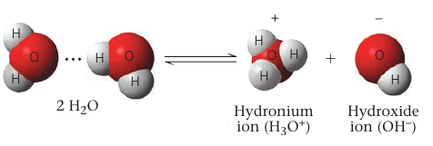

By concention, `H⁺` is used to represent the hydronium ion.

At equilibrium point, the concentration of water molecules greatly exceeds the concentrations of `H⁺` and `OH⁻`. In pure water, only one water molecule in every 554 million is dissociated. The concentration of `H⁺` and `OH⁻` is therefore `10⁻⁷M` (at 25℃).

Even though the dissociation is statistically rare, it is exceedingly important in the chemistry of life. `H⁺` and `OH⁻` are very reactive. Changes in their concentrations can drastically affect a cell's proteins and other complex molecules.

In pure water, the concentrations of `H⁺` and `OH⁻` are equal, but adding acids and bases disrupts this balance.

Biologists call it *the pH scale* to describe how acidic or basic a solution is.

### Acids and Bases
When **acids** dissolve in water, they donate additional `H⁺` to the solution. For example:

     HCl → H⁺ + Cl⁻

the result is an *acidic solution*: one having more `H⁺` than `OH⁻`.

A substance that reduces the `H⁺` concentration is called a **base**.

Some bases reduce the `H⁺` concentration by accepting it. Like ammonia:

    NH₃ + H⁺ ⇌ NH₄⁺

other bases reduce the `H⁺` concentration by contributing `OH⁻`. Sodium hydroxide:

    NaOH → Na⁺ + OH⁻

Notice the single arrows. Hydrochloric acid (`HCl`) is a strong acid, and sodium hydroxide (`NaOH`) is a strong base. Ammonia is a weak base.

Weak acids are acids that reversibly release and accept back hydrogen ions. Carbonic acid:

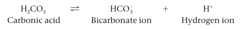

the equilibrium so favors the leftward reaction that only 1% of the molecules are dissociated at any particular time.
Still, that is enough to shift the balance of `H⁺` and `OH⁻` from neutraily.

### The pH Scale
At 25℃, the neutral solution has `[H⁺] = 10⁻⁷M` and `[OH⁻] = 10⁻⁷M` molar concentration.

If enough acid is added to a solution to increase `[H⁺]` to `10⁻⁵M`, then `[OH⁻]` will decline to `10⁻⁹M`. Note that the sum is still `-14`.

This constant relationship can be written as:

    [H⁺] [OH⁻] = 10⁻¹⁴

The pH scale compresses the range of `H⁺` and `OH⁻` by employing logarithms: `pH = -log [H⁺]`.

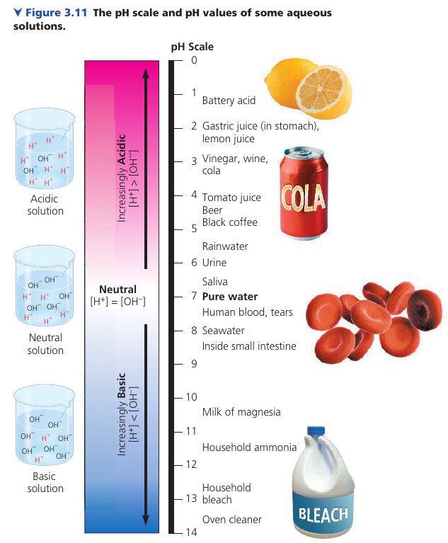

(!) Notice that pH *decreases* as `H⁺` concentration *increases*. A large pH is a strong base. A small pH is a strong acid.

### Buffers
The internal pH of most living cells is close to 7 (neutral). Even a slight change in pH can be harmful because the chemical processes of the cell are very sensitive to the concentrations of `H⁺` and `OH⁻`.

The pH of human blood is ~7.4, which is slightly basic. A person cannot survive for more than a few minutes if it drops to 7 or rises to 7.8.

A chemical system exists in the blood that maintains a stable pH. If 0.01 mol of strong acid is added to a liter of pure water, the pH drops from 7.0 to 2.0. If the same amount of acid is added to a liter of blood, however, the pH decrease is only from 7.4 to 7.3.

A **buffer** is a substance that minimizes changes in the concentrations of `H⁺` and `OH⁻` in a solution. It accepts `H⁺` ions when they are in excess, and donates them when they have been depleted. Most buffer solutions contain a weak acid and its corresponding base, which combine reversibly with hydrogen ions.

Carbonic acid is one such buffer. The chemical equilibrium between carbonic acid and bicarbonate acts as a pH regulator.

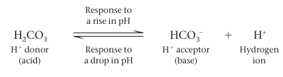

### Acidification: A Threat to Our Oceans
The burning of fossil fuels releases CO₂. About 25% of it is absorbed by the oceans. When CO₂ dissolves in seawater, it reacts with water to form carbonic acid, which lowers ocean pH: **ocean acidification**.

Based on CO₂ levels in air bubbles trapped in ice, scientists calculated that the pH has increased by 0.1 in the past 420 000 years. Coral reefs are havens for a great diversity of marine life, and reefs are sensitive to such changes.

### Pactice.
HCl is a strong acid that dissociates in water.

    HCl → H⁺ + Cl⁻

What is the pH of 0.01M HCl?

`[H⁺] = 0.01M = 10⁻²M`, so pH=2.

