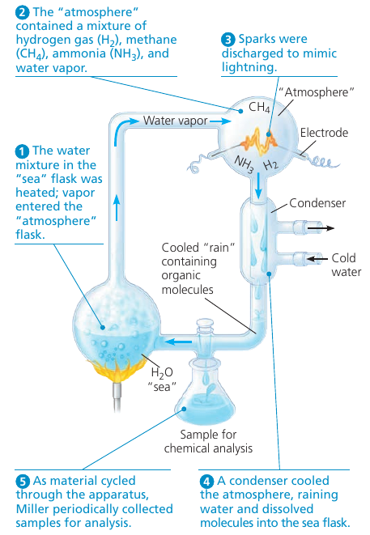
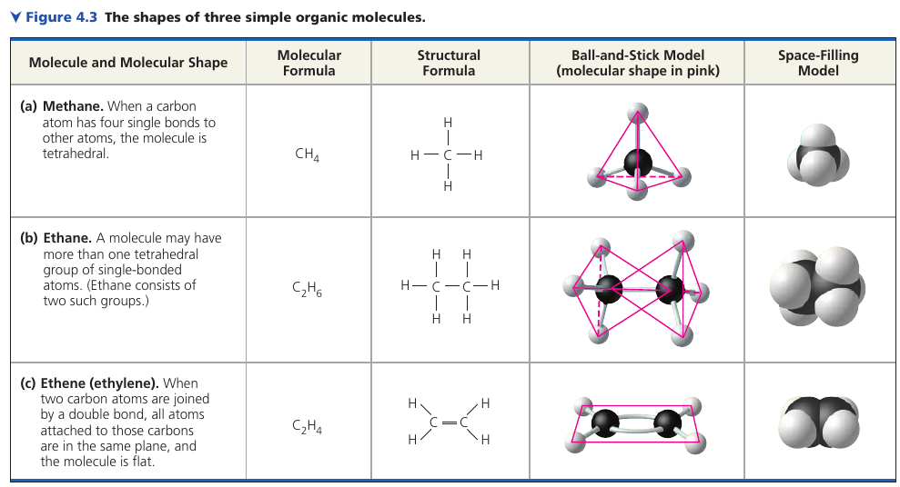
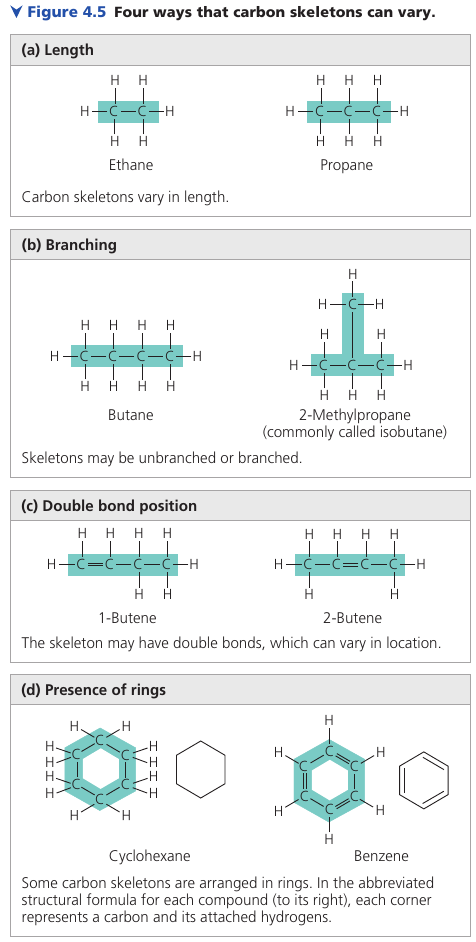
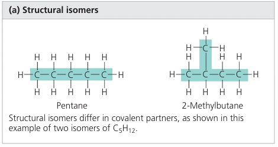
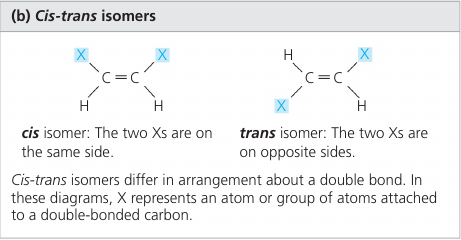
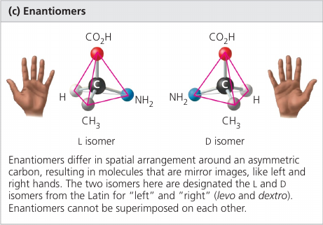
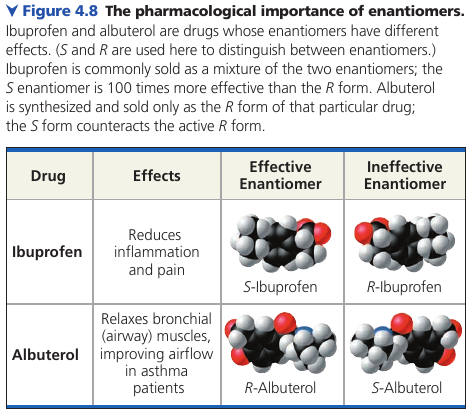

# Chapter 4. Carbon and The Molecular Diversity of Life

## 4.1. Organic chemistry is the study of carbon compounds

In 1953 Stanley Miller concluded that complex organic mulecules could arise spontaneously under conditions *thought at that time* to have existed on the early Earth.

Miller identified a variety of organic molecules that are common in organisms (?false). These included simple compounds, such as formaldehyde (CH₂O, used in DNA production) and hydrogen cyanide (HCN, extremely poisonous because of its ability to block cellular respiration), and more complex molecules, such as amino acids and long chains of carbon and hydrogen known as hydrocarbons.

New evidence indicates that the early earth's atmosphere was different from the "atmosphere" used by Miller,  but recent experiments using the revised list of chemicals also produced organic molecules.

> Stanley Miller: The old definition of "organic molecule" comes from 100 years ago: a molecule that came from living organisms. It was felt that carbon compounds, except carbon dioxide and carbon monoxide, came only from living organisms and had some sort of vital force in them. But we now know that there is no vital force and organic compounds are just those that contain carbon.

By early 1800s, chemists had learned to make simple compounds by combining elements under the right conditions. Artificial synthesis of the complex molecules extracted from living matter seemed impossible, however. Organic compounds were thought to arise only in living organisms, which were believed to contain a life force beyond the jurisdiction of physical and chemical laws.

In 1828, Friedrich Wöhler, a German chemist, tried to make an "inorganic" salt, ammonium cyanate, by mixing solutions of ammonium ions (`NH₄⁺`) and cyanate ions (`CNO⁻`). He was astonished to find that instead he had made urea, an organic compound present in the urine of animals!

## 4.2. Carbon atoms can form diverse molecules by bonding to four other atoms
The shapes of three simple organic molecules.

### The Formation of Bonds with Carbon
Carbon has 4 valence electrons. In organic molecules, carbon usually forms single or double covalent bonds. Each carbon atom acts as an intersection point from which a molecule can branch off in as many as four directions. This enables carbon to form large, complex molecules.

In methane, the bond angles are 109.5°, and they are roughly the same in any group of atoms where carbon has 4 single bonds -- because of the arrangement of hybrid orbitals.

When two carbon atoms are joined by a double bond, as in thlene, the bonds from both carbons are all in the same plane, so the atoms joined to those carbons are in the same plane as well.

### Molecular Diversity Arising from Variation in Carbon Skeletons

Four ways that carbon skeletons can vary:

### Hydrocarbons

All molecules shown are **hydrocarbons**: organic molecules consisting of only carbon and hydrogen. Hydrocarbons are the major components of petroleum, which is called a fossil fuel because it consists of the partially decomposed remains of organisms that lived millions of years ago. [this means that they the carbon you see there was breathed out, then caught by plants, then eaten by the animal, which is now a fossil fuel. This is the energy that living things produced but have not used.].

Molecules known as fats have long hydrocarbon tails attached to a non-hydrocarbon component.
Hydrocarbons are hydrophobic because C-H bonds are relatively nonpolar.

Another characteristic of hydrocarbons is that they can undergo reactions that release a relatively large amount of energy. The gasoline that fuels a car consists of hydrocarbons, and fats serve as stored fuel for plant embryos (seeds) and animals.

### Isomers
**Isomers**: compunds that have the same number of atoms of the same elements but different structures, and hance, different properties.

**Structural isomers** differ in the covalent arrangements of their atoms and the location of double bonds.

**Cis-trans isomers** differ in their spatial arrangements due to the inflexibility of double bonds.

Single bonds allow the atoms they join to rotate freely about the bond axis without changing the compound. In contrast, double bonds do not permit such rotation.

**Enantiomers** are isomers that are mirror images of each other and that differ in shape due to the presense of an *assymetric carbon*, one that is attached to four different atoms or groups of atoms.

Enantiomeres are, in a way, left-handed and right-handed versions of the molecule.

Usually, only one isomer is biologically active because only that form can bind to specific molecules in an organism.

Methamphetamine also occues in two enantiomeres that have very different effects. One enantiomer (dextro-methamphetamine) is the highly addictive drug known as "crank". The other (levo-methamphetamine) has a much weaker effect and is the active ingredient in an over-the-counter vapor inhaler for treatment of nasal congestion.

The different effects of enantiomers in the body demonstrate that organisms are sensitive to even the subtlest variations in molecular architecture.

Wiki: a **chiral compound** is a molecule that cannot be superposed on its mirror image by any combination of rotations and translations. This geometric property is called **chirality**.

## 4.3. A few chemical groups are key to molecular function

