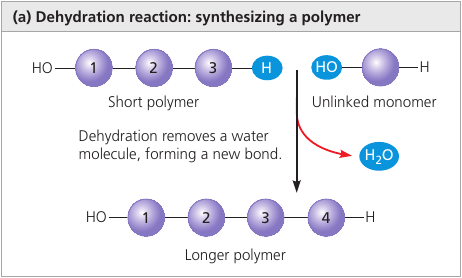
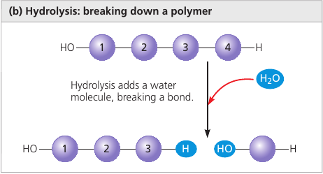
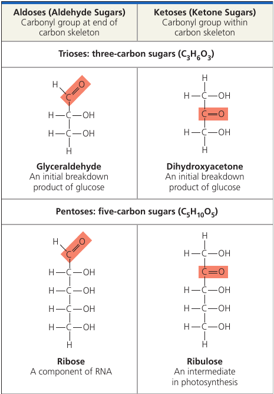
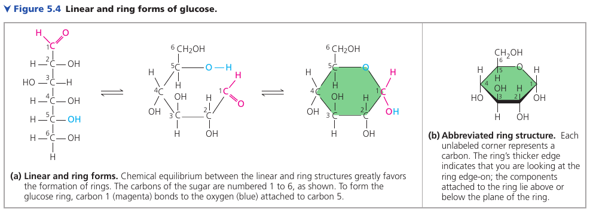
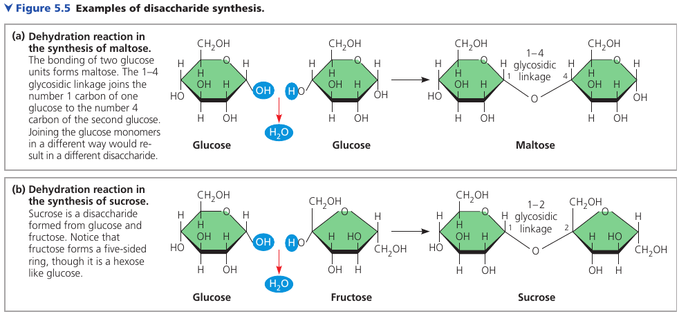
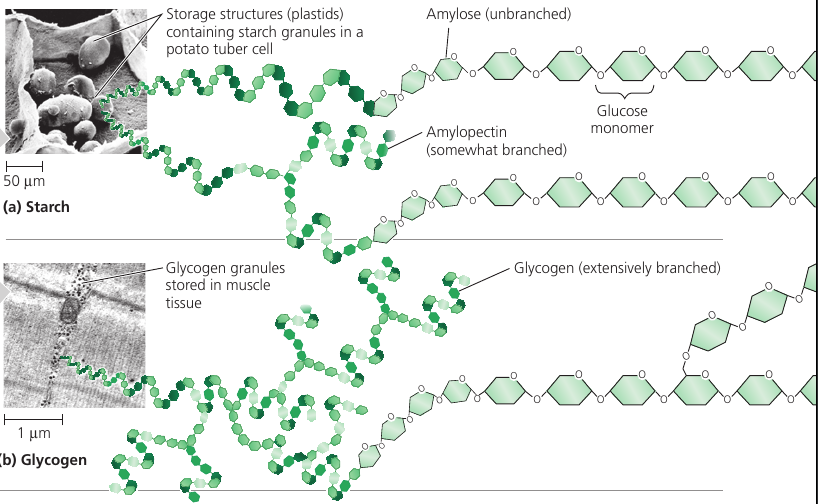
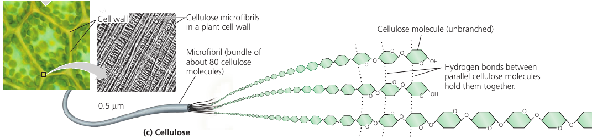
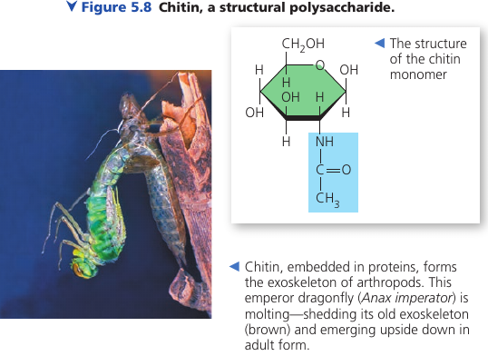

# Chapter 5. The Structure and Function of Large Biological Molecules
Given the rich complexity of life on Earth, it might surprise you that the most important large molecules found in all living things can be sorted into just four main classes: carbohydrates, lipids, proteins, and nucleic acids.

Some of them can be so huge that they are called **macromolecules**. For example, a protein may consist of thousands of atoms that form a molecular colossus.

## 5.1. Macromolecules are polymers built from monomers
Large carbohydrates, proteins, and nucleic acids are chain-like molecules called polymers.

A **polymer** (Greek *polys*, many, and *meros*, part) is a long molecule consisting of many similar or identical building blocks linked by covalent bonds. The repeating units are smaller molecules called **monomers**.

### The Synthesis and Breakdown of Polymers
Although each class of polymer is made up of a different type of monomer, the chemical mechanisms by which cells make and break down polymers are basically the same in all cases.

In cells, **enzymes** are specialized macromolecules that speed up chemical reactions.

**Dehydratation reaction** is a reaction in which two molecules are covalently bonded to each other with the loss of a water molecule. It can link two monomers: one with hydroxyl group `­— OH`, another with a hydrogen `— H`.

**Hydrolysis** (Gk. *hydro*, water, *lysis*, break ) is a reaction that disassembles polymers to monomers.

The bulk of organic material in our foods are in the form of polymers that are much too large to enter our cells. Within the digestive tract, various enzymes attack the polymers, speeding up hydrolysis. Released monomers are then absorbed into the bloodstream for distribution to all body cells.

## 5.2. Carbohydrates serve as fuel and bulding material
**Carbohydrates** include sugars and polymers of sugars.

Simplest carbohydrates are the monosaccharides, or simple sugars.

Disaccharides are double sugars: two monosaccharides joined by a covalent bond.

Polysaccharides are composed of many sugar building blocks.

### Sugars
**Monosaccharides** generally have molecular formulas that are some multiple of the unit CH₂O.

The hallmarks of sugars: a carbonyl group `C = O` and multiple hydroxyl groups `— OH`.

Glucose (C₆H₁₂O₆), the most common monosaccharide, is of central importance in the chemistry of life.

Depending on the location of the carbonyl group, a sugar is either an aldose (aldehyde sugar) or a ketose (ketone sugar). Glucode is an aldose, fructose is a ketose.

Still another source of diversity is the spacial arrangement of a molecule. Glucose and galactose, for example, differ only in the placement of parts around one assymetric carbon. What seems like a small difference is significant enough to give the two sugars distinctive shapes and binding activities, thus different behaviors.

### Linear and Righ Forms of Glucose
The linear carbon skeleton representation is not completely accurate. In aqueous solutions, glucose molecules, as well as most other 5- and 6-carbon sugars, form rings, because they are the most stable form of these sugars under physiological conditions.

### Mono and Disaccharides

Monosaccharides, particularly glucose, are major nutrients for cells. In the process known as cellular respiration, cells extract energy from glucose molecules by breaking them down in a series of reactions. Their carbon skeletons also serve as raw material for the synthesis of other types of small organic molecules, such as amino acids and fatty acids.

Fructose is the sugar that makes fruits and berries sweet. It tastes sweeter than glucose.

In the 1970s, a process was developed that converts the glucose in corn syrup into sweeter-stasting fructose. High-fructose corn syrup is a common ingredient in soft drinks and processed food.

A **disaccharide** consists of two monosaccharides joined by a **glycosidic linkage**: a covanent bond formed between two monosaccharides by a dehydration reaction.

Maltose, known as "malt sugar", is an ingredient used in brewing beer. It's made of glucose + glucose.

Sucrose is a glucose + fructose. It's the sugar that circulates in plant sap, which we obtain from sugar cane and sugar beets and use it as table sugar.

Lactose, the sugar present in milk, is another disaccharide: glucose joined to a galactose.

Disaccharides must be broken down into monosaccharides to be used for energy by organisms. Lactose intolerance is a common condition in humans who lack lactase, the enzyme that breaks down lactose. The sugar is instead broken down by intestinal bacteria, causing formation of gas and subsequent cramping. The problem may be avoided by taking the enzyme lactase when eating or drinking dairy products, or consuming dairy products that have already been treated with lactase to break down the lactose.

### Polysaccharides
Polysaccharides are macromolecules with a few hundred to a few thousand monosaccharides joined by glycosidic linkages.

Some polysaccharides serve as storage material, hydrolyzed as needed to provide sugar for cells. Other serve as building material.

#### Storage Polysaccharides
Both plants and animals store sugars for later use: plants store **starch** (a polymer of glucose monomers) granules within in plastides (chroloplasts and others). This allows plants to stockpile glucose because it is a major cellular fuel.

The sugar can later be used by the plant by hydrolysis.

Most animals, including humans, also have enzymes that can hydrolyze plant starch, making glucose available as a nutrient for cells. Potato tubers and grains are the major sources of starch in the human diet.

Most of the starch is amyloze: unbranched starch joined by 1-4 linkages (number 1 carbon to number 4 carbon).

Amylopectin is a more complex starch, a branched polymer.

Animals store a polysaccharide called **glycogen** that is extensively branched. Vertebrates store glycogen mainly in liver and muscle cells which is used when the demand for sugar increases. The store is not large: in humans, for example, glycogen stores are depleted in about a day unless they are replenished by eating. This is an issue of concern in lo-carbohydrate diets, which can result in weakness and fatigue.

#### Structural Polysaccharides
Organisms build strong materials from structural polysaccharides.

**Cellulose** is a major component of the tough walls that enclose plant cells. It is the most abundant organic compoung on Earth.

Like starch, cellulose is a polymer of glucose, but made of β-Glucose (a different arrangement of a ring: the hydroxyl group attaches to number 1 carbon above, not below, the plane of the ring).

The different lankage makes cellulose molecules straight, unlike helilcal starch. Cellulose is never branched, and some hydroxyl groups are free to H-bond twith those of other cellulose molecules lying parallel to it.

In plant cell walls, parallel cellulose molecules held together in this way are grouped into units called microfibris. These cable-like microfibrils are a strong building material for plants.

This is also the cellulose that we make out paper of.

Enzymes that digest starch by hydrolyzing its α-linkages are unable to hydrolyze the β linkages of cellulose due to the different shapes of these two molecules. Most animals cannot digest cellulose, including humans. Cellulose passes through the digestive tract and is eliminated with the feces. Along the way, the cellulose abrades the wall of the digestive tract and stimulates the lining to secrete mucus, which aids in the smooth passage of food through the tract.

Thus, although cellulose is not a nutrient for humans, it is an important part of a healthful diet. Most fruits, vegetables, and whole grains, are righ in cellulose. On food packages, "insoluble fiber" refers mainly to cellulose.

Some microorganisms can digest cellulose and hydrolyze it into glucose: cows have those in its gut, and so it can eat grass while we can't.

Another important structural polysaccharide is **chitin**, the carbohydrate used by arthropods (insects, crustaceans, etc) to build their exoskeletons. It is like cellulose, but has a nitrogen-containing attachment.

Chitin is embedded into proteins and is leathery and flexible at first, but becomes hardened when the proteins are chemically linked to each other (as in insects).

## 5.3. Lipids are a diverse group of hydrophobic molecules

## 5.4. Proteins include a diversity of structures, resulting in a wide range of functions

## 5.5. Nucleic acids store, transmit, and help express hereditary information

## 5.6. Genomics and proteomics have transformed biological inquiry and applications

