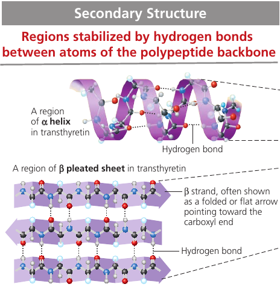
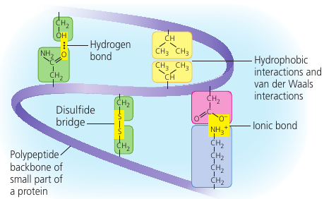

# Chapter 5. The Structure and Function of Large Biological Molecules
Given the rich complexity of life on Earth, it might surprise you that the most important large molecules found in all living things can be sorted into just four main classes: carbohydrates, lipids, proteins, and nucleic acids.

Some of them can be so huge that they are called **macromolecules**. For example, a protein may consist of thousands of atoms that form a molecular colossus.

## 5.1. Macromolecules are polymers built from monomers
Large carbohydrates, proteins, and nucleic acids are chain-like molecules called polymers.

A **polymer** (Greek *polys*, many, and *meros*, part) is a long molecule consisting of many similar or identical building blocks linked by covalent bonds. The repeating units are smaller molecules called **monomers**.

### The Synthesis and Breakdown of Polymers
Although each class of polymer is made up of a different type of monomer, the chemical mechanisms by which cells make and break down polymers are basically the same in all cases.

In cells, **enzymes** are specialized macromolecules that speed up chemical reactions.

**Dehydratation reaction** is a reaction in which two molecules are covalently bonded to each other with the loss of a water molecule. It can link two monomers: one with hydroxyl group `­— OH`, another with a hydrogen `— H`.

**Hydrolysis** (Gk. *hydro*, water, *lysis*, break ) is a reaction that disassembles polymers to monomers.

The bulk of organic material in our foods are in the form of polymers that are much too large to enter our cells. Within the digestive tract, various enzymes attack the polymers, speeding up hydrolysis. Released monomers are then absorbed into the bloodstream for distribution to all body cells.

## 5.2. Carbohydrates serve as fuel and bulding material
**Carbohydrates** include sugars and polymers of sugars.

Simplest carbohydrates are the monosaccharides, or simple sugars.

Disaccharides are double sugars: two monosaccharides joined by a covalent bond.

Polysaccharides are composed of many sugar building blocks.

### Sugars
**Monosaccharides** generally have molecular formulas that are some multiple of the unit CH₂O.

The hallmarks of sugars: a carbonyl group `C = O` and multiple hydroxyl groups `— OH`.

Glucose (C₆H₁₂O₆), the most common monosaccharide, is of central importance in the chemistry of life.

Depending on the location of the carbonyl group, a sugar is either an aldose (aldehyde sugar) or a ketose (ketone sugar). Glucode is an aldose, fructose is a ketose.

Still another source of diversity is the spacial arrangement of a molecule. Glucose and galactose, for example, differ only in the placement of parts around one assymetric carbon. What seems like a small difference is significant enough to give the two sugars distinctive shapes and binding activities, thus different behaviors.

### Linear and Righ Forms of Glucose
The linear carbon skeleton representation is not completely accurate. In aqueous solutions, glucose molecules, as well as most other 5- and 6-carbon sugars, form rings, because they are the most stable form of these sugars under physiological conditions.

### Mono and Disaccharides

Monosaccharides, particularly glucose, are major nutrients for cells. In the process known as cellular respiration, cells extract energy from glucose molecules by breaking them down in a series of reactions. Their carbon skeletons also serve as raw material for the synthesis of other types of small organic molecules, such as amino acids and fatty acids.

Fructose is the sugar that makes fruits and berries sweet. It tastes sweeter than glucose.

In the 1970s, a process was developed that converts the glucose in corn syrup into sweeter-stasting fructose. High-fructose corn syrup is a common ingredient in soft drinks and processed food.

A **disaccharide** consists of two monosaccharides joined by a **glycosidic linkage**: a covanent bond formed between two monosaccharides by a dehydration reaction.

Maltose, known as "malt sugar", is an ingredient used in brewing beer. It's made of glucose + glucose.

Sucrose is a glucose + fructose. It's the sugar that circulates in plant sap, which we obtain from sugar cane and sugar beets and use it as table sugar.

Lactose, the sugar present in milk, is another disaccharide: glucose joined to a galactose.

Disaccharides must be broken down into monosaccharides to be used for energy by organisms. Lactose intolerance is a common condition in humans who lack lactase, the enzyme that breaks down lactose. The sugar is instead broken down by intestinal bacteria, causing formation of gas and subsequent cramping. The problem may be avoided by taking the enzyme lactase when eating or drinking dairy products, or consuming dairy products that have already been treated with lactase to break down the lactose.

### Polysaccharides
Polysaccharides are macromolecules with a few hundred to a few thousand monosaccharides joined by glycosidic linkages.

Some polysaccharides serve as storage material, hydrolyzed as needed to provide sugar for cells. Other serve as building material.

#### Storage Polysaccharides
Both plants and animals store sugars for later use: plants store **starch** (a polymer of glucose monomers) granules within in plastides (chroloplasts and others). This allows plants to stockpile glucose because it is a major cellular fuel.

The sugar can later be used by the plant by hydrolysis.

Most animals, including humans, also have enzymes that can hydrolyze plant starch, making glucose available as a nutrient for cells. Potato tubers and grains are the major sources of starch in the human diet.

Most of the starch is amyloze: unbranched starch joined by 1-4 linkages (number 1 carbon to number 4 carbon).

Amylopectin is a more complex starch, a branched polymer.

Animals store a polysaccharide called **glycogen** that is extensively branched. Vertebrates store glycogen mainly in liver and muscle cells which is used when the demand for sugar increases. The store is not large: in humans, for example, glycogen stores are depleted in about a day unless they are replenished by eating. This is an issue of concern in lo-carbohydrate diets, which can result in weakness and fatigue.

#### Structural Polysaccharides
Organisms build strong materials from structural polysaccharides.

**Cellulose** is a major component of the tough walls that enclose plant cells. It is the most abundant organic compoung on Earth.

Like starch, cellulose is a polymer of glucose, but made of β-Glucose (a different arrangement of a ring: the hydroxyl group attaches to number 1 carbon above, not below, the plane of the ring).

The different lankage makes cellulose molecules straight, unlike helilcal starch. Cellulose is never branched, and some hydroxyl groups are free to H-bond twith those of other cellulose molecules lying parallel to it.

In plant cell walls, parallel cellulose molecules held together in this way are grouped into units called microfibris. These cable-like microfibrils are a strong building material for plants.

This is also the cellulose that we make out paper of.

Enzymes that digest starch by hydrolyzing its α-linkages are unable to hydrolyze the β linkages of cellulose due to the different shapes of these two molecules. Most animals cannot digest cellulose, including humans. Cellulose passes through the digestive tract and is eliminated with the feces. Along the way, the cellulose abrades the wall of the digestive tract and stimulates the lining to secrete mucus, which aids in the smooth passage of food through the tract.

Thus, although cellulose is not a nutrient for humans, it is an important part of a healthful diet. Most fruits, vegetables, and whole grains, are righ in cellulose. On food packages, "insoluble fiber" refers mainly to cellulose.

Some microorganisms can digest cellulose and hydrolyze it into glucose: cows have those in its gut, and so it can eat grass while we can't.

Another important structural polysaccharide is **chitin**, the carbohydrate used by arthropods (insects, crustaceans, etc) to build their exoskeletons. It is like cellulose, but has a nitrogen-containing attachment.

Chitin is embedded into proteins and is leathery and flexible at first, but becomes hardened when the proteins are chemically linked to each other (as in insects).

## 5.3. Lipids are a diverse group of hydrophobic molecules
**Lipids** are not polymers, but macromolecules, assembled by dehydration reaction.

Lipids are all hydrophobic because they consist mostly of hydrocarbon regions that are nonpolar.

Lipids: fats, phospholipids, steroids.

### Fats
A **fat** is constructed from a glycerol (an alcohol) + fatty acids by a dehydration reaction.

A **fatty acid** has a long carbon skeleton (16-18 carbons long) with a carboxyl group on one end: this makes it an acid.

In making a fat, three fatty acid molecules are joined to a glycerol. The resulting fat is a **triaculglycerol**, or **triglyceride**.

The `C-H` bond is nonpolar => the molecule is hydrophobic. Water molecules bond to one another and exclude the fats. This is why vegetable oil (a liquid fat) separates from water.

#### Saturated and Unsaturated Fats
The terms *saturated fats* and *unsaturated fats* are commonly used in the context of nutrition.

In a *saturated fat*, there are no double bonds between carbon atoms. As many hydrogen atoms as possible are bonded to the carbon skeleton. Such a structure is said to be *saturated* with hydrogen.

Most animal fats are saturated. Such molecules can pack together tightly: this is why saturated animal fats, such as lard and butter, are solid at room temperatures.

An *unsaturated fat* has one or more double bonds, with one fewer hydrogen atom. Nearly In naturally occurring fats, it is nearly always a *cis* double bond, which creates a kink in the hydrocarbon chain. These kinks do not let molecules stay close enough to solidify. The resulting fat is always a liquid.

The fats of plants and fishes are generally unsaturated and are referred to as "oils". They are usually liquid at room temperature.

#### Cis and Trans Fats
The phrase "hydrogenated vegetable oils" on food labels means that unsaturated fats have been synthetically converted to saturated fats by adding hydrogen, allowing them to solidify. Examples are: peanut butter and margarine.

This process, however, also generates the so-called *trans fats*: unsaturated fats where the double bond is *trans*. It appears that trans fats can contribute to coronary heart disease. This is why foods provide the *trans fat* content information. The US FDA has ordered *trans* fats to be removed from the US food supply by 2018. Some countries, such as Denmark and Switzerland, have already banned *trans* fat in foods.

#### Fat Function
The major function of fats is energy storage: the hydrocarbon part is just as rich in energy storage as gasoline.

A gram of fat stores more than twice as much energy as a gram of a polysaccharide, such as starch.

Because plants are relatively immobile, they can function with bulky energy storage in the form of starch. Animals, however, must carry their energy stores with them, so there is an advantage to having a more compact reservoir of fuel: fat.

Vegetable oils are generally obtained from seeds, where more compact storage is an asset to the plant, because seeds need to be mobile as well.

Mammals stock their long-term food reserves in adipose cells which swell and shrink as fat is deposited and withdrawn from storage. Adipose tissue also cushions vital organs, and a layer of fat beneath the skin insulates the body. This subcutaneous layer is especially thick in whales, seals, and most other marine mammals, insulating their bodies in cold ocean water.

### Phospholipids
**Phospholipids** is a fat molecule with only two fatty acids. In place of the third hydroxyl groups is a phosphate group which has a negative electrical charge. Typically, an additional polar molecule is also linked to the phosphate group, such as choline.

The two ends of phospholipids show different behaviors with respect to water: the tails are hydrophobic and are excluded from water, but the head is hydrophilic and has affinity to water. Because of this, when phospholipids are added to water, they self-assemble into a double-layered sheet membrane (called "bilayer") that shields their hydrophobic fatty acid tails from water.

Such phospholipidic bilayer forms a boundary between the cell and its external environment, with hydrophobic tails pointing inward, away from water.

### Steroids
**Steroids** are lipids characterized by a carbon skeleton consisting of four fused rings, with different chemical groups attached them.

**Cholesterol** is a common component of animal cell membranes. Also other steroids, such as the vertebrate sex hormones, are synthesized from it.

Sex hormones:

## 5.4. Proteins include a diversity of structures, resulting in a wide range of functions

Proteins account for more than 50% of the dry mass of most cells and they are instrumental in almost everything organisms do. Some proteins speed up chemical reactions, while others play a role in defense, storage, transport, cellular communication, movement, or structural support.

Proteins are responsible for almost everything that happens in your body. Some proteins regulate and speed up chemical reactions (enzymes); others act as a filter on cellular membrane, letting in some molecules and not others.

Most enzymes are proteins: they are chemical agents that speed up specific chemical reactions. They can be used again and again, and can be thought of as workhorses that keep cells running by carrying our the processes of life.

Proteins are the most structurally sophisticated molecules known. They are all constructed from the same set of 20 amino acids which are assembled into a linear structure -- **polypeptide** -- which then folds and coils into a specific three-dimensional shape.

### Amino Acid Monomers
An **amino acid** has both an amino group and a carboxyl group, with an assymetric "α-carbon" at the center, and a variable group symbolized by R: the "side chain".

This figure shows the 20 amino acids that cells use to build their thousands of proteins.

The physical and chemical properties of the side chain determine the unique characteristics of a particular amino acid, thus affecting its functional role in a polypeptide.

Different amino acids have different properties that affect the folding of the protein.
Some groups are hydrophobic; some are hydrophilic; others are hydrophilic and also basic or acidic. Some have a positive or negative charge.

### Polypeptides (Amino Acid Polymers)
Two amino acids are joined by a dehydration reaction with a *peptide bond*. Many amino acids are linked into a polypeptide. Note that one end has a free amino group (the N-terminus) while the opposite end has a free carboxyl gruopo (the C-terminus).

The chemical structure of the molecule is determined by the kind and sequence of the side chains, which determine how a polypeptide folds and thus its final shape and chemical characteristics.

### Protein Structure and Function
A protein is one or more polypeptides precisely twisted, folded, and coiled into a molecule of unique shape. It is the amino acid sequence of each polypeptide that determines what three-dimensional structure the protein will have.

When a ell synthesizes a polypeptide, the chain may fold spontaneously, assuming the functional structure for that protein. This folding is driven and reinforced by the formation of various bonds between parts of the chain, which in turn depends on the sequence of amino acids.

A protein's specific structure determines how it works. In almost every case, the function of a protein depends on its ability to recognize and bind to some other molecule.

In an especially striking example of the marriage of form and function, this figure shows the exact match of shape between an antibody (a protein) and the particular foreign substance a flu virus that the antibody binds to and marks for destruction.

### Four Levels of Protein Structure
Proteins have three level of structure: primary, secondary, and tertiary structure. A fourth level, quaternary structure, arises when a protein consists of seveal polypeptide chains.

#### Primary Structure
The primary structure: its sequence of amino acids.

Transthyretin is made up of 4 identical polypeptides, each composed of 127 amino acids. It is a globular blood protein that transports vitamin A.

The primary structure is very long. If left to chance, there would be 20127 different ways of making a polypeptide chain 127 amino acids long. It's a number with 127 digits. But the precise primary structure of a protein is determined byt inherited genetic information.

The primary structure dictates the secondary and tertiary structure.

#### Secondary Structure
**secondary structure** is the repeated segments of coils and folds. They form because of hydrogen bonds between the repeating constituents of the polypeptide backbone: individually, the bonds are weak, but because they are repeated many times over a relatively long region of the polypeptide chain, they can support a particular shape for that part of the protein.

The secondary structure depends on the arrangement of negatively and positively charged atoms. These charged atoms are attracted to one another at regular intervals along the chain causing parts of the protein to twist of fold back onto itself.

**α-helix**: a delicate coil held together by hydrogen bonding between every fourth amino acid. Proteins may have one or many α-helix regions.

**β-pleated sheet** is a structure with two or more segments of the polypeptide chain lying side by side, connected by hydrogen bonds.

Some fibrous proteins are dominated by β-pleated sheets. The spider silk protein is stronger than steel strand of the same weight because of the teamwork of so many hydrogen bonds.

### Tertiary Structure
**Tertiary structure** is the overall shape of a polypeptide resulting from interations between the side chains (R groups) of the various amino acids.

One type of interaction is **hydrophobic interaction**: as a polypeptide folds into its functional shape, amoni acids with hydrophobic side chains usually end up in clusers at the core of the protein, out of contact with water. Once they come close together, van der Waals interations help hold them together.

Covalent bonds called **disulfide bridges** may further reinforce the shape of a protein. It is formed by when two cysteine monomers (which have sulfhydrul groups, `— SH`) are brought close together by the folding of the protein. The surfurs bond together, and the disulfide bridge `— S ­— S —` is formed, holding the protein together.

Also, ionic bonds may form between acidic and basic groups.

#### Quaternary Structure
**Quaternary Structure** is the overall protein structure that results from the aggregation of several polypeptide units.

For example, collagen, which is a fibrous protein in skin, bone, tendons, ligaments, and other body parts, consists of three identical helical polypeptides intertwined into a larger triple helix, giving the long fibers great strength. Collagen accounts for 40% of the protein in a human body.

Hemoglobin, the oxygen-binding protein of red blood cells, is another example of globular protein with quarternary structure. It consists of four polypeptide subunits, two of one kind (α) and two of another kind (β). Both consist primarily of α-helical secondary structure. Each subunit has a nonpolypeptide component, called heme, with an iron atom that binds oxygen.

### Sickle-Cell Disease: A Change in Primary Structure
Even a slight change in primary structure can affect a protein's shape and ability to function.

For instance, **sickle-cell disease**, an inherited blood disorder, is caused by the substitution of one amino acid (valine) for the normal one (glutamic acid) in hemoglobin. The abnormal hemoglobin molecules tend to aggregate into chains, deforming some of the red blood cells into a sickle shape. These elongated red blood cells clog tiny blood vessels, impeding blood flow. A simple change in protein structure can have devastating effects on protein function.

### Denaturation
The protein's structure depends on the sequence of amino acids, its folding assisted by other proteins. But the structure also depends on the environment: if the pH, salt concentration, temperature, etc, are altered, the weak chemical bonds and interactions within a protein may be destroyed, causing the protein to unravel and lose its shape: a change called **denaturation**. The denaturated protein is biologically inactive.

Most proteins become denaturated if they are transferred from an aqueous environment to a nonpolar solvent, such as ether or chloroform: the polypeptide refolds so that its hydrophobic regions face outward toward the solvent.

Other denaturation agents include chemicals that disrupt the hydrogen bonds, ionic bonds, and disulfide bridges that maintain a protein's shape.

Denaturation can also result from excessive heat, which agitates the polypeptide chain enough to overpower the weak interactions that stabilize the structure. The white of an egg becomes opaque during cooking because the denaturated proteins are insoluble and solidify. This also explains why excessively high fevers can be fatal: proteins in the blood tend to denaturate at very high body temperatures.

### Protein Folding in the Cell
Biochemists know the amino acid sequence for about 65 million proteins, and the three-dimensional shape for almost 35 000. Researchers have tried to predict how a protein folds based on the sequence of its amino acids, but protein-folding is a complicated process, Most proteins probably go through several intermediate structures on their way to a stable shape.

The study is further complicated by a significant number of proteins (20%-30%) that do not have a distinct 3-D structure until they interact with a target molecule. Their flexibility and indefinite structure are important for their function, which may require binding with different targets at different times.

Protein misfolding is a serious problem and the cause of many diseases, such as cystic fibrosis, Alzheimer's, Parkinson's, and mad cow disease: they are associated with an accumulation of misfolded proteins.

## 5.5. Nucleic acids store, transmit, and help express hereditary information
If the primary structure of polypeptides determines a protein's shape, what determines primary structure?

The amino acid sequence of a polypeptide is programmed by a discrete unit of inheritance: a **gene**. Genes consist of DNA.

A **nucleic acid** is a polymer made of **nucleotides**.

### The Roles of Nucleic Acids
**Deoxyribonucleic acid** (DNA) and **ribonucleic acid** (RNA) enable living organisms o reproduce their complex components from one generation to the next.

In organisms, DNA is inherited from parents. Each chromosome contains one long DNA molecule, usually carrying over several hundred genes. It encodes a program for all the cell's activities.

DNA is unique among molecules in that it provides directions for its own replication. It also directs RNA synthesis, which in turn controls protein synthesis. This process is called **gene expression**.

**Ribisomes** is what synthesizes proteins. In a eukaryotic cell, ribosomes are in the cytoplasm, but DNA resides in the nucleus. A given gene is first copied into a type of RNA, called *messenger RNA* (mRNA), which then provides information to a ribosome, which reads it and produces a polypeptide.

Prokaryotic cells lack nuclei, but still use mRNA to convey a message from the DNA to ribosomes.

### The Components of Nucleic Acid
Nucleic acids are **polynucleotides** made of **nucleotide** monomers.

A nucleotide is composed of a 5-carbon sugar (a pentose), a nitrogen-containing (nitrous) base, and one to three phosphate groups.

The beginning monomer initially has 3 phosphate groups, but two are lost during the polymerization process.

The "functional" portion of a nucleotide is called *a nucleoside*.

There are two families of *nitrogenous bases* (called *bases* because they tend to take up H⁺ from solution).

**Pyrimidine** has one six-membered ring of carbon and nitrogen atoms: cytosine (C), thymine (T), and uracil (U). They differ in the chemical groups attached to the rings.

**Putines** are larger, with a six-membered ring fused to a five-membered ring: adenine (A) and guanine (G).

In DNA, `AGCT` is used. In RNA, `AGCU` is used. In DNA, the sugar is **deoxyribose**; in RNA, it is **ribose**. (The only difference is that deoxyribose lacks an oxygen atom on the second carbon, hence the name *deoxy*ribose).

#### Nucleotide Polymers
Nucleotides are joined by a phosphodiester linkage: a phosphate group that links the sugars. The repeating pattern is called the *sugar-phosphate backbone*.

One end of the backbone has a phosphate group attached to a 5' carbon (called "the 5' end") and the other end has a hydroxyl group on a 3' atom (called "the 3' end"). It has a directionality: from 5' to 3'.

The information carried by the gene is encoded in its specific sequence of the four DNA bases. The linear order of bases specifies the amino acid sequence of a protein. For example, `5'-AGGTAACTT-3'`.

### The Structure of DNA and RNA molecules
DNA molecules have two strands that form a **double helix**. The two backbones run in opposite `5' -> 3'` directions from each other in an **antiparallel** arrangement. The sugar-phosphate backbones are on the outside of the helix, and the nitrogenous bases are paired in the interior of the helix. The two strands are held by hydrogen bonds between the paired bases.

In base pairing, only certain bases are compatible: `A` pairs with `T`, `G` pairs with `C`. Reading the sequence along one strand woudl tells us the sequence of bases along the other strand: `5'-AGGTCCG-3'` is necessarily complemeneted by `3'-TCCAGGC-5'` by the base-pairing rules.

The two strands are *complementary*. This property makes it possible to generate two identical copies during cell division.

RNA molecules exist as single strands.

Complementary base pairing can occur, however, between regions of two RNA molecules or even between two stretches in the same RNA molecule. In fact, base pairing within an RNA molecule allows it to take on the particular three-dimentional shape necessary for its function.

Consider tRNA: transfer RNA which brings amino acids to the ribosome during the synthesis of a polypeptide. It has ~80 nucleotides, and it has base pairing of complementary stretches.

## 5.6. Genomics and proteomics have transformed biological inquiry and applications

