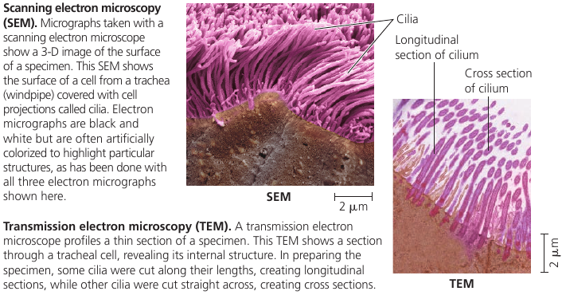
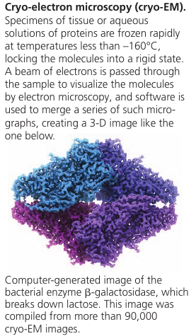
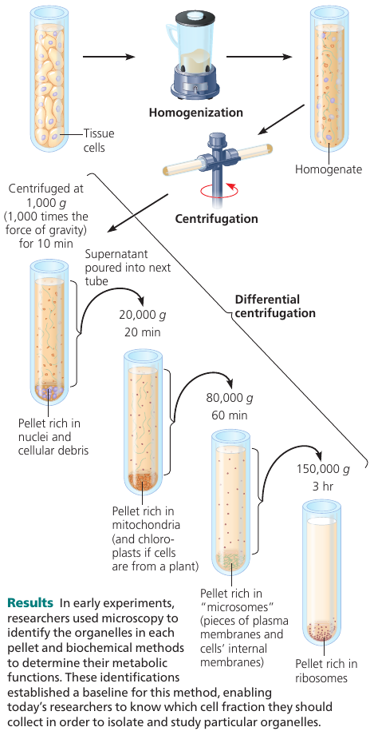

# Chapter 6. A Tour of the Cell

## 6.1. Biologists use microscopes and biochemistry to study cells

### Microscopy
In a light microscope (LM), visible light is passed through the specimen and then through glass lenses that refract (bend) the light in such a way that the image of the specimen is magnified.

**Light microscopes** can magnify to about 1000 times the actual size of the specimen. It cannot resolve details finer than about 200nm regardless of the magnification. This prevented cell biologists from studying **organelles**: the membrane-enclosed structures within eukaryotic cells.

**Electron microscope** focuses a beam of electrons through the specimen or onto its surface. Resolution is inversely related to the wavelength of the light (or electrons) a microscope uses for imaging, and electron beams have much shorter wavelengths than visible light. Modern electron microscopes can theoretically achieve a resolution of about 0.002nm, though in practice they usually cannot resolve structures smaller than about 2nm across. Still, it's a 100-fold improvement.

**Scanning electron microscope (SEM)** uses an electron beam to scan the surface of the sample, usually coated with a thin film of gold. The beam excites electrons on the surface, and these secondary electrons are detected by a device. The result is an image of the specimen's surface.

**Transmission electron microscope (TEM)** is used to study the internal structure of cells: it aims an electron beam through a very thin section of the specimen, which has been stained with atoms of heavy metals, which attach to certain cellular structures, thus enhancing the electron density there.

Instead of using glass lenses, both SEM and TEM use electromagnets as lenses to bend the paths of the electrons, ultimately focusing the image onto a monitor.

Light microscopes still offer advantages: one can study living cells, whereas with electron microscopy yhe methods used to prepare the specimen kill the cells.

Recent development: new type of TEM called *cryo-electron microscopy* (cryo-EM) allows specimens to be preserved at extremely low temperatures. This avoids the use of preservatives, allowing visualization of structures in their cellular environment.
The Nobel Prize for Chemistry was awarded in 2017 to the developers of this valuable technique.

### Cell Fractionation
A useful technique is **cell fractionation** which takes cells apart and separates  subcellular structures from one another. A centrifuge is used to break down cells and separate components by size: at higher speeds, smaller components settle to the bottom of the tube as pellets.

This allows to prepare specific cell components in bulk.

## 6.2. Eukaryotic cells have internal membranes that compartmentalize their functions

## 6.3. The eukaryotic cell's genetic instructions are housed in the nucleus and carried out by the ribosomes

## 6.4. The endomembrane system regulates protein traffic and performs metabolic functions

## 6.5. Mitochondria and chloroplasts change energy from our form to another

## 6.6. The cytoskeleton is a network of fibers that organizes structures anc activities in the cell

## 6.7. Extracellular components and connections between cells help coordinate cellular activities

## 6.8. A cell is greater than the sum of its parts

