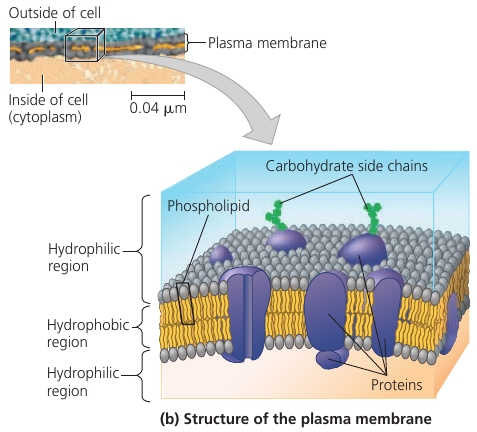
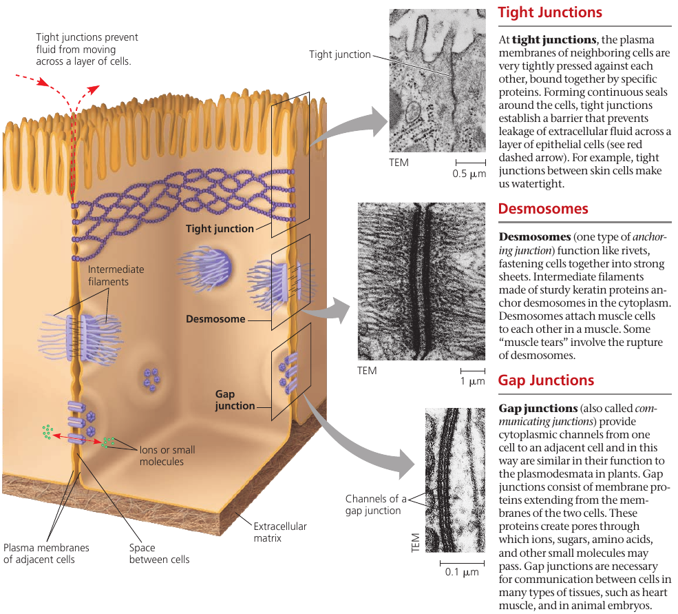
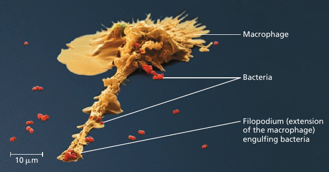
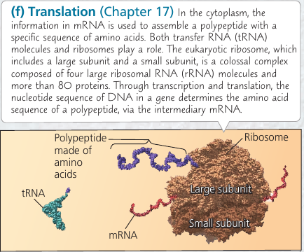

# Chapter 6. A Tour of the Cell

## 6.1. Biologists use microscopes and biochemistry to study cells

### Microscopy
In a light microscope (LM), visible light is passed through the specimen and then through glass lenses that refract (bend) the light in such a way that the image of the specimen is magnified.

**Light microscopes** can magnify to about 1000 times the actual size of the specimen. It cannot resolve details finer than about 200nm regardless of the magnification. This prevented cell biologists from studying **organelles**: the membrane-enclosed structures within eukaryotic cells.

**Electron microscope** focuses a beam of electrons through the specimen or onto its surface. Resolution is inversely related to the wavelength of the light (or electrons) a microscope uses for imaging, and electron beams have much shorter wavelengths than visible light. Modern electron microscopes can theoretically achieve a resolution of about 0.002nm, though in practice they usually cannot resolve structures smaller than about 2nm across. Still, it's a 100-fold improvement.

**Scanning electron microscope (SEM)** uses an electron beam to scan the surface of the sample, usually coated with a thin film of gold. The beam excites electrons on the surface, and these secondary electrons are detected by a device. The result is an image of the specimen's surface.

**Transmission electron microscope (TEM)** is used to study the internal structure of cells: it aims an electron beam through a very thin section of the specimen, which has been stained with atoms of heavy metals, which attach to certain cellular structures, thus enhancing the electron density there.

Instead of using glass lenses, both SEM and TEM use electromagnets as lenses to bend the paths of the electrons, ultimately focusing the image onto a monitor.

Light microscopes still offer advantages: one can study living cells, whereas with electron microscopy yhe methods used to prepare the specimen kill the cells.

Recent development: new type of TEM called *cryo-electron microscopy* (cryo-EM) allows specimens to be preserved at extremely low temperatures. This avoids the use of preservatives, allowing visualization of structures in their cellular environment.
The Nobel Prize for Chemistry was awarded in 2017 to the developers of this valuable technique.

### Cell Fractionation
A useful technique is **cell fractionation** which takes cells apart and separates  subcellular structures from one another. A centrifuge is used to break down cells and separate components by size: at higher speeds, smaller components settle to the bottom of the tube as pellets.

This allows to prepare specific cell components in bulk.

## 6.2. Eukaryotic cells have internal membranes that compartmentalize their functions

### Comparing Prokaryotic and Eukaryotic Cells
All cells share certain features. They are all bounded by a selective barrier: the *plasma membrane*. Inside all cells is a semi-fluid, jellylike substance called **cytosol**, in which subcellular components are suspended. All cells have *chromosomes*, which carry genes in the form of DNA. And all cells have *ribosomes*, tiny complexes that make proteins according to instructions from the genes.

A major difference between eukaryotic and prokaryotic cells is the location of their DNA.

In a **eukaryotic cell** (means: "true nucleus"), most of the DNA is in the organelle called *nucleus*, which is bounded by a double membrane.

In a **prokaryotic cell** ("before nucleus"), the DNA is concentrated in a region that is not membrane-enclosed, called the **nucleoid**.

The interior of a cell is called the **cytoplasm**. Eukaryotic cells have membrane-enclosed organelles of specialized form an function; prokaryotic cells do not have organelles. Some prokaryotes, however, have regions surrounded by proteins where specific reactions take place.

Typical eukaryotic cells are 10-100 μm in diameter. Prokaryotic cells are generally much smaller: 1-5μm. The logistics of carrying out cellular metabolism set limits on cell size.

Smallest cells known are mycoplasmas: they have diameters between 0.1-1.0μm. These are perhaps the smallest packages with enough DNA to program metabolism and enough enzymes and other cellular equipment to carry out the activities necessary for a cell to sustain itself and reproduce.

### Plasma Membrane

The plasma membrane is a bilayer of phospholipids with various proteins attached to or embedded into it. Carbohydrate side chains may be attached to proteins or lipids on the outer surface.

Metabolic requirements inpose a theoretical upper limits on the cell size. The **plasma membrane** is a selective barrier that allows passage of enough oxygen, nutrients, and wastes to service the entire cell. For each square micrometer of membrane, only a limited amount of a particular substance can cross per second, so the ratio of surface area to volume is critical. As a cell increases in size, its surface area grows slower than its volume.

The need for a surface area large enough to accommodate the volume helps explain the microscopic size of most cells.

Cells that exchange a lot of material, such as intertestinal cells, may have long thin projections, called *microvilli*, which increase surface area.

In addition to the plasma membrane, a eukaryotic cell has extensive, elaborately arranged internal membranes that divide the cell into compartments: the organelles. The compartments provide different local environments that support specific metabolic functions, so incompatible processes can occur simultaneously in a single cell.

All membranes participate directly in the cell's metabolism because many enzymes are built right into the membranes. Each type of membrane has a unique composition, suited to its specific functions.

For example, enzymes embedded into the membranes of mitochondria function in cellular respiration.

### A Panoramic View of the Eukaryotic Cell

## 6.3. The eukaryotic cell's genetic instructions are housed in the nucleus and carried out by the ribosomes
The **nuclear envelope** encloses the nucleus, separating its contents from the cytoplasm. It's a *double* membrane, with 20-40 nm distance between them.

The inner side of the envelope is lined by **nuclear lamina**: protein filaments that maintain the shape of the nucleus.

The double membrane is perforated by pore structures, each containing at least 456 individual proteins, called *pore complex*, that regulate the entry and exit of proteins, RNAs, and other molecules. It can actively conduct 1000 translocations per complex per second: large molecules may be recognized by specific signal sequences and then be actively transported through the pore.

There is also a *nuclear matrix*: a framework of protein fibers extending throughout the nuclear interior.

Within the nucleus, the DNA is organized into discreet **chromosomes**, each containing one long DNA molecule, wrapped around *histones*: proteins that help coil the DNA to reduce its length.

Inside nucleus there is **nucleolus**: a dense area where *ribosomal RNA* (rRNA) is synthesized from genes in the DNA. Also, large subunits of ribosomes are assembled here. These subunits then leave through the pores.

The nucleus also directs protein synthesis by synthesizing *messenger RNA* (mRNA).

### Ribosomes: Protein Factories

Ribosomes are complexes made of ribosomal RNAs and proteins. They carry out protein synthesis.

Cells with high rates of protein synthesis have large number of ribosomes and prominent nucleoli, which makes sense. Human pancreas cell is an example: it has a few million ribosomes.

Ribosomes reside in two regions. *Free ribosomes* are suspended in the cytosol: proteins produced by them mostly function within the cytosol. *Bound ribosomes* are attached to the outside of the endoplasmic reticulum or nuclear envelope: they generally make proteins that are destined for insertion into membranes, or for secretion.

## 6.4. The endomembrane system regulates protein traffic and performs metabolic functions
The **endomembrane system** includes all organelles: all internal membranes. The system does: protein synthesis, transport of proteins, metabolism and movement of lipids, detoxification of poisons.

These membranes relate either by physical continuity (contact) or by the formation of **vesicles**: sacs made of membrane.

The composition of these membranes is not fixed, but modified during the membrane's life.

### The Endoplasmic Reticulum: Biosynthesis Factory

The **endoplasmic reticulum (ER)** is a network of membranous tubules and sacs called cisternae (lat. *cisterna*, a reservoir). The whole of the internal space is called *ER lumen* (cavity). It is continuous with the nuclear envelope.

Two distinct regions: **smooth ER**, and **rough ER**, which is studded with ribosomes on the outer surface and thus appears rough through the electron microscope.

#### Functions of Smooth ER
Functions: synthesis of lipids and steroids, metabolism of carbohydrates, detoxification of drugs and poisons, storage of calcium ions. This is done by enzymes: they synthesize non-protein molecules.

Cells that secrete steroid hormones (sex hormones, adrenaline, etc) are rich in smooth ER.

Other enzymes help detoxify drugs: this usually involves adding `— OH` hydroxyl groups, making molecules more water-soluble and easier to flush from the body. The sedative phenobarbital and other barbiturates are examples of drugs metabolized in this manner by smooth ER in liver cells.

Barbiturates, alcohol, and many other drugs induce the proliferation of smooth ER and its associated detoxifying enzymes, thus increasing the rate of detoxification. This, in turn, increases tolerance to drugs.

The smooth ER also pumps calcium ions from the cytosol into the ER lumen, and when a muscle cell is stimulated by a nerve impulse, calcium ions rush back across the ER membrane into the cytosol and trigger contraction of the muscle cell. In other cell types, release of calcium ions from the smooth ER triggers different responses, such as secretion.

#### Functions of Rough ER
Many cells secrete proteins that are produced by ribosomes attached to rough ER. For instance, insulin is produced by pancreatic cells.

The rough ER membrane has pore complexes: as a polypeptide chain grows, it is threaded *into* the ER lumen where is is kept separate from the cytosol. The new protein folds into its functional shape.

Most secretory proteins are **glycoproteins**: they have carbohydrates covalently bonded to them. These are attached to the proteins by enzymes built into the ER membrane.

Secretory proteins depart from the ER wrapped in the membranes of vesicles that bud from a specialized region: *transitional ER*.

Rough ER is also a membrane factory for the cell: the membrane grows in place, proteins are inserted into the membrane, and portions of it are transferred in the form of transport vesicles to other components of the endomembrane system.

### The Golgi Apparatus: Shipping and Receiving Center
Many transport vesicles travel to the **Golgi apparatus**: a warehouse for receiving, sorting, shipping, and even some manufacturing.

Here, products of the ER, such as proteins, are modified and stored and then sent to other destinations. Not surprisingly, the Golgi apparatus is especially extensive in cells specialized for secretion.

The Golgi apparatus consists of a groups of associated, flattened membranous sacs: cisternae. A cell may have many, even hundreds, of these stacks. Vesicles around it are engaged in the transfer of material between parts of the Golgi and other structures.

It has a directionality: *cis* face (receiving side) and *trans* face (shipping side). Vesicles can add its membrane and the contents of its lumen to the *cis* face by fusing with a Golgi membrane on that side. The *trans* face gives rise to vesicles that pinch off and travel to other sides.

While going through the Golgi apparatus, products are usually modified: e.g. glycoproteins have some sugar monomers replaced by others. Membranes may also be altered in the Golgi.

The Golgi apparatus also manufactures many polysaccharides: pectins and others.

Each cisternae contains unique teams of enzymes. Until recently, it was thought that the Golgi is a static structure, with vesicles travelling between cisternae.
The *cisternal maturation model*, where the cisternae actually progress forward carrying and modifying their cargo as they move. In addition, some vesicles recycle enzymes by transporting them "backward" to a less mature region.
In reality, both both models probably apply: some regions of the cistarnae remain in place, while the outer ends are more dynamic.

The Golgi stack also sorts the products and targets them for various parts of the cell. Molecular identification tags, such as phosphate groups added to the Golgi products, aid in sorting by acting like zip codes on mailing labels.

Finally, transport vesicles budded from the Golgi may have external molecules on their membranes that recognize "docking sites" on the surface of specific organelles or on the plasma membrane, thus targeting the vesicles appropriately.

Animation:

### Lysosomes: Digestive Compartments
A **lysosome** is a membranous sac of hydrolytic enzymes used to digest (hydrolyze) macromolecules. These enzymes work best in acidic environment found in lysosomes, and are relatively inactive otherwise.

Lysosomes carry out intracellular digestion. Amoebas and many other unicellular protists eat by engulfing smaller organisms or food particles: a process called **phagosytosis**. The *food vacuole* then fuses with a lysosome, whose enzymes digest the food. Digestive products are: simple sugars, amino acids, other monomers. They pass into the cytosol and become nutrients for the cell.

Some human cells also carry out phagocytosis. Among them are macrophages, a type of white blood cell that helps defend the body by engulfing and destroying bacteria and other invaders.

Lysosomes are also used to recycle the cell's own organic material: a process called *autophagy*. During autophagy, a damaged organelle becomes surrounded by a double membrane (of unknown origin), and a lysosome fuses with it. The lysosomal enzymes dismantle the enclosed material, and the resulting small organic compounds are released to the cytosol for reuse. With the help of lysosomes, the cell continually renews itself. A human liver cell, for example, recycles half of its macromolecules each week.

### Vacuoles
**Vacuoles** are large vesicles derived from the endoplasmic reticulum and Golgi apparatus. It is selective in transporting solutes; as a result, the solution inside a vacuole differs in composition from the cytosol.

Vacuoles perform a variety of functions. **Food vacuoles** are formed by phagocytosis. **Contractile vacuoles** pump excess water out of the cell. In plants, small vacuoles can hold stockpiled reserves of proteins in seeds. Vacuoles may store poisonous compounds for defense. Some plant vacuoles contain pigments of petals that help attract pollinating insects.

Mature plant cells generally contain a large **central vacuole** that contains cell sap: cell's main repository of inorganic ions and water. It grows as the vacuole absorbs water, up to the point where cytosol occupies only a thin layer between the central vacuole and the plasma membrane.

### Endomembrane System Review

## 6.5. Mitochondria and chloroplasts change energy from our form to another
**Mitochondria** singular, *mitochondrion*) are the sites of cellular respiration: the metabolic process that uses oxygen to drive the generation of ATP by extracting energy from sugars, fats, and other fuels.

**Chloroplasts**, found in plants and algae, are the sites of photosynthesis.

### Evolutionary Origin of Mitochondria and Chloroplasts
Mitochondria and chloroplasts display similarities with bacteria. This led to the **endosymbiont theory**: an early ancestor of eukaryotic cells (a *host* cell) engulfed an oxygen-using nonphotosynthetic prokaryotic cell. Eventually, the engulfed cell formed a relationship with the host cell in which it became an *endosymbiont*: a cell living within another cell.

This is a widely accepted theory. Because:
1) it's bounded by a double-membrane, not by a single membrane like organelles (evidence suggests that ancestral prokaryotes had two outer membranes); 2) they contain ribosomes and own circular DNA molecules, like bacterial chromosomes; 3) they are autonomous organelles that grow and reproduce within the cell.

### Mitochondria: Chemical Energy Conversion
Cells often have hundreds or even thousands of mitochondria, the number correlating with the cell's level of metabolic activity: i.e. higher in cells that move or contract.

The inner membrane encloses the **mitochondrial matrix** and has infoldings called **cristae** which increase the surface area. The matrix contains many different enzymes, mitochondrial DNA, ribosomes.

The enzymes catalyze some of the steps of cellular respiration. Other enzymes, including the one that makes ATP, are built into the inner membrane.

Time-lapse films show that mitochondira move around, change their shapes, fuse and divide into fragments. Mitochondria form a branched tubular network that is in a dynamic state of flux (see image, part (b)).

In skeletal muscle, this network has been referred to as a "power grid".

### Chloroplasts: Capture of Light Energy
These lens-shaped organelles are found in leaves and other green organs of plants and in algae. Inside the double membrane is has another membranous system of flat, interconnected sacs called **thylakoids**. They stack into a **granum** (plural, *grana*). The fluid outside them is the **stroma**, which contains the chloroplast DNA and ribosomes, as well as many enzymes.

Chloroplasts are not static: their shape is changeable, they grow and occasionally pinch in two, reproducing themselves. They move around the cell along tracks of the cytoskeleton.

Chloroplasts belong to a class of **plastids**. There are *amyloplasts* that store starch (alylose), particularly in roots and tubers. *Chromoplast* has pigments that give fruits and flowers their orange and yellow hues.

### Peroxisomes: Oxidation
The **peroxisome** is a specialized metabolic compartment. It has a single membrane, and it contains enzymes that remove `H₂` from various substances and attaches them to `O₂`, producing hydrogen peroxide `H₂O₂` as a by-product, hence the name.

Functions: break fatty acids own into smaller molecules that are transported to mitochondira and used as fuel. In liver, they detoxify alcohol and other harmful compounds.

The `H₂O₂` is itself toxic, but the organelle also contains an enzyme that converts `H₂O₂` to water.

Peroxisome is an excellent example how the cell's compartmental structure is crusial to its functions: toxic substances are sequestered away from other cellular components that could be damaged.

In seeds, there is a type of peroxisome called *glyoxysomes*: they contain enzymes that convert fatty acids to sugar, which the seedling uses as a source of energy and carbon until it can produce its own sugar by photosynthesis.

## 6.6. The cytoskeleton is a network of fibers that organizes structures anc activities in the cell

### Role of Cytoskeleton: Support and Mobility
**Cytoskeleton** is a network of fibers extending throughout the cytoplasm. It gives mechanical support to the cell and maintains its shape, which is especially important to animal cells which lack walls. It also provides anchorage for many organelles and even cytosolic enzyme molecules.

The cytoskeleton is more dynamic than an animal skeleton, however: it can be quickly dismantled in one part of the cell and reassembled in a new location, changing the shape of the cell. The cytoskeleton manipulates the plasma membrane, bending it inward to form food vacuoles or other phagocytic vesicles.

Vesicles and other organelles often use motor proteins that "walk" to their destinations along a track provided by the cytoskeleton. For example, this is how vesicles containing neurotransmitter molecules migrate to the tips of axons and release chemical signals to the adjacent nerve cells.

### Components of the Cytoskeleton
Three main types of fibers:

* *Microtubules* are the thickest of the three.
* *Microfilaments* (also called actin filaments) are the thinnest.
* *Intermediate filaments* are fibers with diameters in a middle range

### Microtubules
**Microtubules** are hollow rods contructed from globular proteins: tubulins, of two different types. Microtubules grow in length by adding tubulin dimers (molecule made of two components), and can also be disassembled.

On one end, the "plus end", the microtubule can grow and shrink much faster (because of the orientation of tubulin dimers).

Microtubules shape and support the cell, and also serve as tracks along which organelles equipped with motor proteins can move. Microtubules also guide vesicles from the ER to the Golgi apparatus, and from it -- to the plasma membrane.

### Centrosomes and Centrioles
In animal cells, microtubules grow out from a **centrosome**, often located near the nucleus. They function as compression-resisting girders of the cytoskeleton.

Centrosome is composed of a pair of **centrioles**, each having nine sets of triplet microtubules arranged in a ring.

Many other, non-animal, eukaryotic cells lack centrosomes and use other means to organize microtubules.

### Cilia and Flagella
Both **flagella** (singular, *flagellum*) and **cilia** (singular, *cilium*) contain microtubules. Their specialized arrangement is responsible for the beating of these structures.  (The bacterial flagellum, however, has a completely different structure).

Flagella and cilia propel unicellular protists, sperm cells, algae. The ciliated lining of the trachea (windpipe) sweeps mucus containing trapped debris out of the lungs. In a woman's reproductive tract, the cilia lining the oviducts help move an egg towards the uterus.

A cell usually has, if any, no more than a few long flagella, or large numbers of short cilia. A flagellum has an undulating motion like the tail of a fish. Cilia have alternating power and recovery strokes, much like the oars of a boat.

#### Primary Cilium

A cilium may also act as a signal-receiving "antenna" for the cell. In fact, in vertebrate animals, it appears that almost all cells have such a cilium, which is called a *primary cilium* (blood cells being a prominent exception). Membrane proteins on this kind of cilium transmit molecular signals from teh cell's environment to its interior, triggering signaling pathways that may lead to changes in the cell's activities.

Although the primary cilium was discovered in 1898, it was largely ignored for a century and considered a vestigial (evolutionary leftover) organelle without important function. Recent findings regarding its physiological roles in chemosensation, signal transduction, and cell growth control, have revealed its importance in cell function. The primary cilium is now known to play an important role in the function of many human organs.

Some primary cilia on epithelial cells in eukaryotes act as cellular antennae, providing chemosensation, thermosensation and mechanosensation of the extracellular environment.

In the kidney, primary cilia sense urine flow and are essential for the maintenance of epithelial architecture.

#### Structure
Each motile cilium/flagellum has a group of microtubules sheathed in an extension of the plasma membrane. The arrangement is referred to as the "9 + 2" pattern and is found in nearly all eukaryotic flagella and motile cilia. Nonmotile primary cilia have a "9 + 0" pattern, lacking the central pair of microtubules.

The assembly is anchored in the cell by a **basal body**, which is structurally similar to a centriole, with "9 + 0" triplets. In many animals, including humans, the basal body of the fertilizing sperm's flagellum enters the egg and becomes a centriole!

The bending movement involves large motor proteins called **dyneins**: they have "feet" that "walk" along the microtubule of the adjacent doublet. The walking movement is coordinated so that it happens on one side of the circle at a time. The doublets do not slide past each other because they are held in place by flexible cross-linking proteins. They can't slide, so the walking of the dynein feet cause the microtubules to bend.

Animation:

### Microfilaments (Actin Filaments)
**Microfilaments** is a twisted double-chain of globular **actin** protein subunits. It can be linear, or branched. Microfilaments seem to be present in all eukaryotic cells.

While microtubules has compression-resisting function, the function of microfilaments is to bear tension (pulling forces). They form a three-dimensional network just inside of the plasma membrane and gives the outer cytoplasic layer of a cell (**cortex**) the semi-solid consistency of a gel that helps maintain the cell's shape.

In some cells, like intestinal cells, bundles of microfilaments make up the core of the microvilli.

Actin filaments play a role in cell motility: thousands of actin filaments interact with thicker **myosin** proteins to cause contraction of muscle cells.

In the unicellular protist *Amoeba* and some of our blood cells, localized contractions are involved in the amoeboid (crawling) movement of the cells: it extends **pseudopodia** and moves toward them.

In plant cells, actin-protein interactions contribute to **cytoplasmit streaming**: a circular flow of cytoplasm within cells.

## 6.7. Extracellular components and connections between cells help coordinate cellular activities

### Cell Walls of Plants
The **cell wall** is one of the features that distinguishes plant cells from animal cells. The wall protects the plant cell, maintains its shape, and prevents excessibe uptake of water.

At the level of the whole plant, the strong walls of specialized cells hold the plant up against the force of gravity.

Prokaryotes, some protists, and fungi, also have cell walls.

The wall is much thicker than the membrane: 0.1μm+. Its microfibrils are made of cellulose which is made by the enzyme "cellulose synthase", and secreted into the extracellular space, where they become embedded in a matrix of other polysaccharides and proteins.

Cell wall has the same basic architectural design as steel-reinforced concrete and fiberglass: the combination of materials, strong fibers, and a ground substance (matrix).

A young cell secretes a relatively thin and flexible **primary cell wall**. **Middle lamella** is a thin space between the walls of adjacent cells: it contains sticky polysaccharides called pectins: it glues the adjacent walls together. (Pectin is a thickening agent used in jams and jellies).

When a mature cell stops growing, it strengthens its wall: some cells do this simply by secreting hardening substances into the primary wall; other cells add a **secondary wall** underneath the primary wall. Wood, for instance, consists mainly of strong secondary walls.

### The Extracellular Matrix (ECM)
Animal cells don't have cell walls, but they have an elaborate **extracellular matrix (ECM)**: glycoproteins and other carbohydrate-containing molecules secreted by the cells.

**Collagen** forms many strong fibers outside the cells. It is so abundant that it accounts for about 40% of the total protein in human body.

Collagen fibers are embedded in a network woven out of **proteoglycans**. A proteoglycan molecule consists of a single long polysaccharide, with many proteoglycan molecules noncovalently attached, each molecule having a small core protein with many carbohydrate chains covalently attached to it, so that it may be up to 95% carbohydrate.

In some cells, *fibronectin** attaches ECM proteins to **integrins** that span the membrane and bind to microfilaments of the cytoskeleton. Integrins can transmit signals between the ECM and the cytoskeleton and thus *to integrate* changes occurring outside and inside the cell and regulare the cell's behavior.

Researchers have learned that the ECM can influence the activity of genes in the nucleus. The information is probably communicated by a combination of mechanical and chemical signalling pathways.

### Cell Junctions
Neighboring cells in a tissue often adhere, interact, and communicate via sites of direct physical contact.

#### Plasmodesmata in Plant Cells
Many plant cell walls are not continuous: they are perforated by **plasmodesmata** (Gk. *desma*, bond): channels that connect cells so that the cytoplasm of one cell is continuous with the cytoplasm of its neighbors.

Membranes of adjacent cells line the channel and thus are also continuous.

Plasmodesmata unify most of the plant into one living continuum: water and small solutes can pass freely from cell to cell, and in some circumstances, certain proteins and RNA molecules can do this as well. Macromolecules appear to reach plasmodesmata by moving along fibers of the cytoskeleton.

#### Cell Junctions in Animal Cells
In animals, there are three main types of cell junctions: *tight junctions*, *desmosomes*, and *gap junctions*. Every junction has a specialized function.

All three types of cell junctions are especially common in epithelial tissue which lines the external and internal surfaces of the body. The following figure uses epithelial cells of the intestinal lining to illustrate these junctions.

*Tight junctions* prevent fluids from the external environment from getting into the space between the cells.

*Desmosomes*, or anchoring junctions, appear as thickened patches in the cell membrane region. They contain specialized proteins, such as keratene, the same protein found in fingernails and hair, that increase the rigidity of tissues. These are button-like junctions that bind cells together, and also act as anchorage for fibers in the cytoskeleton.

In *gap junctions*, or communicating junctions, the gap between the cells is bridged by a specialized channel that allows the passage of water and small molecules. It also serves communicational purposes: for example, a hormone that activates one cell will often activate adjacent cells as well by the passage of intracellular signals through gap junctions.

## Macrophage

Processes in a cell happen in a co-ordinated fashion.
For instance, consider the microscopic scene in the figure below. A macrophage helps to defend the mammalian body against infections by ingesting bacteria: the small red cells (see image).

In order to do this, the macrophage crawls along a surface and reaches out to the bacteria with thin pseudopodia. Actin filaments interact with the cytoskeleton in these movements.

After the macrophage engulfs the bacteria, the sac containing the bacteria fuses with a lysosomes that contains digestive enzymes.

All these components are manufactured by ribosomes that build cell's proteins.

And every process mentioned here requires energy which mitochondria supply in the form of ATP.

If any of these complicated processes was missing, the macrophage would be an inert piece of matter, unable to act.

## Visualization of the Molecular Machinery in a Cell

