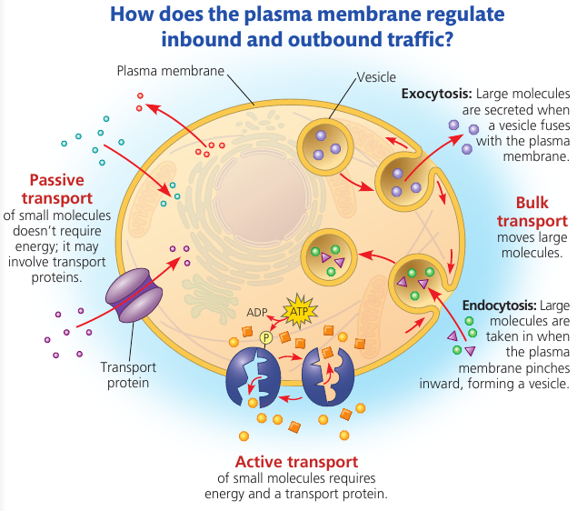
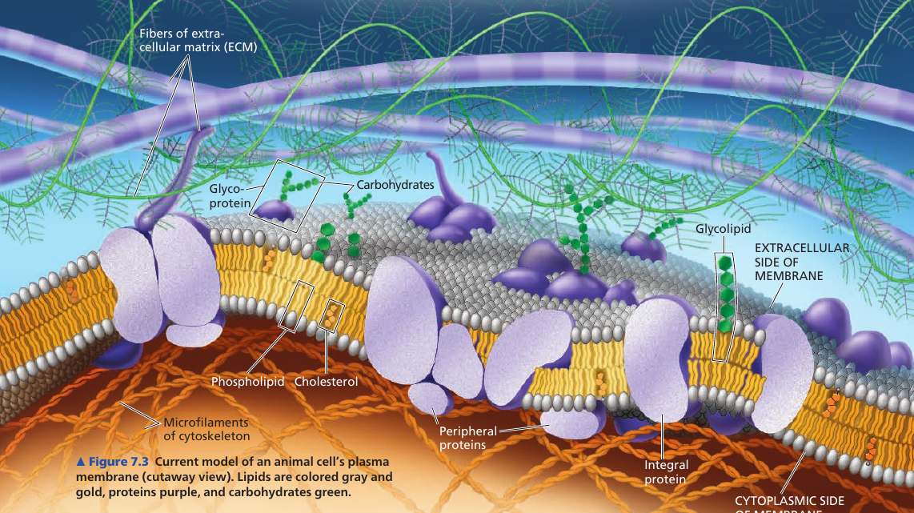
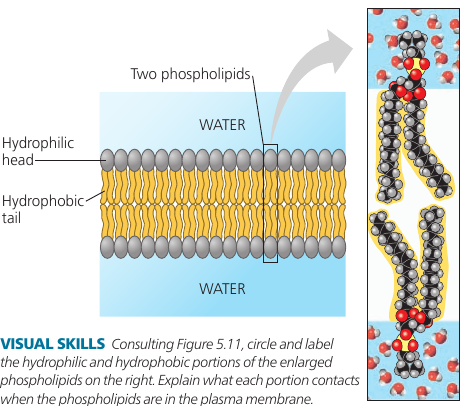
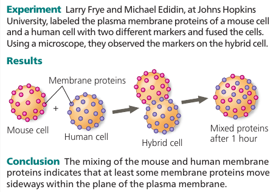
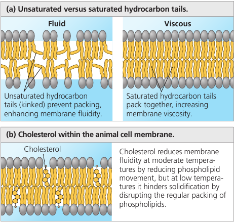

# Chapter 7. Membrane Structure and Function

## 7.1. Cellular membranes are fluid mosaics of lipids and proteins
The currently accepted model of the plasma membrane: the **fluid mosaic model**. It is continually being refined.

Membranes are composed of: lipids, proteins, some carbohydrates.

Phospholipids have an ability to form membranes between two aqueous compartments: it is inherent in their molecular structure. They are **amphipathic**: have a hydrophilic and a hydrophobic region.

Most membrane proteins are amphipathic as well: their orientation maximizes contact of hydrophilic regions with water, while providing their hydrophobic parts with a nonaqueous environment.

Proteins are not randomly distributed: they are often grouped in long-lasting, specialized patches, where they carry out common functions.

### The Fluidity of Membranes
Most of the lipids and some proteins in the membrane can shift about sideways because the membrane is held together by weak hydrophobic bonds. Like partygoers elbowing their way through a crowded room.

The movement is rapid: a phospholipid can travel the length of a typical bacteria (2μm) in 1 second. Proteins are larger and move more slowly, when they move. Many membrane proteins seem to be held immobile by their attachment to the cytoskeleton or to the extracellular matrix.

Some proteins drift in the membrane; others seem to move in a highly directed manner, perhaps driven along cytoskeletal fibers by motor proteins.

Very rarely, also, a lipid may flip-flop across the membrane, switching from one phospholipid layer to the other.

A membrane remains fluid until temperature decreases to a certain point, when it solidifies. This point depends on the types of lipids it's made of: unsaturated hydrocarbon tails have kinks that cannot pack as closely together, making the membrane more fluid.

Embedded cholesterol also controls membrane fluidity: at high temperatures (37℃) it makes the membrane less fluid by restraining phospholipid movement, and it also hinders the close packing of phospholipids at lower temperatures, lowering the temperature required for the membrane to solidify.

Thus, cholesterol can be thought of a "fluidity buffer" for the membrane, resisting changes in membrane fluidity that can be caused by changes in temperature.

Membranes must be fluid to work properly: the fluidity of a membrane affects both its permeability and the ability of membrane proteins to move to where their function is needed.

Usually, membranes are about as fluid as olive oil.

## 7.2. Membrane structure results in selective permeability

## 7.3. Passive transport is diffusion of a substance across a membrane with no energy investment

## 7.4. Active transport uses energy to move solutes against their gradients

## 7.5. Bulk transport across the plasma membrane occurs by exocytosis and endocytosis
