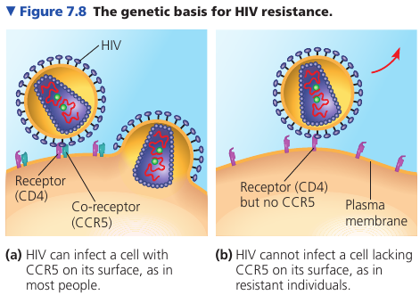
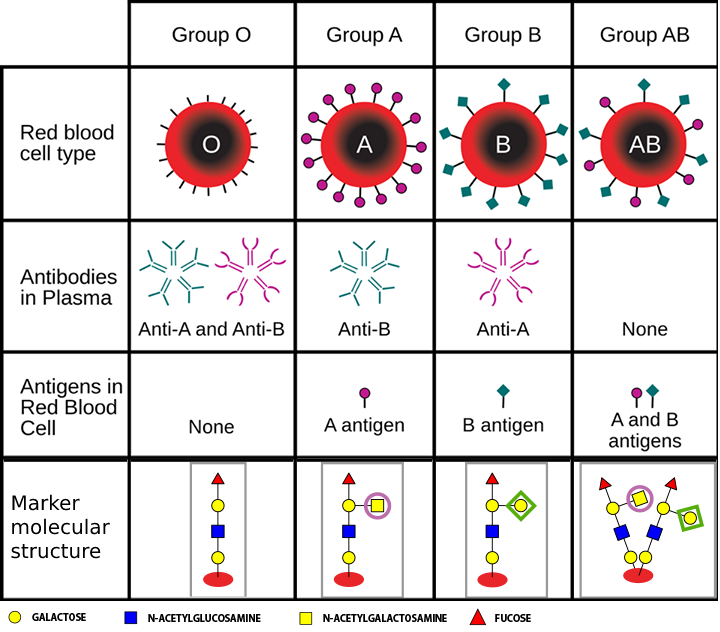
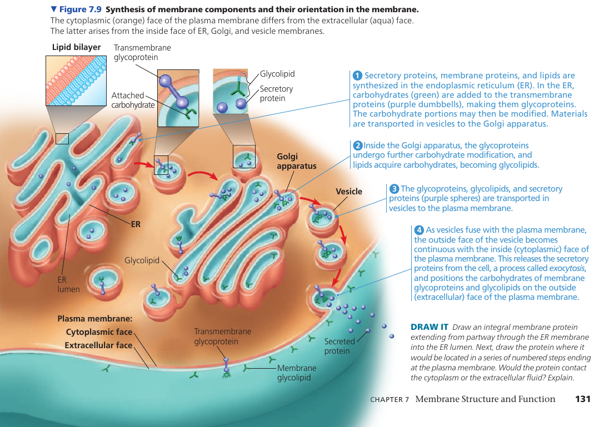

# Chapter 7. Membrane Structure and Function

## 7.1. Cellular membranes are fluid mosaics of lipids and proteins
The currently accepted model of the plasma membrane: the **fluid mosaic model**. It is continually being refined.

Membranes are composed of: lipids, proteins, some carbohydrates.

Phospholipids have an ability to form membranes between two aqueous compartments: it is inherent in their molecular structure. They are **amphipathic**: have a hydrophilic and a hydrophobic region.

Most membrane proteins are amphipathic as well: their orientation maximizes contact of hydrophilic regions with water, while providing their hydrophobic parts with a nonaqueous environment.

Proteins are not randomly distributed: they are often grouped in long-lasting, specialized patches, where they carry out common functions.

### The Fluidity of Membranes
Most of the lipids and some proteins in the membrane can shift about sideways because the membrane is held together by weak hydrophobic bonds. Like partygoers elbowing their way through a crowded room.

The movement is rapid: a phospholipid can travel the length of a typical bacteria (2μm) in 1 second. Proteins are larger and move more slowly, when they move. Many membrane proteins seem to be held immobile by their attachment to the cytoskeleton or to the extracellular matrix.

Some proteins drift in the membrane; others seem to move in a highly directed manner, perhaps driven along cytoskeletal fibers by motor proteins.

Very rarely, also, a lipid may flip-flop across the membrane, switching from one phospholipid layer to the other.

A membrane remains fluid until temperature decreases to a certain point, when it solidifies. This point depends on the types of lipids it's made of: unsaturated hydrocarbon tails have kinks that cannot pack as closely together, making the membrane more fluid.

Embedded cholesterol also controls membrane fluidity: at high temperatures (37℃) it makes the membrane less fluid by restraining phospholipid movement, and it also hinders the close packing of phospholipids at lower temperatures, lowering the temperature required for the membrane to solidify.

Thus, cholesterol can be thought of a "fluidity buffer" for the membrane, resisting changes in membrane fluidity that can be caused by changes in temperature.

Membranes must be fluid to work properly: the fluidity of a membrane affects both its permeability and the ability of membrane proteins to move to where their function is needed.

Usually, membranes are about as fluid as olive oil.

### Membrane Lipid Composition Adaptation
The ability to change the lipid composition of cell membranes in response to changing temperatures has evolved in organisms that live where temperatures vary. In many plants that tolerate extreme cold, such as winter wheat, the percentage of unsaturated phospholipids increases in autumn: an adjustment that keeps the membranes from solidifying during winter.

Cold-water fishes have a high proportion of unsaturated phospholipids in their membranes as well. As the other extreme, some bacteria that thrive in thermal hot springs include unusual lipids that may prevent excessive fluidity at such high temperatures.

### Membrane Proteins and Their Functions
More than 50 kinds of proteins have been found in the plasma membrane of red blood cells.

Proteins determine most of the membrane's functions.

The majority of **integral proteins** (that are inserted into the membrane) are **transmembrane proteins**, which span the membrane. Their hydrophobic regions consist of stretches of nonpolar amino acids, usually coiled into α-helices, while the hydrophilic parts of the molecule are exposed to the aqueous solutions.
Some proteins also have hydrophilic channels that allow pasaage through the membrane of hydrophilic substances, even of water itself.

Bacteriorhodopsin: a bacterial transfer protein.

**Peripheral proteins** are not embedded in the lipid bilayer at all: they are loosely boudn to the surface of the membrane, often to exposed parts of integral proteins.

On the cytoplasmic side of the membrane, some proteins are held in place by attachment to the cytoskeleton. On the outside, membrane proteins may attach to other materials: e.g. in animal cells, membrane proteins may be attached to fibers of the extracellular matrix to give animal cells a stronger framework than the plasma membrane alone could provide.

The following figure illustrates 6 major functions performed by proteins of the plasma membrane. A protein may carry out multiple functions.

Surface proteins are important in the medical field. For example, it was discovered that some people, despite multiple exposures to HIV, do not develop AIDS and show no evidence of HIV-infected cells. Comparing their genes with the genes of infected individuals, researchers learned that resistant people have an unusual form of a gene that codes for an immune cell-surface protein called CCR5. Further work showed that although the CD4 protein on the surface of immune cells helps HIV infect those cells, HIV must also bind to CCR5 as a "co-receptor" to infect most cells. An absence of CCR5 on the cells of resistant individuals, due to gene alteration, prevents the virus from entering the cells.

This information has been key to developing a treatment for HIV: interfering with CD4 causes dangerous side-effects because of its many important functions in cells; CCR5 is a safer target for development of drugs that mask this protein and block HIV entry.

### The Role of Membrane Carbohydrates in Cell-Cell Recognition
Cell recognition is a cell's ability to distinguish one type of neighboring cell from another. It is important, for example, in the sorting of cells into tissues and organs in an animal embryo. It is also the basis for the rejection of foreign cells by the immune system.

Cells recognize other cells by binding to molecules on the surface of the plasma membrane. These molecules are usually short, branched, chains of carbohydrates, bonded to lipids (forming *glycolipids*) or proteins (forming *glycoproteins*).

These carbohydrate tags vary from species to species; they also vary among individuals of the same species; they even vary from one cell type to another in a single individual. Such diversity makes them sufficiently unique to function as markers that distinguish one cell from another.

For example, the four human blood types, designated A, B, AB, and O, reflect variation in the carbohydrate part of the glycoproteins on the surface of red blood cells.

### Synthesis and Sidedness of Membranes
The two lipid layers of the membrane may differ in lipid composition, and each *integral protein* has directional orientation in the membrane.
The asymmetrical arrangement is determined as the membrane is being built.

## 7.2. Membrane structure results in selective permeability

## 7.3. Passive transport is diffusion of a substance across a membrane with no energy investment

## 7.4. Active transport uses energy to move solutes against their gradients

## 7.5. Bulk transport across the plasma membrane occurs by exocytosis and endocytosis
