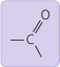
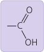
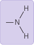
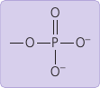
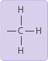

Avogadro's Number: NA = 6.022 × 10²³

Chemical reaction Symbols: →⇌

Functional groups:

* **Hydroxyl group** `— OH`. Alcohol. . Polar. 2+ groups makes water-soluble. Hydrogen-bonds.
* **Carbonyl group** `C = O`. Ketone (mid) / Aldehyde (end) . Polar.
* **Carboxyl group** `— COOH`. Carboxylic acid , Organic acid. . Acid: donates `H⁺`.
* **Amino group** `— NH₂`. Amine. . Base: picks up `H⁺`, becomes positive.
* **Sulfhydryl group** `­— SH`. Thiol. . Cross-links for structural stability.
* **Phosphate group** `­— OPO₃²⁻` or `Ⓟ`. Organic phosphate. . Acid. Negative charge. Reacts with water.
* **Methyl group**. `— CH₃`. Methylated compound. . Recognizable tag.
