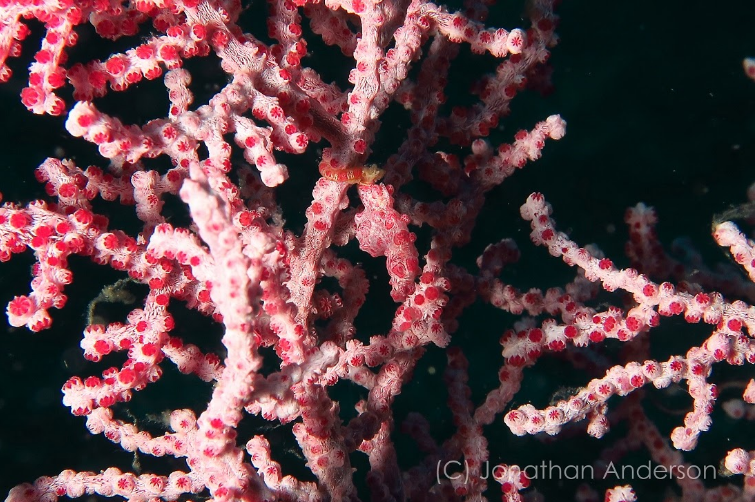
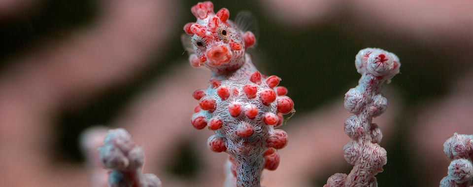
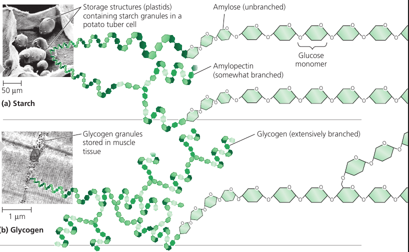
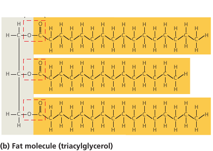
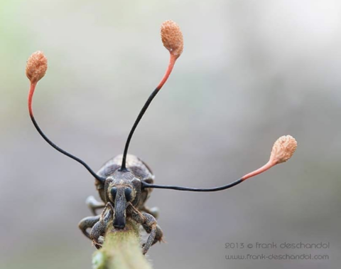
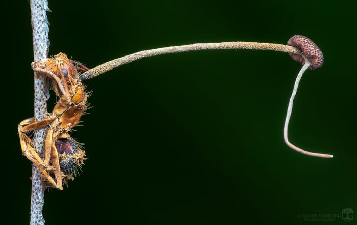
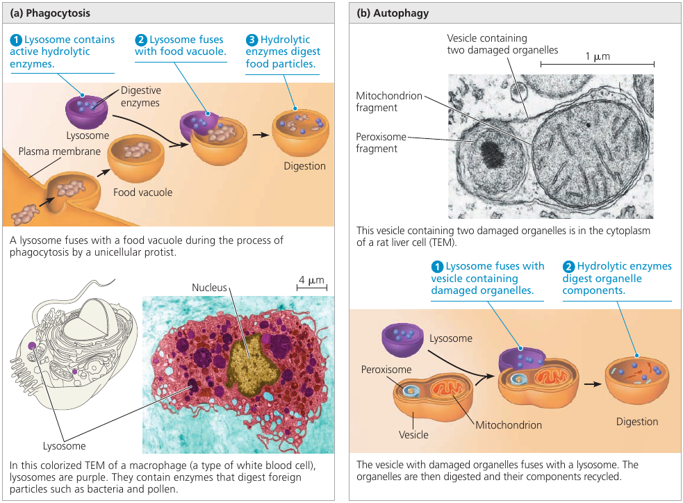

# Wonderful Biology

# Amoeba

A macro picture of an Amoeba. This is a single-cell organism and looks like it has a universe inside of it!

An amoeba having lunch. It extends pseudopodia to "hug" the victim. This shape-changing behavior is actually achieved through rapidly rebuilding microfilaments that support its shape into a different structure that pushes the external membrane into the desired direction. (may not be a completely accurate description, but gives an idea of what's going on).

More unicellular brutality :)

# Ants Shoot Acid

Wood ants live in colonies. When threatened from above, the ants shoot volleys of formic acid into the air from their abdomens.

The acid bombards the potential predator, such as a hungry bird.

# Pigmy Seahorse
Can you spot a Pygmy Seahorse, the master of camouflage? 😁

Can you spot it now? :)

# How Heroin Works
Here's how heroin works.
Molecular shape is crucial to the function of any biological molecule. The shape determines how they recognize and respond to one another with specificity. They often bind to each other temporarily by forming weak interactions, such as the attraction of charged regions (positive to negative), but only if the shapes of those molecules are complementary.
Consider opiates: they relieve pain and alter mood by weakly binding to specific receptor molecules on the surfaces of brain cells.
Why would brain cells carry receptors for opiates, compounds that are not made by the body, but by poppy plants?
In 1975, the discovery of endorphines answered this question.
Endorphines are signalling molecules made by the pituitary gland that bind to the receptors, relieving pain and producing euphoria during times of stress, such as intensive exercise.
Opiates have shapes similar to endorphines and mimic them by binding to endorphin receptors in the brain. That is why opiates and endorphins have similar effects.

# Bombardier Beetle
The Bombardier beetle has an interesting defense mechanism: in case of danger, it sprays a  boiling hot liquid that contains irritating chemicals.

The beetle stores two sets of chemicals separately in its glands. While the chemicals are stored apart, they are harmless. In case of danger, the beetle mixes the chemicals in the reaction chamber. The chemical reaction produces heat, which raises the temperature of the liquid to 100°C. It boils, and shoots from the beetle's abdomen. The tip of the abdomen can move and steer the explosive discharge towards the enemy.

# Carbohydrates: How Plants and Animals use Sugar
The food that we eat, among other things contains carbohydrates. Carbohydrates is a class of molecules that includes sugars and composite sugars, *polymers*.

First of all, they are called *carbohydrates* because sugars primarily consist of Carbon atoms (the chain of carbons in the middle, called "carbon skeleton") and hydrogen atoms. Carbon-Hydrogen. Carbo-hydrates.

The hallmark of sugars, however, is the series of `-OH` hydroxyl groups and the double link with Oxygen (colored red), see picture.

Glucose is the most common sugar. It is of central importance to the chemistry of life because it is the fuel that cells use for biological processes. Everything that moves in you, does so thanks to glucose.

Fructose is the sugar that makes fruits and berries sweet.
Notice that the highlighted oxygen is at a different place. This makes the molecule the so-called "ketone sugar": . The rest of the molecule is same as glucose.

Fructose tastes sweeter than glucose. In the 1970s, a process was developed that converts the glucose in corn syrup into sweeter-tasting fructose. The result is the high-fructose corn syrup, which is also cheaper than table sugar. It's now an ingredient you commonly see in soft drinks and processed food.

The sugar that circulates in plant sap is not a simple sugar. It is a glucose and a fructose molecules linked together by an oxygen atom. This is called "sucrose", or table sugar. This double-sugar molecule is what we obtain from sugar cane and sugar beets. (picture)

Maltose, known as "malt sugar", is an ingredient used in brewing beer. It is extracted from malt: a substance obtained in the process of allowing grain to soften in water and germinate. It consists of two glucose molecules linked together.

Cow milk contains lactose: another composite sugar: a glucose joined to a galactose.

Such sugar molecules cannot be used by our body immediately: they must be broken down into simple sugars. Enzymes do that.

For instance, lactose — the milk sugar — is broken down into two simple sugars by lactase: an enzyme that breaks down lactose. Some people lack lactase and cannot effectively break it down. This lactose goes further, where intestinal bacteria feast on it, and the result is gas and diarrhea. This is how lactose intolerance works.

Such people can, however, take the lactase enzyme when eating dairy products and it will break down lactose for them. They can also choose dairy products that have already been treated with lactase to break down the lactose.

Sugars can be even bigger than that: when many sugars are joined together, this is called a *glucose polymer*, or a *polysaccharide*. It can be hundreds and thousands of units long.

Both plants and animals can stockpile glucose for later use, because glucose is the source of energy they may need.

Plants use **starch**: a polymer of glucose, in which many glucose molecules are linked to one another into long chains (top picture). The plants are able to remove pieces of this energy stockpile as needed.

When we each vegetables that contain starch, we can break the starch apart into glucose molecules because we have enzymes that can do that.

Animals also stockpile glucose, but as **glycogen**: it's like starch, but extensively branched. (bottom picture)

Vertebrates store glycogen mainly in liver and muscle cells which is used when the demand for sugar increases. The store is not large: in humans, for example, glycogen stores are depleted in about a day unless they are replenished by eating. This is an issue of concern in lo-carb diets which can result in weakness and fatigue.

Sugars are used not only for energy, bu also as building materials.

**Cellulose** is the strong material of which cell walls of plant cells are made. It consists of long chains of glucose, but unlike starch, this glucose is linked differently: every second glucose is upside down (picture).

This structure makes cellulose fibers very straight, so they can come close and stick to one another. The resulting fiber is a strong building material.

On food packages, "insoluble fiber" refers mainly to cellulose. Most animals cannot digest cellulose, however: because of its different shape, same enzymes do not work. So when we eat cellulose, it passes straight through the digestive tract. Along the way, however, it abrades intestinal walls and stimulates it to secrete mucus which aids the smooth passage of food through the tract.

Cows can digest cellulose: they have microorganisms living in their gut that does this for them. Thus, cows can eat grass, but we can't.

Insects also use sugars as structural material: **chitin** is a structural glucose polymer that arthropods (insects, crustaceans, etc) use to build their exoskeletons. This clever chemical is leathery and flexible at first, but becomes hardened when the proteins are chemically linked to each other.

# The Carbon Cycle
We all know about photosynthesis from school: plants absorb carbon dioxide and release oxygen. Thanks to this process, we have something to breathe with.

But here's a question. Why do plants have photosynthesis? Why do they absorb carbon dioxide? What's in it for them?

Let's have a look at the molecular formulas. Plants absorb carbon dioxide, that's `CO₂`. And what they release is oxygen, that's `O₂`. In this process, the plant keeps the carbon: `C`.

This carbon is used by the plant to produce carbohydrates: glucose, which, as we've seen, consists of `C`, `O` and `H` atoms.

This glucose is put together using the energy that comes from the sun: that is, the plant stores up solar energy packed into glucose molecules. Extra oxygen is released into the atmosphere. The plant just doesn't need so much oxygen.

Then an animal finds the plant, eats it, and gets the energy in the form of glucose. This is the energy that lets the animal live, move, and carry out cellular processes.

Oxygen is needed to use this glucose fuel. The animal inhales `O₂` and uses it in chemical reactions that release the energy from glucose. During this process, oxygen binds with a carbon, and `CO₂` is produced, which is then exhaled.

Since the energy that we get from the carbohydrates is solar energy, one can say that the heat and the motion of our body is stellar energy :)

The `CO₂` from the animal is then absorbed by other plants and converted to glucose once again. This is the so-called "carbon cycle".

# Fats
Fat molecules consist of a glycerol molecule (colored gray, on the left) with three fatty acids linked to it (colored orange). Glycerol is the base that holds the whole thing together, and the long hydrocarbon tails are the energy storage. In fact, they store as much potential energy as gasoline.

A gram of fat stores more than twice as much energy as a gram of sugar, such as starch. Animals have to carry their energy stores with them, so a compact form of energy storage makes sense. Plants, on the other hand, are immobile, and they are ok with bulky energy storage in the form of starch. But where mobility is an advantage, plants also use fats: in their seeds, which need to be mobile to spread. This is why vegetable oil is extracted from seeds.

These long carbon-hydrogen tails (orange, see image) are non-polar: they have no charged regions, and for this reason the molecule is *hydrophobic*: it repels water, which would only stick to regions of a molecule with partial electric charges.

This is why liquid fats, such as vegetable oils, don't mix with water. They don't bond to one another.

You may have heard that there are two types of fats: *saturated fats* and *unsaturated fats*.

The molecule of *saturated fat* has three tails where every carbon is bonded to as many hydrogen atoms as possible. Such a structure is said to be *saturated* with hydrogen (left image).

Most animal fats are saturated. Such molecules are compact and can pack together tightly: this is why saturated animal fats, such as lard and butter, are solid at room temperatures.

An *unsaturated fat* has fewer hydrogen atoms: a carbon forms a double-bond to another carbon instead (right image). The double bond creates a kink in the hydrocarbon chain and the shape is not linear anymore (the double line on the image).

The fats of plants and fishes are generally unsaturated. Because of the "kink", the molecules cannot stay close together to solidify, and such fats remain liquid at room temperature. We call them "oils".

Margarine used to be oil, but it went through the process of adding hydrogen, the so-called *hydrogenation*, and most fats became saturated, and margarine can now solidify. So margarine is ex-vegetable oil that looks like butter :)

Lipids are used not only for energy storage. There are structural lipids called **phospholipids**.

A **phospholipid** is a fat molecule with only two fatty acids (two "legs", colored orange), and a phosphorus group attached to its head (gray).

The "legs" have no polar regions, but the phosphate group creates a charged region at the head of the molecule. (yellow)

As a result of this charged region, the molecule's head is hydrophilic (has affinity to water), while the legs are hydrophobic (repel water). When in water, many such molecules tend to "put their heads together" and "hide their legs" away from water. This way, they self-assemble into a double-layered membrane, with heads attracted to water molecules, while the legs turn inward and away from water (see image, d).

Such membranes actually form the surface of the cell: their function is to separate the interior of the cell from the environment. If not for these membranes, cells wouldn't exist.

# Proteins
Proteins account for more than 50% of your dry mass, and they are responsible for almost everything that happens in your body.

Some proteins regulate and speed up chemical reactions (enzymes). Others act as a filter on cellular membrane, letting in some molecules and not others. Proteins store and transport useful molecules (hemoglobin transports oxygen). They provide defense against pathogens. They provide the means for signaling and communication. They implement mechanisms that let you move.

Proteins are the most structurally sophisticated molecules known, but they are all constructed from the same set of building blocks: 20 amino acids.

An amino acid is a molecule that has a carbon atom with two functional groups (see picture: the purple rectangles). These groups are able to attach to other amino acids so that they can form long chains.

This is what proteins are: long chains of amino acids, called **polypeptides**.

Every amino acid has these two "connector" groups, but each also has the "side chain" (see picture: the "R" group). This group differs from one amino acid to another and determines its physical and chemical properties. Some attachments give it a positive or a negative charge, making them able to make connections.

Typical proteins would have hundreds of amino acids, each perfectly in its place. The exact sequence of amino acids is encoded in the DNA. This code is read by molecular machinery which assembles together a chain of amino acids, one at a time. (see picture, left).

This chain has regions which are able to make connections: positively charged regions of the chain are attracted to negatively charged regions. Repeated sequences of charged amino acids make the protein spontaneously fold into helixes, other regions form pleated sheets (see picture, middle). Pleated sheets make additional bonds to one another and thus keep the molecule in shape.

The final shape of the protein is encoded as the sequence of amino acids, but the protein folding process is a complicated multi-step process. For this reason, among the 65 million known proteins, scientists only know the shape of 35 000 of them.

The shape can be quite complicated: see picture. Notice the familiar helixes and sheets that define the shape.

As a protein is manufactured, it's just a chain of amino acids. It is then precisely twisted, folded, and coiled into a molecule of unique shape.

A protein is like a tool which needs to have a specific shape in order to perform a function. One example we've seen is the receptor that reacts to endorphines because of its specific shape. It wouldn't perform if the shape was different.

An especially striking example of the marriage of form and function is the flu antibody: it's a protein with a particular shape that matches the shape of the flu virus. Because of the perfect match, the antibody binds to the virus and marks it for destruction.

See picture: on the left is the flu antibody protein. On the right is a protein from flu virus which the antibody matches perfectly and is thus able to attach to.

# Kinesin

Look at the animation of a motor protein, kinesin: it can travel along microtubules in your cells and carry cargo from one place to another. It knows what to carry, where to go, and when to stop. Millions of them are doing this inside you this very instant. And yes, they can walk!

These are the nano trucks that carry nutrients to places where they are needed, and they would pick up waste and expel it from the cell.

# Zombie Fungus

This weevil is infected with *ophiocordyceps curculionum*, or a zombie fungus.

There are over 400 subspecies of this fungus, each targeting a specific species of insect. It releases spores that penetrate the exoskeleton and seizes control of the muscles. With control of the motor functions now fully assumed by the parasite, the infected will seek out an elevated spot. When it finds one, the insect will secure themselves to it and then slowly die.

The fungus would feed on the innards of the host until ready to fruit. Those large alien-looking branches are the result of this fruiting. When these fruit rupture, spores are release, which will seek out to infect more weevils and do the same to them.

Here's another fungus that targets ants. The spores attach to their exoskeletons and break through using mechanical pressure and enzymes. After the fungus enters the ant it propagates, and fungal cells are found beside the host's brain, where it presumably produces compounds that affect the ant's behavior.

An infected ant exhibits irregularly timed full-body convulsions that dislodge it from its canopy nest to the forest floor. The ant then climbs up the stem to a height of 26 cm above the forest floor. This is followed by the fungus controlling the locking of its jaw: the ant bites the leaf so tightly that the ant is prevented from falling as it dies hanging upside down.

Atrophy quickly sets in, destroying the muscle fibers. The ant is no longer able to control the muscles of the mandible and remains fixed in place, hanging upside-down on the leaf. This lockjaw trait is popularly known as the death grip and is essential in the fungus's lifecycle.

The fungus then kills the ant and continues to grow, invading more soft tissues, until it fruits.

The alteration of the host's behavior happens through secretion of various metabolites beside the host's brain and muscle. Studies have shown that the fungus secretes different substances according to the host tissue it encounters and whether they are live or dead.

This fungus is able to destroy entire ant colonies, forming ant graveyards of 20-30 meters in range.

# Plasma Membrane

Every living cell is surrounded by a membrane. We normally think of a membrane as a barrier that separates the cell from the external environment. But it is much more than that.

The cell requires oxygen and nutrients in order to function, so the membrane needs to allow them in. But it shouldn't let just everything in. At the same time, some waste products are generated in the cell, and these should be removed. But the membrane shouldn't just let everything out.

Membranes are selectively permeable. They would let some substances in one direction, and other substances in another direction.

Some substances can slowly ooze through the membrane, such as glucose, amino acids, fatty acids, etc. This is passive transport. But there is also active transport, provided by proteins embedded into the membrane: they act as transporter mechanisms that pump specific molecules in and out: `K`, `Na`, `Cl`, `H₂O`, and others. Some transporters function all the time, others will only start pumping on cue.

The membrane may also enclose enzymes: molecules that facilitate specific chemical reactions. For instance, your intestines have digestive enzymes embedded into their membranes that break down complex sugars into simple ones and complex proteins into amino acids. Those broken down components can then be ingested as nutrients.

Cellular membrane also has carbohydrate side chains attached to it: they form distinctive cellular markers, sort of like molecular ID badges, that allow cells to recognize each other. These markers, for instance, allow immune cells to identify body cells, which they shouldn’t attack, and tell them from foreign cells or tissues, which they should.

So, the membrane is not just a cell's bag. It is the cell's ID. It acts as a selective pump. It facilitates chemical processes. And it controls which substances go in and out.

That's one smart bag.

Some sci-fi authors wondered whether a large sentient single-cell being is possible. Turns out, the membrane is one of the issues that makes such a being impossible.

The problem is its capacity to support cellular metabolism. Because the plasma membrane is a selective barrier, each square micrometer of membrane can transport only a limited amount of a particular substance per second, so the ratio of surface area to volume is critical.

As a cell increases in size, its surface area grows slower than its volume. At some point, the membrane just doesn't have enough area to support metabolism. The cell becomes just too big, and the membrane cannot do enough. (If we dive into math, cell's volume is proportional to its `r³`, whereas the surface area is proportional to `r²`, so it lags behind).

This explains why cells are microscopic: because of the need for a surface area large enough to accommodate the volume.

There are geometrical tricks that help cells increase their surface area. Some cells are elongated, such as nerve cells. Other cells have *microvilli*: thin projections that have a lot of surface.

Let's consider intestinal cells, for instance: they need to exchange a lot of material, and this process requires surface area. Small intestines have folds; then folds have villi, which look like small hairs on the surface. In fact, each "hair" has blood vessels and lots of epithelial cells. These *villi* are composed of cells, and those cells also have *microvilli*.

Every possible trick is used to increase the surface area and make sure that the food that you is digested and absorbed efficiently.

The outer membrane is actually not the only membrate a cell has.

In addition to the plasma membrane, plant and animal cells have extensive, elaborately arranged internal membranes that divide the cell into compartments: **the organelles**. The compartments provide different local environments that support specific metabolic functions, so incompatible checmical processes can occur simultaneously in a single cell.

All membranes participate directly in the cell's chemical processes because many enzymes are built right into the membranes. Each type of membrane has a unique composition, suited to its specific functions.

For instance, the endoplasmic reticulum (see image: the blue structure). It is the cell's biosynthesis factory. Its membrane is filled with enzymes: tools that carry out specific chemical reactions. They make fats, steroid hormones, process carbohydrates, and carry out other reactions. It also detoxifies drugs and poisons. In response to increased dosages of drugs, poisons, and alcohol, the endoplasmic reticulum would grow, increasing its detoxifying rate. This is how a person can get used to drugs, poisons, and alcohol, so that larger doses are necessary.

Consider the nucleus: it is the central part of the cell where the DNA redides (see picture: the violet structure). The nucleus is surrounded by a membrane which has pores (see picture: pimples on the nucleus). These pores are not just holes: these are intricate protein mechanisms that can recognize large molecules by specific signal sequences and then actively transport them through the pore. Its performance is incredible: one pore can actively conduct 1000 translocations per second.

The endoplasmic reticulum (see image: again, the blue structure) also has areas where ribosomes are built into membranes. As a copy of some DNA gene (called *RNA*) leaves the nucleus through the pore, it may attach itself to a ribosome. The ribosome is a molecular factory that reads the DNA code like tape: instruction by instruction, the code is executed, and a protein is assembled from the amino acid sequence specified in that code.

Once proteins are produced, they can leave the reticulum, which has an interesting solution for their transportation. The reticulum's membrane can form vesicles: "bubbles" of membrane that enclose proteins and act as shipping containers. Some vesicles would go to the golgi apparatus (see image, green structure) where the membrane of the vesicle fuses with it, releasing proteins. They would undergo further processing, then some of them would leave the cell in another vesicle (see image: this greenish bubble on the image).

Remember the motor protein? It was carrying a large bubble: a vesicle, a shipping container for biological molecules. The motor protein delivers it to a proper place. For instance, to the plasma membrane, where the bubble fuses with it and leaves the cell.

This is how secretion works. From the DNA in the nucleus, all the way to the plasma membrane.

# Lysosome
Wonder how cells keep themselves young?

Have a look at the **lysosome**: a sac made of membrane with enzymes that can digest large molecules such as sugars, fats, and proteins. These enzymes require acidic environment for their function: an environment that would be dangerous to cell's organelles, so this environment is localized to a lysosome. A dangerous sac of digestive stuff.

Lysosomes are used to digest things when they get inside the cell. Single-celled organisms, such as protists, eat by engulfing smaller organisms and food particles. This engulfing creates a *food vacuole*: a membrane that surrounds the food. A lysosome then fuses with it, and the enzymes digest the food (see image, left).

This digestion process is actually the breaking up of large molecules into smaller ones. Complex sugars are broken down into simple sugars, and proteins are broken down into amino acids. So, whatever the prey was made of, is disassembled into the basic building blocks of life. The cell can use them for its own purposes.

Lysosomes are also used to recycle the cell's own parts. In a process called *autophagy* (Greek "auto", self, and "phagos", devour) a damaged organelle becomes surrounded by a double membrane of unknown origin. A lysosome fuses with it and releases digestive enzymes that dismantle the enclosed material (see image, right).

The resulting small organic building blocks are then released into the cytoplasm for reuse. Out of this material, a new, healthy, organelle may be built to replace the destroyed one.

 With the help of lysosomes, the cell continually renews itself. A human liver cell, for example, recycles half of its macromolecules each week!

# Vacuoles
Why do plants wither when you do not water them?

Plant cells have a **central vacuole**: a large bubble, surrounded by a membrane, that contains cell sap. This is the cell's main repository of water and inorganic ions.

Plants can't walk, so when it rains, they have to store as much water as they can. A plant absorbs water, and excessive water is stored inside this central vacuole. It becomes bigger as more water is absorbed, and can become really huge: up to the point where the rest of the cell occupies only a thin layer between the central vacuole and the plasma membrane.

When there's no more rain, the plant still needs water, and it's taken from the central vacuole, which starts to shrink. As the water is used up, the vacuole becomes smaller and smaller, and you can see that a plant withers: because all of its cells have shriveled.

# Windpipe Cilia
Your windpipe is not just an air duct. It actually has tools that help keep your lungs clean.

The lining of the trachea (windpipe) and the bronchi has cilia: small hair-like projections that move back and forth. They sweep the mucus out of the lungs, and this mucus contains trapped debris. It goes up, against the pull of gravity, and up there you cough and dispose of it.

This is how your lungs are kept clean.

Cilia are also found in a woman's reproductive tract: the cilia lining the oviducts help move an egg towards the uterus. Single-celled organisms also use cilia to propel themselves through liquid.

# Cilia and Flagella
Some cells have small cilia to row through the liquid, but others, such as sperm cells, have a long tail-like **flagellum**. A flagellum performs an undulating motion like the tail of a fish (see image, left).

As simple as it looks, the flagellum is a marvelous molecular mechanism.

It consists of microtubules (see image, colored yellow) arranged in the so-called "9 + 2" pattern: 9 pairs of microtubules are arranged around the central pair. All microtubules are linked by elastic proteins (see image, colored blue).

The bending movement is produced by large motor proteins called **dyneins** (see image, colored red): arrays of them are attached to microtubules. They have feet that push the adjacent pair of microtubules, causing them to slide past each other. When this "frame" changes shape, the flagellum bends.

The push of dyneins is coordinated by molecular signals: the "push" happens only one one side of the flagellum at a time. When the coordination signal changes, the other side of the flagellum become active, bending it into the opposite direction. Bending left, then bending right. The result is the fish-like swimming motion that propels the cell.

A larger picture of this *dynein* motor protein is shown in the circle at the bottom (see image): it's base is attached to one microtubule at the top, and its leg pushes the adjacent microtubule at the bottom.

Click this video to see this thing in action!

# Muscle Contraction
How do muscles contract?

# How Are Cells Attached to One Another?
TODO: rewrite

In animals, there are three main types of cell junctions: *tight junctions*, *desmosomes*, and *gap junctions*. Every junction has a specialized function.

All three types of cell junctions are especially common in epithelial tissue which lines the external and internal surfaces of the body. The following figure uses epithelial cells of the intestinal lining to illustrate these junctions.

*Tight junctions* prevent fluids from the external environment from getting into the space between the cells.

*Desmosomes*, or anchoring junctions, appear as thickened patches in the cell membrane region. They contain specialized proteins, such as keratene, the same protein found in fingernails and hair, that increase the rigidity of tissues. These are button-like junctions that bind cells together, and also act as anchorage for fibers in the cytoskeleton.

In *gap junctions*, or communicating junctions, the gap between the cells is bridged by a specialized channel that allows the passage of water and small molecules. It also serves communicational purposes: for example, a hormone that activates one cell will often activate adjacent cells as well by the passage of intracellular signals through gap junctions.

# Carbon Dating: How Does it Work?
How do scientists estimate the age of a fossil?

The bodies of living organisms have a lot of carbon. In the periodic table, carbon is number 6, which means that it has 6 protons and 6 neutrons in its nucleus: a total of 12 particles. We call it **Carbon-12**, or just carbon.

The atmosphere also contains a small amount of **Carbon-14**: it's the same atom, but with two extra neutrons. It's a radioactive isotope: this means that it decays over time. But because of cosmic rays that constantly produce more Carbon-14, the ratio of C-14 to C-12 remains constant.

This Carbon-14 from the air is absorbed by plants and is incorporated into their molecules. As both isotopes are constantly absorbed from the air, the ratio of C-14/C-12 in plant tissues remains the same. Then animals eat these plants, so the C-14/C-12 ratio in animal tissues and bones is also constant.

Once an organism dies, it stops eating and breathing. There is no intake of fresh Carbon-14, and the existing Carbon-14 continues to decay, while Carbon-12 remains stable.

Radioactive isotopes decay at a fixed rate that is not affected by temperature nor pressure. This rate of decay is called **half-life** of the isotope. For Carbon-14, the half-life period is 5730 years: this means that every 5730 years half of the atoms decay.

Thus, by measuring the C-14/C-12 ratio in a fossil, and comparing it to the original ratio in the atmosphere, we can calculate how long the pool of original ¹⁴C has been decaying.
For instance, if we know that in a certain fossil, half of its Carbon-14 atoms have decayed, it must have been dead for around 5730 years.

The problem is to pin-point the original C-14/C-12 ratio in the ancient air: how would we know how much Carbon-14 did the organism contain while it was alive centuries ago?

Scientists use air bubbles trapped in ice cores to calibrate the method, and the age of the ice core itself can be estimated using potassium dating, which involves another round of *radiometric dating*. Tree rings, sediments, and other measurements are used to estimate the composition of ancient air.

New information may lead to carbon-dating method recalibration. Such recalibration leads to a reassessment of previous results. Sometimes the shifts are subtle. Sometimes the previous result is 100 years off.

A bigger issue is sample contamination: the minuscule amount of Carbon-14 in the sample makes it very difficult to measure and extremely sensitive to contamination.

# Coordinated Activity within Cells

Processes in a cell happen in a coordinated fashion.

For instance, consider the microscopic scene in the figure below. A macrophage helps to defend the mammalian body against infections by ingesting bacteria: the small red cells (see image).

In order to do this, the macrophage crawls along a surface and reaches out to the bacteria with thin pseudopodia, using mechanics similar to that of muscle contraction we've seen recently: it involves an interaction between rigid filaments and the cytoskeleton of the cell.

The macrophage engulfs the bacteria creating a sac around it: a bubble that is now inside the macrophage. Then a lysosome, another vesicle containing digestive enzymes, fuses with it, and the enzymes disassemble the bacteria into the basic building blocks of life: carbohydrates, amino acids, and other substances.

This process is made possible by coordinated activities within the macrophage. Ribosomes build proteins: emzymes, motor proteins, and others. Things get delivered to the right locations to perform their functions. Rigid parts of the cell interact with one another to produce movement in the right direction. Signalling pathways make sure that the right things happen at the right time. And every process mentioned here requires energy, which is supplied by the mitochondria organelle in the form of ATP.

If any of these complicated processes was missing, the macrophage would be an inert piece of matter.

Video: 

