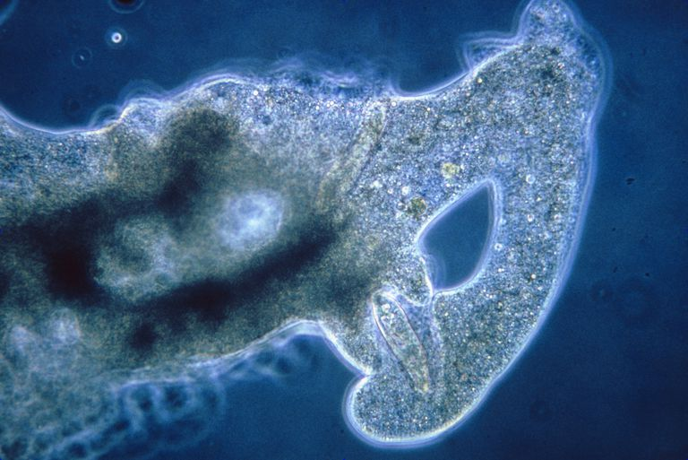

### Amoeba

A macro picture of an Amoeba. This is a single-cell organism and looks like it has a universe inside of it!

An amoeba having lunch. It extends pseudopodia to "hug" the victim. This shape-changing behavior is actually achieved through rapidly rebuilding microfilaments that support its shape into a different structure that pushes the external membrane into the desired direction. (may not be a completely accurate description, but gives an idea of what's going on).

### Ants Shoot Acid

Wood ants live in colonies. When threatened from above, the ants shoot volleys of formic acid into the air from their abdomens.

The acid bombards the potential predator, such as a hungry bird.

### How Heroin Works
Here's how heroin works.
Molecular shape is crucial to the function of any biological molecule. The shape determines how they recognize and respond to one another with specificity. They often bind to each other temporarily by forming weak interactions, such as the attraction of charged regions (positive to negative), but only if the shapes of those molecules are complementary.
Consider opiates: they relieve pain and alter mood by weakly binding to specific receptor molecules on the surfaces of brain cells.
Why would brain cells carry receptors for opiates, compounds that are not made by the body, but by poppy plants?
In 1975, the discovery of endorphines answered this question.
Endorphines are signalling molecules made by the pituitary gland that bind to the receptors, relieving pain and producing euphoria during times of stress, such as intensive exercise.
Opiates have shapes similar to endorphines and mimic them by binding to endorphin receptors in the brain. That is why opiates and endorphins have similar effects.

### Bombardier Beetle
This bombardier beetle is spraying a boiling hot liquid that contains irritating chemicals, used as a defense mechanism against its enemies. The beetle stores two sets of chemicals separately in its glands. While the chemicals are stored apart, they are harmless, but when the beetle mixes them, the chemical reaction causes an explosive discharge.

