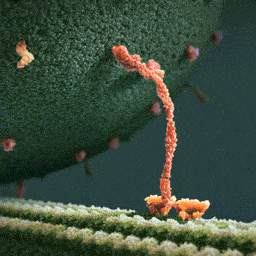

### Amoeba

A macro picture of an Amoeba. This is a single-cell organism and looks like it has a universe inside of it!

An amoeba having lunch. It extends pseudopodia to "hug" the victim. This shape-changing behavior is actually achieved through rapidly rebuilding microfilaments that support its shape into a different structure that pushes the external membrane into the desired direction. (may not be a completely accurate description, but gives an idea of what's going on).

### Ants Shoot Acid

Wood ants live in colonies. When threatened from above, the ants shoot volleys of formic acid into the air from their abdomens.

The acid bombards the potential predator, such as a hungry bird.

### How Heroin Works
Here's how heroin works.
Molecular shape is crucial to the function of any biological molecule. The shape determines how they recognize and respond to one another with specificity. They often bind to each other temporarily by forming weak interactions, such as the attraction of charged regions (positive to negative), but only if the shapes of those molecules are complementary.
Consider opiates: they relieve pain and alter mood by weakly binding to specific receptor molecules on the surfaces of brain cells.
Why would brain cells carry receptors for opiates, compounds that are not made by the body, but by poppy plants?
In 1975, the discovery of endorphines answered this question.
Endorphines are signalling molecules made by the pituitary gland that bind to the receptors, relieving pain and producing euphoria during times of stress, such as intensive exercise.
Opiates have shapes similar to endorphines and mimic them by binding to endorphin receptors in the brain. That is why opiates and endorphins have similar effects.

### Bombardier Beetle
The Bombardier beetle has an interesting defense mechanism: in case of danger, it sprays a  boiling hot liquid that contains irritating chemicals.

The beetle stores two sets of chemicals separately in its glands. While the chemicals are stored apart, they are harmless. In case of danger, the beetle mixes the chemicals in the reaction chamber. The chemical reaction produces heat, which raises the temperature of the liquid to 100°C. It boils, and shoots from the beetle's abdomen. The tip of the abdomen can move and steer the explosive discharge towards the enemy.

### Carbohydrates: How Plants and Animals use Sugar
The food that we eat, among other things contains carbohydrates. Carbohydrates is a class of molecules that includes sugars and composite sugars, *polymers*.

First of all, they are called *carbohydrates* because sugars primarily consist of Carbon atoms (the chain of carbons in the middle, called "carbon skeleton") and hydrogen atoms. Carbon-Hydrogen. Carbo-hydrates.

The hallmark of sugars, however, is the series of `-OH` hydroxyl groups and the double link with Oxygen (colored red), see picture.

Glucose is the most common sugar. It is of central importance to the chemistry of life because it is the fuel that cells use for biological processes. Everything that moves in you, does so thanks to glucose.

Fructose is the sugar that makes fruits and berries sweet.
Notice that the highlighted oxygen is at a different place. This makes the molecule the so-called "ketone sugar": . The rest of the molecule is same as glucose.

Fructose tastes sweeter than glucose. In the 1970s, a process was developed that converts the glucose in corn syrup into sweeter-tasting fructose. The result is the high-fructose corn syrup, which is also cheaper than table sugar. It's now an ingredient you commonly see in soft drinks and processed food.

The sugar that circulates in plant sap is not a simple sugar. It is a glucose and a fructose molecules linked together by an oxygen atom. This is called "sucrose", or table sugar. This double-sugar molecule is what we obtain from sugar cane and sugar beets. (picture)

Maltose, known as "malt sugar", is an ingredient used in brewing beer. It is extracted from malt: a substance obtained in the process of allowing grain to soften in water and germinate. It consists of two glucose molecules linked together.

Cow milk contains lactose: another composite sugar: a glucose joined to a galactose.

Such sugar molecules cannot be used by our body immediately: they must be broken down into simple sugars. Enzymes do that.

For instance, lactose — the milk sugar — is broken down into two simple sugars by lactase: an enzyme that breaks down lactose. Some people lack lactase and cannot effectively break it down. This lactose goes further, where intestinal bacteria feast on it, and the result is gas and diarrhea. This is how lactose intolerance works.

Such people can, however, take the lactase enzyme when eating dairy products and it will break down lactose for them. They can also choose dairy products that have already been treated with lactase to break down the lactose.

Sugars can be even bigger than that: when many sugars are joined together, this is called a *glucose polymer*, or a *polysaccharide*. It can be hundreds and thousands of units long.

Both plants and animals can stockpile glucose for later use, because glucose is the source of energy they may need.

Plants use **starch**: a polymer of glucose, in which many glucose molecules are linked to one another into long chains (top picture). The plants are able to remove pieces of this energy stockpile as needed.

When we each vegetables that contain starch, we can break the starch apart into glucose molecules because we have enzymes that can do that.

Animals also stockpile glucose, but as **glycogen**: it's like starch, but extensively branched. (bottom picture)

Vertebrates store glycogen mainly in liver and muscle cells which is used when the demand for sugar increases. The store is not large: in humans, for example, glycogen stores are depleted in about a day unless they are replenished by eating. This is an issue of concern in lo-carb diets which can result in weakness and fatigue.

Sugars are used not only for energy, bu also as building materials.

**Cellulose** is the strong material of which cell walls of plant cells are made. It consists of long chains of glucose, but unlike starch, this glucose is linked differently: every second glucose is upside down (picture).

This structure makes cellulose fibers very straight, so they can come close and stick to one another. The resulting fiber is a strong building material.

On food packages, "insoluble fiber" refers mainly to cellulose. Most animals cannot digest cellulose, however: because of its different shape, same enzymes do not work. So when we eat cellulose, it passes straight through the digestive tract. Along the way, however, it abrades intestinal walls and stimulates it to secrete mucus which aids the smooth passage of food through the tract.

Cows can digest cellulose: they have microorganisms living in their gut that does this for them. Thus, cows can eat grass, but we can't.

Insects also use sugars as structural material: **chitin** is a structural glucose polymer that arthropods (insects, crustaceans, etc) use to build their exoskeletons. This clever chemical is leathery and flexible at first, but becomes hardened when the proteins are chemically linked to each other.

### Fats
Fat molecules consist of a glycerol molecule (colored gray, on the left) with three fatty acids linked to it (colored orange). Glycerol is the base that holds the whole thing together, and the long hydrocarbon tails are the energy storage. In fact, they store as much potential energy as gasoline.

A gram of fat stores more than twice as much energy as a gram of sugar, such as starch. Animals have to carry their energy stores with them, so a compact form of energy storage makes sense. Plants, on the other hand, are immobile, and they are ok with bulky energy storage in the form of starch. But where mobility is an advantage, plants also use fats: in their seeds, which need to be mobile to spread. This is why vegetable oil is extracted from seeds.

These long carbon-hydrogen tails (orange, see image) are non-polar: they have no charged regions, and for this reason the molecule is *hydrophobic*: it repels water, which would only stick to regions of a molecule with partial electric charges.

This is why liquid fats, such as vegetable oils, don't mix with water. They don't bond to one another.

You may have heard that there are two types of fats: *saturated fats* and *unsaturated fats*.

The molecule of *saturated fat* has three tails where every carbon is bonded to as many hydrogen atoms as possible. Such a structure is said to be *saturated* with hydrogen (left image).

Most animal fats are saturated. Such molecules are compact and can pack together tightly: this is why saturated animal fats, such as lard and butter, are solid at room temperatures.

An *unsaturated fat* has fewer hydrogen atoms: a carbon forms a double-bond to another carbon instead (right image). The double bond creates a kink in the hydrocarbon chain and the shape is not linear anymore (the double line on the image).

The fats of plants and fishes are generally unsaturated. Because of the "kink", the molecules cannot stay close together to solidify, and such fats remain liquid at room temperature. We call them "oils".

Lipids are used not only for energy storage. There are structural lipids called **phospholipids**.

A **phospholipid** is a fat molecule with only two fatty acids (two "legs", colored orange), and a phosphorus group attached to its head (gray).

The "legs" have no polar regions, but the phosphate group creates a charged region at the head of the molecule. (yellow)

As a result of this charged region, the molecule's head is hydrophilic (has affinity to water), while the legs are hydrophobic (repel water). When in water, many such molecules tend to "put their heads together" and "hide their legs" away from water. This way, they self-assemble into a double-layered membrane, with heads attracted to water molecules, while the legs turn inward and away from water (see image, d).

Such membranes actually form the surface of the cell: their function is to separate the interior of the cell from the environment. If not for these membranes, cells wouldn't exist.

### Proteins
Proteins account for more than 50% of your dry mass, and they are responsible for almost everything that happens in your body.

Some proteins regulate and speed up chemical reactions (enzymes). Others act as a filter on cellular membrane, letting in some molecules and not others. Proteins store and transport useful molecules (hemoglobin transports oxygen). They provide defense against pathogens. They provide the means for signaling and communication. They implement mechanisms that let you move.

Proteins are the most structurally sophisticated molecules known, but they are all constructed from the same set of building blocks: 20 amino acids.

An amino acid is a molecule that has a carbon atom with two functional groups (see picture: the purple rectangles). These groups are able to attach to other amino acids so that they can form long chains.

This is what proteins are: long chains of amino acids, called **polypeptides**.

Every amino acid has these two "connector" groups, but each also has the "side chain" (see picture: the "R" group). This group differs from one amino acid to another and determines its physical and chemical properties. Some attachments give it a positive or a negative charge, making them able to make connections.

Typical proteins would have hundreds of amino acids, each perfectly in its place. The exact sequence of amino acids is encoded in the DNA. This code is read by molecular machinery which assembles together a chain of amino acids, one at a time. (see picture, left).

This chain has regions which are able to make connections: positively charged regions of the chain are attracted to negatively charged regions. Repeated sequences of charged amino acids make the protein spontaneously fold into helixes, other regions form pleated sheets (see picture, middle). Pleated sheets make additional bonds to one another and thus keep the molecule in shape.

The final shape of the protein is encoded as the sequence of amino acids, but the protein folding process is a complicated multi-step process. For this reason, among the 65 million known proteins, scientists only know the shape of 35 000 of them.

The shape can be quite complicated: see picture. Notice the familiar helixes and sheets that define the shape.

As a protein is manufactured, it's just a chain of amino acids. It is then precisely twisted, folded, and coiled into a molecule of unique shape.

A protein is like a tool which needs to have a specific shape in order to perform a function. One example we've seen is the receptor that reacts to endorphines because of its specific shape. It wouldn't perform if the shape was different.

An especially striking example of the marriage of form and function is the flu antibody: it's a protein with a particular shape that matches the shape of the flu virus. Because of the perfect match, the antibody binds to the virus and marks it for destruction.

See picture: on the left is the flu antibody protein. On the right is a protein from flu virus which the antibody matches perfectly and is thus able to attach to.

# Kinesin

Look at the animation of a motor protein, kinesin: it can travel along microtubules in your cells and carry cargo from one place to another. It knows what to carry, where to go, and when to stop. Millions of them are doing this inside you this very instant. And yes, they can walk!

These are the nano trucks that carry nutrients to places where they are needed, and they would pick up waste and expel it from the cell.
