# Удивительная Биология

# Амёба

Макрофотография амёбы. В её теле будто целая вселенная заключена.
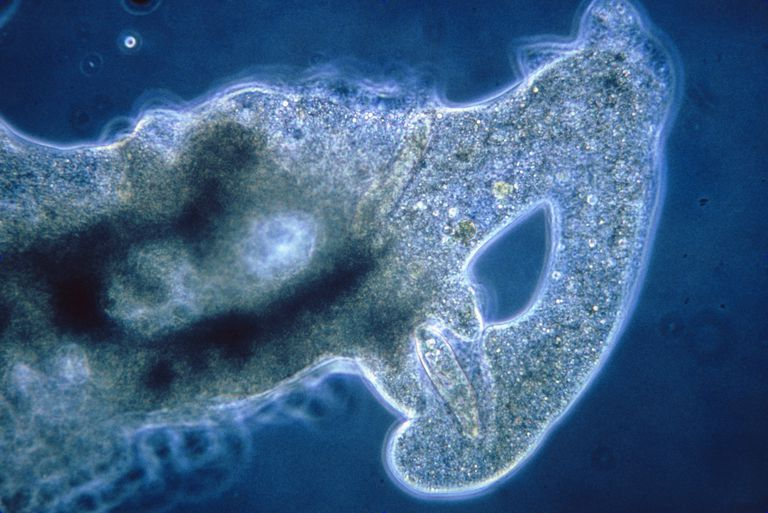

Амёба кушает.
Она выпускает ложноножки и обхватывает добычу со всех сторон. Удивительно, но изменение формы у неё происходит за счёт быстрого построения внутреннего каркаса из микротрубочек, поддерживающих форму клетки. На видео хорошо видно как перетекает её цитоплазма

# Муравьи стреляют кислотой

В случае опасности сверху, колония древесных муравьёв стреляют муравьиной кислотой в воздух.
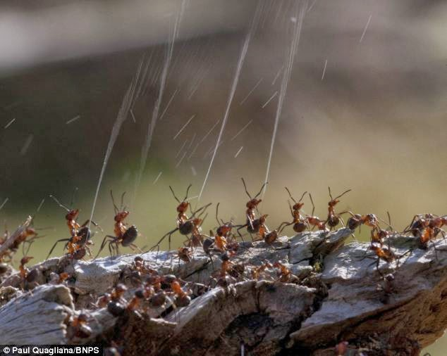

Подобная атака вполне способна отпугнуть хищника. Например, птицу
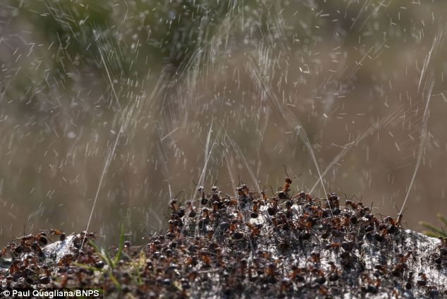

# Карликовый Морской Конёк
Сможешь найти спрятавшегося морского конька? Будет непросто, он мастер маскировки 😁

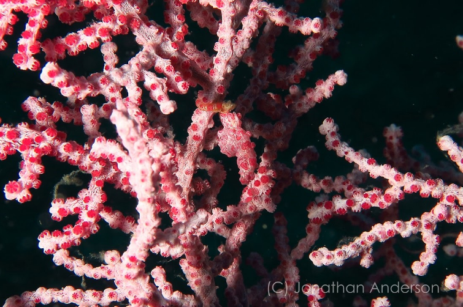

Хорошо, вот как он выглядит. Теперь можешь?)

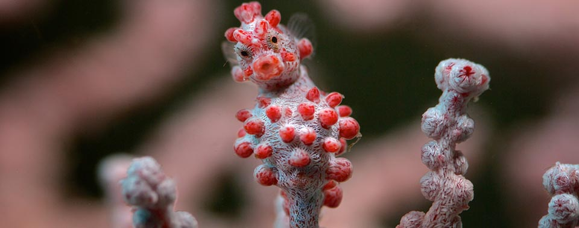

# Как работает героин?
Форма биологической молекулы определяет её функцию в организме: эта форма задаёт то, как биологические молекулы опознают друг друга и как взаимодействуют. Молекулы часто соединяются друг с другом, образуя слабые полярные связи (плюс к минусу), но только если формы этих молекул дополняют друг друга. То есть, если они идеально друг другу подходят по форме.

Например, давайте посмотрим на опиаты, такие как морфин и героин. Они утоляют боль, а также меняют состояние человека. Это происходит из-за того, что они связываются с определёнными молекулами в головном мозге: рецепторами.

Вопрос. Как так получилось, что в головном мозге человека есть рецепторы, которые реагируют на молекулы, произведённые не телом человека, а вообще маковыми растениями? Они-то тут при чём?

В 1975-м году, когда были открыты эндорфины, нашёлся ответ на этот вопрос.
Эндорфины — это сигнальные молекулы, которые производятся гипофизом, и связываются с рецепторами в головном мозге, смягчая боль и вызывая эйфорию во время физических нагрузок. Например, во время бега или тренировки.

Опиаты имеют форму, схожую с эндорфинами, и благодаря этой форме, могут связываться с теми же самыми рецепторами в мозгу. Вот почему опиаты и эндорфины имеют схожее действие на человека.

Иллюстрация. Слева -- молекула эндорфина человека. Справа -- молекула морфия. Квадратиком обведена та часть молекулы, которая является общей, и которая способна благодаря своей форме соединиться с эндорфиновым рецептором.

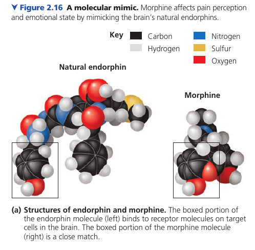

Иллюстрация. И естественный эндорфин (слева), и морфий (справа), способны соединяться с одним и тем же рецептором. Рецептор встроен во внешнюю мембрану клетки (на изображении: окружность) .
Воздействие на этот рецептор передаёт воздействие внутрь нейрона и вызывает ту реакцию, на которую эта цепочка запрограммирована.

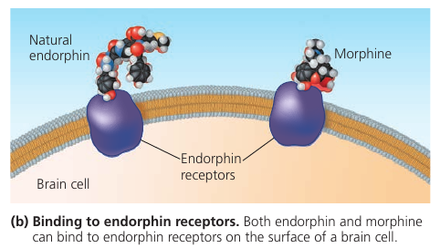

Дима:

> У героинового (и в принципе опиатного) наркомана постепенно прекращается синтез собственных эндорфинов. Организм видит, что аналог эндорфина поступает извне, и перестаёт расходовать ресурсы на создание собственного.
>
> А эндорфин очень нужная штука, на самом деле. Когда мы ходим, стоим, сидим, даже лежим — у нас там кости в суставах трутся, мышцы разные напрягаются и расслабляются, но мы этого не чувствуем. Все эти ощущения гасит эндорфин: он как бы задаёт ватерлинию, ощущения ниже которой мозгом игнорируются. Это так же задаёт болевой порог.
>
> Поэтому, что такое опиатная ломка? Это ощущение своего организма "как есть", чистое ощущение, не убаюканное эндорфином. И это очень и очень страшно и больно в плане ощущений — пережившие говорят, как будто всё тело засунули в мясорубку и проворачивают в фарш.
>
> Но несмотря на жуткие ощущения, опиатная ломка — довольно безопасное для организма состояние. Ничего реально страшного в принципе не происходит: ведь ты просто ощущаешь каждые движения, соприкосновение костей, сокращения и расслабления мышц внутри твоего тела. Но это настолько кошмарные ощущения, что люди кончают с собой от адских мук, и даже понимание процесса им вообще не помогает.

# Жук Бомбардир
У жука-Бомбардира интересный механизм защиты от врагов: в случае опасности он прыскает кипящей жидкостью которая содержит раздражающие химикаты.

Жук хранит реагенты в своём теле в раздельных камерах: когда химикаты разделены, они безопасны. В случае опасности жук сжимает стенки резервуара, химикаты изливаются в общую камеру, и там происходит реакция с выделением тепла. Жидкость нагревается до 100℃, вскипает, и выстреливает из брюшка. Кончик брюшка подвижен и позволяет направлять струю жидкости точно на врага.

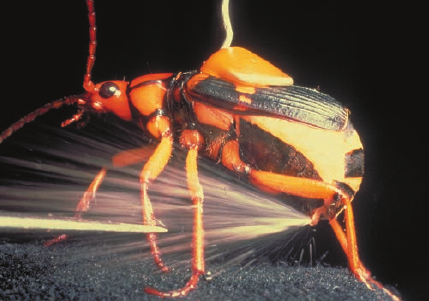

# Углеводы: Как Растения И Животные Используют Сахар
Если почитать состав на коробке еды, можно заметить что там есть "углеводы". Углеводы — это класс молекул, которые включают в себя сахара и составные сахара, *полимеры*.

Начнём с того, почему они так называются. Углеводы состоят из атомов углерода (эта цепочка углеродов на изображении называется "углеродный каркас") и водородов. Углерод-вородород. Угле-воды. Отсюда и название.

Однако это не всё. Чтобы попасть в категорию "углеводы", молекула должна так же содержать несколько `—OH` групп, и двойную связь с одним кислородом (выделено красным на рисунке).

Важнейший сахар — глюкоза (картинка): это то самое топливо, которое клетки используют как источник энергии. Всё что в тебе шевелится, шевелится благодаря глюкозе.

Фруктоза — это сахар, дающий сладкий вкус фруктам и ягодам.
Обратите внимание на переместившийся кислород (выделенный красным, картинка). Такое положение говорит, что это так называемый "кетон". Остальная часть молекулы не отличается от глюкозы.

Фруктоза на вкус слаще глюкозы. В 1970-х произошло важное событие: была разработана методика преобразования глюкозы из кукурузного сиропа в более сладкую фруктозу. В результате получился кукурузный сироп с высоким содержанием фруктозы: этот ингридиент слаще, дешевле, и теперь его можно заметить в составе лимонадов и полуфабрикатов.

Сок растений содержит сахар, но это не глюкоза. Там содержится более сложная молекула: глюкоза, соединённая через атом кислорода с фруктозой. Такая молекула называется "сахароза", или наш обычный столовый сахар (картинка). Именно такую молекулу мы получаем из сахарного тростника и сахарной свёклы.

Мальтоза, также известная как "солодовый сахар", используется в пивоварении. Он получается из солода, когда тот побродит в воде. Мальтоза состоит из двух глюкоз, соединённых вместе.

Молоко содержит лактозу: ещё один сахар. В нём глюкоза соединена с галактозой.

Такие составные молекулы не могут использоваться нашим организмом сразу: они должны быть разбиты на более простые сахара. Этим занимаются ферменты.

Например, лактоза — "молочный сахар" — раскладывается на два простых сахара ферментом под названием "лактаза". У некоторых людей нет лактазы, и соответственно, они не могут перерабатывать лактозу. На эту неусваивающуюся лактозу набрасываются кишечные бактерии, которые в результате дают газ и диарею. Так работает непереносимость лактозы.

Люди с непереносимостью лактозы могут есть молочные продукты, но им нужно будет отдельно принять фермент лактазу, чтобы он расщепил лактозу на простые сахара. Существует также молочная продукция, уже обработанная лактазой.

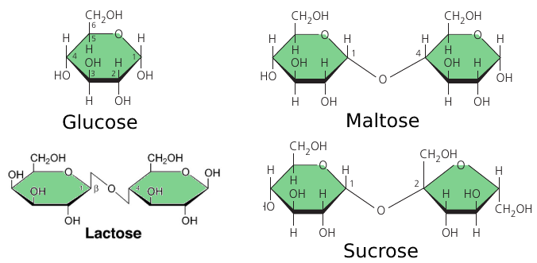
Мы посмотрели на простые углеводы. Но бывают и намного более длинные цепочки сахаров: они называются *полисахариды* (поли = много), и состоят из множества соединённых вместе глюкоз. Такой *полимер* может быть длиной сотни и тысячи единиц.

И растения, и животные, складируют глюкозу в виде таких цепочек, потому что это источник энергии, которая может пригодиться.

Растения используют **крахмал**: полимер, в котором множество молекул глюкозы соединены в длинные цепочки (верхняя картинка). Растения способны отщипывать кусочки этой цепи если есть потребность в энергии.

Мы тоже можем пользоваться этой энергией. Когда мы съедаем овощ, содержащий крахмал, он расщепляется на составляющие, потому что у нас есть ферменты которые этим занимаются. В результате получаются маленькие глюкозки, которые мы можем использовать для получения энергии.

Животные тоже складируют глюкозу, но в виде **гликогена**: он как крахмал, но сильно ветвится. (Нижняя картинка)

У позвоночных, гликоген откладывается в-основном в печени и в мышечных клетках. Он используется, когда возникает потребность в сахаре. Однако эти запасы невелики: у человека, например, запас гликогена иссякает за день, если его не восполнять приёмом пищи. В этом проблема диет с низким содержанием углеводов: может начаться слабость и усталость.

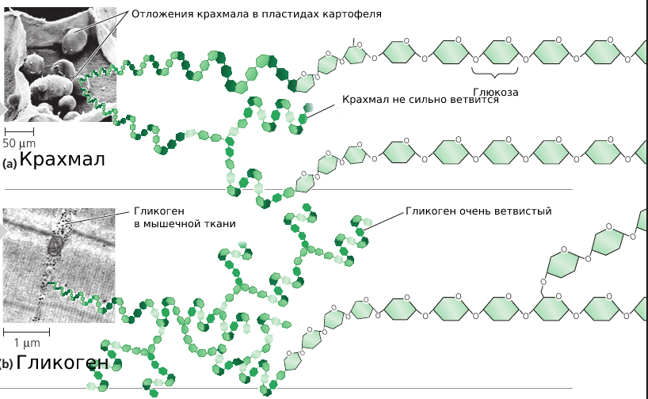

Сахара используются не только как источник энергии, но так же как стройматериал.

**Целлюлоза** — это крепкий материал, из которого сделаны стенки клеток растений. Он состоит из длинных цепочек глюкозы, в которых, в отличие от крахмала, каждая вторая глюкоза размещена вверх ногами (картинка).

Благодаря такой структуре, волонка целлюлозы получаются очень прямые, и благодаря этому они могут находиться близко друг к другу и прилипать. В итоге получается прочное волокно.

На упаковке еды, "клетчатка" указывает на целлюлозу. Но большинство животных не могут её переваривать: из-за того, что у неё отличается форма, те же самые ферменты уже не способны её обработать. Так что когда мы едим целлюлозу, она проходит насквозь. Однако по пути она стимулирует стенки кишечника на выработку слизи, которая способствует более лёгкому прохождению пищи через желудочно-кишечный тракт.

Коровы могут переваривать целлюлозу: для этого у них в кишечнике живут специальные микроорганизмы, помогающие её расщеплять. Поэтому коровы могут есть траву, а мы — нет.

Насекомые тоже используются сахар как стройматериал: **хитин** — это полимер глюкозы, который членистоногие (насекомые, ракообразные, и др.) используют для своего экзоскелета. Это хитрое химическое соединение кожистое и мягкое, но со временем твердеет благодаря тому, что протеины химически связываются друг с другом.

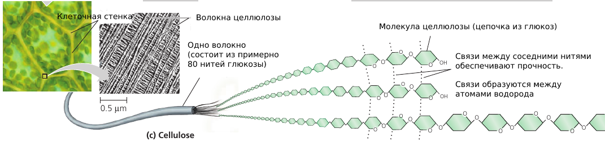

# Круговорот Глюкозы
Ещё в школе мы слышали про фотосинтез: растения поглощают углекислый газ и выделяют кислород. Благодаря этому процессу нам есть чем дышать.

А вот вопрос. Зачем растения это делают? Для чего им нужен углекислый газ? А кислород они зачем выделяют, для нас что ли?

Давайте посмотрим на формулы. Растение поглощает углекислый раз, это `CO₂`. А выделяют кислород, это `O₂`. После этого самому растению остаётся углерод `C`.

Из этого углерода растение производит углеводы: глюкозу, которая, как мы видели, состоит из атомов `C`, `O`, `H`.

Глюкоза образуется с помощью энергии света: то есть, растение запасает солнечную энергию и "складывает" её в молекулы глюкозы. Лишний кислород при этом выбрасывается. Он просто лишний.

Далее животное съедает растение, и получает ту самую энергию в виде глюкозы. На этой энергии животное может двигаться, жить, и осуществлять другие клеточные процессы.

Однако чтобы превратить глюкозу в энергию, требуется кислород. Животное вдыхает `O₂` и использует его в реакциях окисления, которые на выходе дают энергию. При этом процессе образуется лишний `CO₂`, которое животное выдыхает.

Поскольку энергия, которую мы получаем из съеденных углеводов, является энергией солнца, можно сказать, что тепло и движение нашего тела — это энергия звёзд :)

Далее этот `CO₂` улавливается другими растениями и снова превращается в глюкозу. Получается так называемый "цикл углерода в природе".

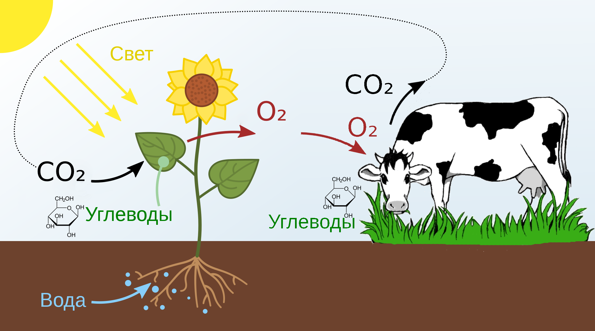

# Жиры
**Жир**. Тот самый, который мы гоняем с живота и боков. Он откладывается внутри клеток, состоящих из жировой ткани, которые способы этот самый жир накапливать, и возникновении потребности в энергии, отдавать. Давайте посмотрим, из чего состоит сам жир.

Жиры состоят из молекулы глицерина (серая, слева на изображении) с тремя присоединёнными к нему жирными кислотами (выделены оранжевым). Глицерин — это основа, которая держит всю молекулу вместе, а длинные "хвосты" углеродов с водородами запасают энергию. В этих "хвостах", между прочим, запасено столько же энергии сколько в бензине, на котором ездят наши машины.

Один грамм жира хранит в два с лишним раза больше энергии, чем крахмал. Животным нужно таскать все свои запасы энергии с собой, поэтому более компактное хранилище имеет смысл. А растениям мобильность не требуется, поэтому им вполне подходит запасание в громоздком крахмале, который обычно откладывается в корнях и корнеплодах.

Однако обратите внимание: в семенах растения содержится не крахмал, а жир, в форме масла. Семенам требуется компактность и мобильность, поэтому громоздкий крахмал тут не годится. Всё продумано :)

В итоге жиры — это компактное хранилище запасённой энергии.

Молекула жира обладает интересным свойством: она гидрофобна (от греческого "гидро" — вода, "фобия" — страх). Жир, кажется, отталкивает воду: капли воды скатываются с жирной поверхности. Это происходит потому, что вода притягивается к положительно или отрицательно заряженным областям, а у жиров таких областей нет, и поэтому вода просто проходит мимо, вместо жира кучкуясь сама с собой.

Поэтому гусь, чьи перья смазаны жиром, не намокает в воде, а ты выходишь весь мокрый, и волосы тоже приходится сушить.

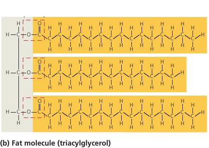

Вспомним, в каком виде бывает жир в нашей пище?

Животный жир это сливочное масло, и оно твёрдое. А растительный жир -- это растительное масло, и оно жидкое. Рыбий жир тоже жидкий. Откуда такая разница?

Потому что жир бывает двух видом.

Молекула *насыщенного жира* имеет три "хвоста", где каждый углерод связан с двумя водородами. Больше не влезает по валентности. Такая структура "насыщена" водородом (левое изображение).

Жиры животного происхождения обычно насыщенные. Такие молекулы длинные, ровные, стройные, и могут плотно прилегать друг к другу: поэтому насыщенные животные жиры, такие как сало и масло, при комнатной температуре достаточно тверды и не растекаются.

*Ненасыщенный жир* содержит меньше атомов водорода: в них один углерод вместо этого образовал двойную связь с соседом (см. правую картинку). Эта двойная связь также создаёт перегиб в цепи, и форма молекулы уже не получается ровной.

Жиры растений и рыб обычно ненасыщенные. Из-за перегиба у молекулы хвост торчит в сторону, и такие молекулы уже не могут плотно прилегать друг к другу. При комнатной температуре они остаются в жидкой форме.

Но вспомним, что маргарин — это тоже растительный жир, но он твёрдый. Как же так?
Дело в том, что маргарин когда-то был жидким, но его пропустили через процесс добавления водорода (т.н. "гидрогенизация", от слова hydrogen: водород), и большинство жиров стали насыщенными. Молекулы выпрямились, стали стройными, и плотнее прилегают друг к другу. Теперь такой жир может затвердеть и стать маргарином.

Так, маргарин — это обработанное растительное масло :)

Есть ещё так называемые *транс-жиры*: они вредные и увеличивают вероятность сердечно-сосудистых заболеваний. ВОЗ даже рекомендует их полностью удалить. В небольших количествах такие жиры присутствуют в мясе жвачных животных, но в больших количествах они образуются при *гидрогенизации* масла, то есть, при производстве маргарина.

Отличается транс-жир от обычного ненасыщенного только тем, что "излом" повёрнут в другую сторону. А поскольку в метаболизме форма молекулы играет ключевую роль, это немаловажная деталь.

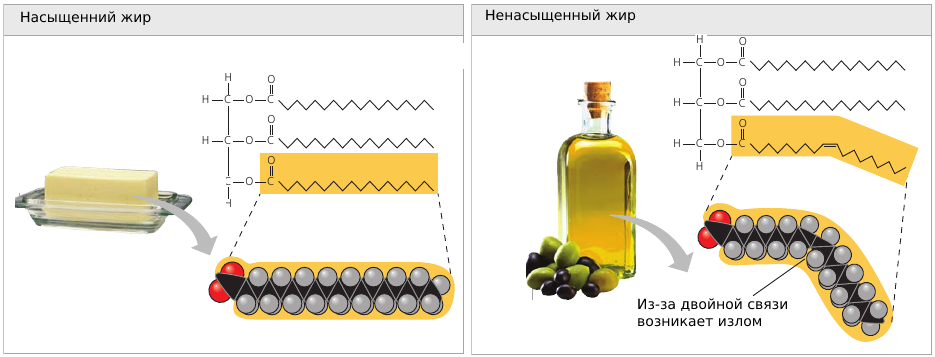

Не все жиры используются как хранилище энергии. Есть жиры в составе клетки: например, **фосфолипиды**.

**Фосфолипид** это молекула жира у которой только две жирные кислоты (на картинке: два хвоста, выделены оранжевым), и группа с фосфором в "голове" этой молекулы (серый).

Фосфор в "голове" молекулы создаёт заряженную область (выделено жёлтым). Из-за такого распределения зарядов, голова получается гидрофильной (притягивается к воде), а ножки -- гидрофобными (отталкиваются от воды).

Когда такие молекулы попадают в воду, они стараются развернуться "головой" к воде и спрятать "ножки" в сторону. В итоге такие молекулы кучкуются и самостоятельно собираются в целое покрывало: двухслойную мембрану, чья внешняя поверхность касается воды "головами" фосфолипидов, в то время как "ножки" отвёрнуты и скрываются внутри мембраны (см. изображение, d).

Такие мембраны составляют внешнюю оболочку клетки, и их функция — отделять внутренность клетки от внешней среды. Если бы не мембраны, клетки вообще бы не смогли существовать.

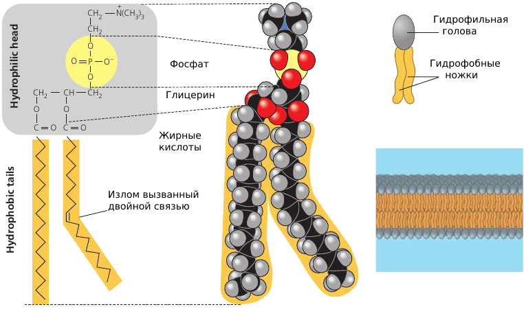

# Белки (Протеины)
Более половины сухой массы вашего тела — это **белки**, которые осуществляют практически все процессы, происходящие внутри вас.

Одни протеины регулируют и ускоряют химические процессы: это ферменты. Другие работают как врата на клеточной мембране, пропуская внутрь только определённые молекулы. Белки умеют захватывать и переносить с места на место разные полезные молекулы, как например, гемоглобин в крови обхватывает и переносит молекулы кислорода. Белки обеспечивают защиту от патогенов. Белки осуществляют сигнализирование и коммуникацию. Они реализуют механизмы, благодаря которым вы можете шевелиться.

Белки — это самые крупные и сложные среди молекул, но они составляются из небольшого набора строительных блоков: 20-ти аминокислот.

**Аминокислота** — это молекула, в центре которой находится атом углерода, к которому присоединены две функциональные группы (см. рисунок: два фиолетовых прямоугольника). Эти группы позволяют двум аминокислотам соединяться друг с другом, и так они образуют длинные цепочки.

Каждая аминокислота, помимо двух "соединяющих" групп, имеет также "радикал". Этот радикал — разный для разных аминокислот, и именно он задаёт её физические и химические свойства. Так, некоторые радикалы задают положительный или отрицательный заряд, позволяя им соединяться друг с другом.

Когда много таких разных по своим свойствам аминокислот соединяются и собираются в длинную цепочку, эта цепочка обладает определёнными свойствами в разных своим регионах. Например, некоторые аминокислоты могут образовывать дополнительные связи, и тогда цепочка, соединяясь сама с собой, сворачивается в более сложную форму. Другие аминокислоты имеют электрический заряд, и позволяют этой области белка соединяться с другими заряженными белками.

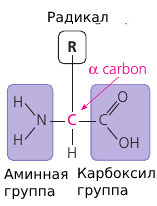

Мы соединили две аминокислоты. А белок обычно состоит из сотни аминокислот и более, и каждая из них подобрана так чтобы у белка были определённые свойства в нужном месте.Конкретная последовательность аминокислот закодирована в ДНК: в соответствии с этим кодом, рибосома (специальная молекулярная фабрика по сборке белков) подбирает нужные аминокислоты и соединяет их в цепочку, соответствующую коду ДНК (см. картинку, слева).

Благодаря радикалам, в этой цепочке есть области, которые могут образовывать связи: положительно заряженные области притягиваются к отрицательно заряженным областям. Когда множество таких притяжений стягивают белок в нескольких местах, образуется трёхмерная структура: спирали (альфа-спирали) и бета-складчатые листы (см. картинку, в середине). Так молекула начинает получать форму.

В свою очередь, складчатые листы с краёв тоже могут образовывать связи, и два листа, притянувшись друг к другу, способны прочно удерживать форму всей молекулы.

Итоговая форма белка закодирована в последовательности аминокислот, но процесс свёртки белка очень сложный и многоходовый. По этой причине, из 65 миллионов известных белков, мы узнали форму только 35 000.

Форма итогового белка может быть достаточно сложной, см. картинку справа. Обратите внимание на знакомые спиральки и плоские листы, которые задают эту форму. А форма молекулы — это важнейшая деталь: только имея правильную форму, она сможет выполнять свою фукнцию.

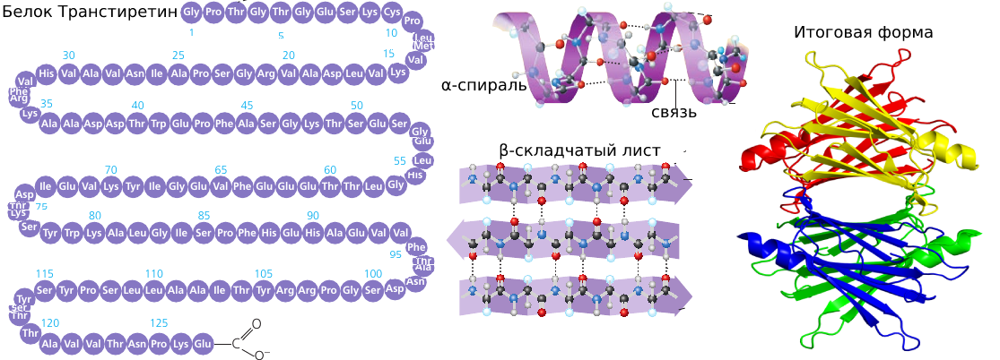

Длинная цепочка аминокислот собирается в белок, но изначально он — просто лента. Далее этот белок сгибается в нужных местах, определённым образом складывается и скручивается, наконец приобретая конкретную трёхмерную форму. Благодаря областям, притягивающимся друг к другу, лента белка сворачивается в трёхмерный объект.

Белок — это инструмент, и его форма должна быть подходящей, чтобы он мог выполнять свою функцию. Один пример мы уже видели: химический рецептор, взаимодействующий с эндорфинами благодаря своей форме. Если бы форма рецептора отличалась, он бы не смог работать: например, эндорфины бы не подходили ему по форме или распределению зарядов, и контакт бы не происходил.

Особенно впечатляющий пример, где от формы протеина зависит его функция, это антитела, которые наш организм вырабатывает к вирусу гриппа. Антитела — это белок, у которого должна быть такая форма, чтобы идеально подходить к вирусу. В таком случае антитело способно соединиться с вирусом и таким образом "пометить" его к уничтожению имунной системой.

См. изображение: слева — белок антитела. Справа — часть вируса гриппа, к которому антитело идеально подходит и соединяется с ним.

Точно так же антитела к коронавирусу определяют вирус: при помощи белка, который совпадает с ним по форме.

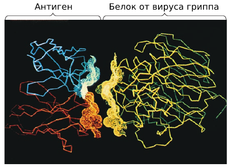

# Кинезин
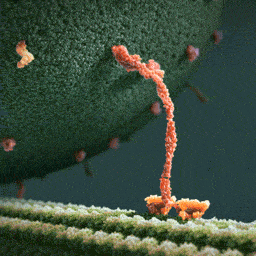

Перед вами моторный белок кинезин. Эта удивительная молекулярная машина перемещается вдоль микротрубочек в ваших клетках, и миллионы таких трудятся внутри тебя прямо сейчас. Они способны подцепить нужный груз и тащить его. Они знают, в какой момент нужно остановиться и выгружать. Такие миниатюрные наногрузовички, которые занимаются доставкой полезных веществ и выведением продуктов жизнедеятельности.

# Зомбирующий Гриб
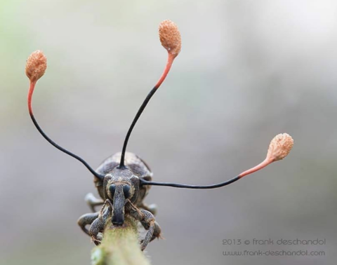

Долгоносик на картинке заражён грибком Кордицепс (*ophiocordyceps curculionum*), также известном как **зомбирующий гриб**.

У кордицепса более 400 видов, каждый из которых специализируется на заражении одного конкретного вида насекомых. Гриб выпускает споры, которые способны пробивать экзоскелет (панцирь) и контролировать мышцы насекомого. Находясь под управлением грибка, насекомое карабкается на определённую высоту, фиксируется на стволе растения, и потом медленно умирает.

Грибок в это время кормится внутренностями насекомого, пока не будет готово принести плод. Эти большие антенны, выглядящие словно они с другой планеты, и есть плоды грибка: утолщение на конце лопнет и выпустит споры, которые разлетятся и будут искать новые жертвы среди долгоносиков, чтобы точно так же их убить.

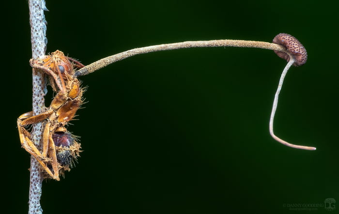

Другой вид того же самого грибка специализируется на муравьях. Споры прикрепляются к их экзоскелету и проникают внутрь, растворяя его ферментами и оказывая механическое давление. Попав внутрь, грибок распространяется по всему телу, находя мышцы, и проникая даже в область мозга, где он может контролировать поведение муравья.

Гриб не управляет мозгом, нет. Но он выпускает химические вещества, которые нарушают его работу. В результате у муравья случаются внезапные судороги, и он сваливается на землю. Там он начинает карабкаться по какой-нибудь травинке на комфортную для грибка высоту 26см. На нужной высоте муравей мощно закусывает веточку, и так и остаётся на ней, надёжно зафиксированный собственными челюстями. Мышцы муравья очень быстро атрофируются, и муравей, ещё живой, становится уже не способен ими управлять.

Грибок продолжает кормиться телом муравья до тех пор, пока не даст плоды.

Интересен механизм, управляющий поведением муравья. Грибок, находясь около мозга муравья, выпускает различиные химические вещества, которые воздействуют на него, изменяя поведение. При этом тот же грибок, находящийся около мышечной ткани, выпускает другие химические вещества. То есть, грибок способен определять, около какой ткани он находится. Грибок так же чувствует, жив ли носитель, и когда тот умирает, секреция грибка тоже меняется.

Зомбирующй гриб способен уничтожить целую колонию муравьёв, образуя кладбища диаметром в 20-30 метров.

# Плазматическая Мембрана
Каждая живая клетка окружена мембраной. Мы обычно думаем, что это такая оболочка, отделяющая клетку от внешней среды. Но мембрана умеет намного больше, чем кажется на первый взгляд.

Клетке для жизнедеятельности нужнен кислород и питательные вещества, так мембране нужно уметь впускать их внутрь клетки. Но мембрана не должна запускать внутрь всё подряд, но быть избирательной. При этом, в клетке образуются отходы, от которых нужно избавляться, и мембрана должна уметь их выпускать. Но она не должна выбрасывать из себя всё подряд.

Поэтому мембрана обладает *выборочной проницаемостью*. Она контролирует проход веществ изнутри наружу, и снаружи вовнутрь, определяя, что и куда может пройти.

Некоторые вещества могут постепенно сочиться сквозь мембрану: например, глюкоза, аминокислоты, жирные кислоты, и прочие. Это пассивная проницаемость. Но есть и активная траспортировка, которую обеспецивают белки, встроенные в мембрану (см. картинку, фиолетовые вставки). Эти белки работают как транспортировочные механизмы, которые прокачивают через себя определённые молекулы: `K`, `Na`, `Cl`, `H₂O`, и другие. Некоторые из них действуют постоянно; другие активируются только по сигналу.

В мембране также могут быть вставлены ферменты: молекулярные конструкции, которые проводят определённые химические реакции. Например, в кишечнике в оболочку клеток встроены пищеварительные ферменты, которые разлагают сложные сахара на простые, разбирают сложные белки на аминокислоты, и все эти базовые компоненты усваиваютс организмом для того, чтобы использовать в собственных клетках.

На поверхности мембраны также есть углеводные "хвостики" (см. картинку, зелёным цветом). Эти поверхностные углеводы выполняют функцию маркеров: это как паспорт клетки, по которому они узнают друг друга. В частности, поверхностные углеводы позволяют имунным клеткам опознавать клетки организма, то есть "своих", и отличать их от "чужих". Благодаря этому механизму, имунные клетки атакуют чужеродные бактерии, но не трогают клетки нашего организма.

Так что мембрана — это не просто мешок. Это паспорт клетки. Это избирательный насос. Это поверхность, проводящая химические реакции. И это граница, решающая, что пропустить внутрь, а что нет.

Оказывается, это очень умный мешок.

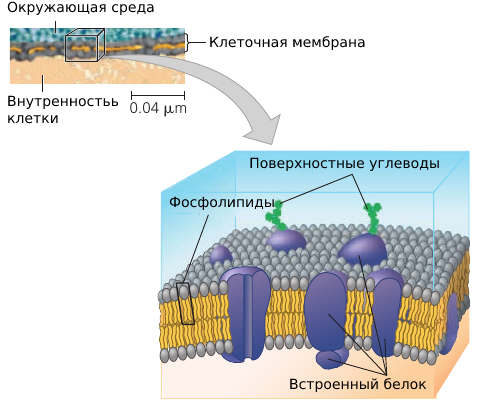

У некоторых писателей-фантастов можно встретить больших разумных одноклеточных существ. Но как оказывается, существование крупной клетки невозможно из-за нюансов с мембраной.

Проблема в том, что у мембраны ограниченная поддерживать клеточный метаболизм (её химические процессы). Так как мембрана имеет выборочную проницаемость, каждый микрометр её площади способен проводить только некоторое количество вещества в секунду. Таким образом, очень важно́ соотношение площади поверхности клетки к её объёму.

С увеличением размера клетки, площадь её поверхности растёт, но растёт медленнее чем объём. В какой-то момент мембрана просто не сможет проводить достаточно веществ для поддержки всех процессов, происходящих в клетке. Она просто становится слишком большой, и мембрана не будет успевать.
(Если закопаться в математику, то вспомним, что объём шара пропорционален кубу его радиуса `r³`, в то время как площадь поверхности пропорциональна лишь квадрату радиуса `r²`, так что площадь поверхности всегда отстаёт).

Эта закономерность объясняет, почему все клетки такие маленькие: потому что у них должна быть площадь поверхности, достаточная для поддержания процессов в объёме клетки.

Однако клетки не шарики. Есть геометрические хитрости, которые используются для того, чтобы увеличить площадь поверхности. Многие клетки имеют вытянутую форму. У других клеток есть **микровилли**: такие выступы, похожие на ворсинки: они тонкие, имеют малый объём, но при этом имеют много поверхности.

Для примера взглянем на клетки кишечника, которым нужно уметь оперативно проводить обменные процессы, а для этого требуется много поверхности. Во-первых, у тонкого кишечника множество складок. Эти складки шершавые: на их поверхности имеются ворсинки ("вилли"), но это не волоски, а выступы эпителия, в каждом из которых есть капилляры и лимфатические сосуды (см. картинку). Наконец, клетки эпителия также имеют выступы: **микровилли**, которые ещё больше увеличивают площадь поверхности.

Таким образом, в кишечнике используются геометрические хитрости для того, чтобы увеличить площадь поверхности и эффективно переваривать то вкусное блюдо, которым вы сегодня пообедали.

The outer membrane is actually not the only membrate a cell has.

In addition to the plasma membrane, plant and animal cells have extensive, elaborately arranged internal membranes that divide the cell into compartments: **the organelles**. The compartments provide different local environments that support specific metabolic functions, so incompatible checmical processes can occur simultaneously in a single cell.

All membranes participate directly in the cell's chemical processes because many enzymes are built right into the membranes. Each type of membrane has a unique composition, suited to its specific functions.

For instance, the endoplasmic reticulum (see image: the blue structure). It is the cell's biosynthesis factory. Its membrane is filled with enzymes: tools that carry out specific chemical reactions. They make fats, steroid hormones, process carbohydrates, and carry out other reactions. It also detoxifies drugs and poisons. In response to increased dosages of drugs, poisons, and alcohol, the endoplasmic reticulum would grow, increasing its detoxifying rate. This is how a person can get used to drugs, poisons, and alcohol, so that larger doses are necessary.

Consider the nucleus: it is the central part of the cell where the DNA redides (see picture: the violet structure). The nucleus is surrounded by a membrane which has pores (see picture: pimples on the nucleus). These pores are not just holes: these are intricate protein mechanisms that can recognize large molecules by specific signal sequences and then actively transport them through the pore. Its performance is incredible: one pore can actively conduct 1000 translocations per second.

The endoplasmic reticulum (see image: again, the blue structure) also has areas where ribosomes are built into membranes. As a copy of some DNA gene (called *RNA*) leaves the nucleus through the pore, it may attach itself to a ribosome. The ribosome is a molecular factory that reads the DNA code like tape: instruction by instruction, the code is executed, and a protein is assembled from the amino acid sequence specified in that code.

Once proteins are produced, they can leave the reticulum, which has an interesting solution for their transportation. The reticulum's membrane can form vesicles: "bubbles" of membrane that enclose proteins and act as shipping containers. Some vesicles would go to the golgi apparatus (see image, green structure) where the membrane of the vesicle fuses with it, releasing proteins. They would undergo further processing, then some of them would leave the cell in another vesicle (see image: this greenish bubble on the image).

Remember the motor protein? It was carrying a large bubble: a vesicle, a shipping container for biological molecules. The motor protein delivers it to a proper place. For instance, to the plasma membrane, where the bubble fuses with it and leaves the cell.

This is how secretion works. From the DNA in the nucleus, all the way to the plasma membrane.

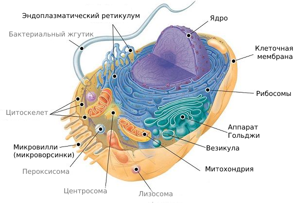

# Lysosome
Wonder how cells keep themselves young?

Have a look at the **lysosome**: a sac made of membrane with enzymes that can digest large molecules such as sugars, fats, and proteins. These enzymes require acidic environment for their function: an environment that would be dangerous to cell's organelles, so this environment is localized to a lysosome. A dangerous sac of digestive stuff.

Lysosomes are used to digest things when they get inside the cell. Single-celled organisms, such as protists, eat by engulfing smaller organisms and food particles. This engulfing creates a *food vacuole*: a membrane that surrounds the food. A lysosome then fuses with it, and the enzymes digest the food (see image, left).

This digestion process is actually the breaking up of large molecules into smaller ones. Complex sugars are broken down into simple sugars, and proteins are broken down into amino acids. So, whatever the prey was made of, is disassembled into the basic building blocks of life. The cell can use them for its own purposes.

Lysosomes are also used to recycle the cell's own parts. In a process called *autophagy* (Greek "auto", self, and "phagos", devour) a damaged organelle becomes surrounded by a double membrane of unknown origin. A lysosome fuses with it and releases digestive enzymes that dismantle the enclosed material (see image, right).

The resulting small organic building blocks are then released into the cytoplasm for reuse. Out of this material, a new, healthy, organelle may be built to replace the destroyed one.

 With the help of lysosomes, the cell continually renews itself. A human liver cell, for example, recycles half of its macromolecules each week!

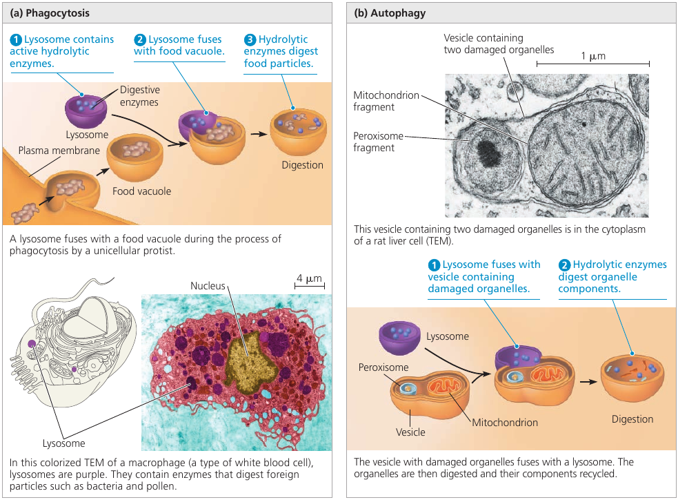

# Vacuoles
Why do plants wither when you do not water them?

Plant cells have a **central vacuole**: a large bubble, surrounded by a membrane, that contains cell sap. This is the cell's main repository of water and inorganic ions.

Plants can't walk, so when it rains, they have to store as much water as they can. A plant absorbs water, and excessive water is stored inside this central vacuole. It becomes bigger as more water is absorbed, and can become really huge: up to the point where the rest of the cell occupies only a thin layer between the central vacuole and the plasma membrane.

When there's no more rain, the plant still needs water, and it's taken from the central vacuole, which starts to shrink. As the water is used up, the vacuole becomes smaller and smaller, and you can see that a plant withers: because all of its cells have shriveled.

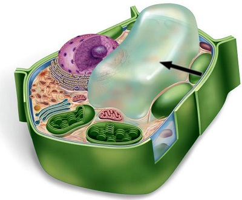

# Реснички на поверхности ваших лёгких
Ваша трахея — это не просто труба для воздушного потока. Они также умеют поддерживать ваши лёгкие в чистоте.

На поверхности трахеи и бронхов находятся реснички: небольшие волоски которые совершают возвратно-поступательное движение. То есть, машут вперёд-назад :) Этим движением они, как маленькие вёсла, заставляют двигаться слизь, которая содержит пыль и прочие лишние частицы, попавшие в лёгкие. Благодаря их работе эта слизь движется вверх, и достигает горла, где мы её откашливаем и избавляемся от неё.

Так ваши лёгкие самоочищаются. Ресничками.

Реснички также находятся в трубах, ведущих от яичников: реснички выстилают их поверхность и продвигают яйцеклетку к матке.

Одноклеточные организмы тоже могут иметь реснички: множество ресничек на поверхности такой клетке совместно гребут жидкость и позволяют клетке продвигаться вперёд.

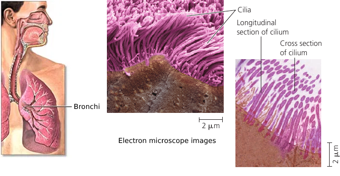

# Cilia and Flagella
Some cells have small cilia to row through the liquid, but others, such as sperm cells, have a long tail-like **flagellum**. A flagellum performs an undulating motion like the tail of a fish (see image, left).

As simple as it looks, the flagellum is a marvelous molecular mechanism.

It consists of microtubules (see image, colored yellow) arranged in the so-called "9 + 2" pattern: 9 pairs of microtubules are arranged around the central pair. All microtubules are linked by elastic proteins (see image, colored blue).

The bending movement is produced by large motor proteins called **dyneins** (see image, colored red): arrays of them are attached to microtubules. They have feet that push the adjacent pair of microtubules, causing them to slide past each other. When this "frame" changes shape, the flagellum bends.

The push of dyneins is coordinated by molecular signals: the "push" happens only one one side of the flagellum at a time. When the coordination signal changes, the other side of the flagellum become active, bending it into the opposite direction. Bending left, then bending right. The result is the fish-like swimming motion that propels the cell.

A larger picture of this *dynein* motor protein is shown in the circle at the bottom (see image): it's base is attached to one microtubule at the top, and its leg pushes the adjacent microtubule at the bottom.

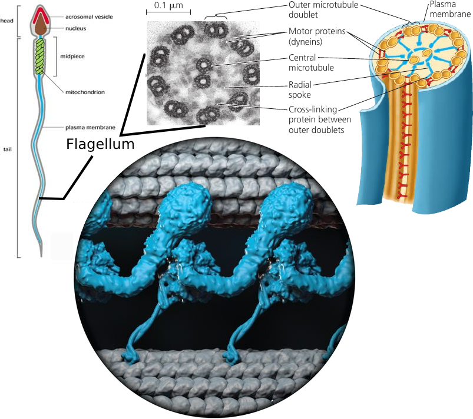

Click this video to see this thing in action!

# Сокращение Мышц
Как происходит сокращение мышц?

# How Are Cells Attached to One Another?
TODO: rewrite

In animals, there are three main types of cell junctions: *tight junctions*, *desmosomes*, and *gap junctions*. Every junction has a specialized function.

All three types of cell junctions are especially common in epithelial tissue which lines the external and internal surfaces of the body. The following figure uses epithelial cells of the intestinal lining to illustrate these junctions.

*Tight junctions* prevent fluids from the external environment from getting into the space between the cells.

*Desmosomes*, or anchoring junctions, appear as thickened patches in the cell membrane region. They contain specialized proteins, such as keratene, the same protein found in fingernails and hair, that increase the rigidity of tissues. These are button-like junctions that bind cells together, and also act as anchorage for fibers in the cytoskeleton.

In *gap junctions*, or communicating junctions, the gap between the cells is bridged by a specialized channel that allows the passage of water and small molecules. It also serves communicational purposes: for example, a hormone that activates one cell will often activate adjacent cells as well by the passage of intracellular signals through gap junctions.

