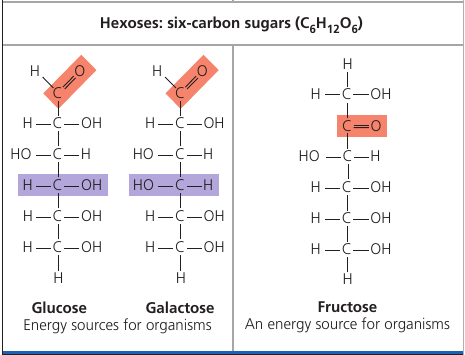
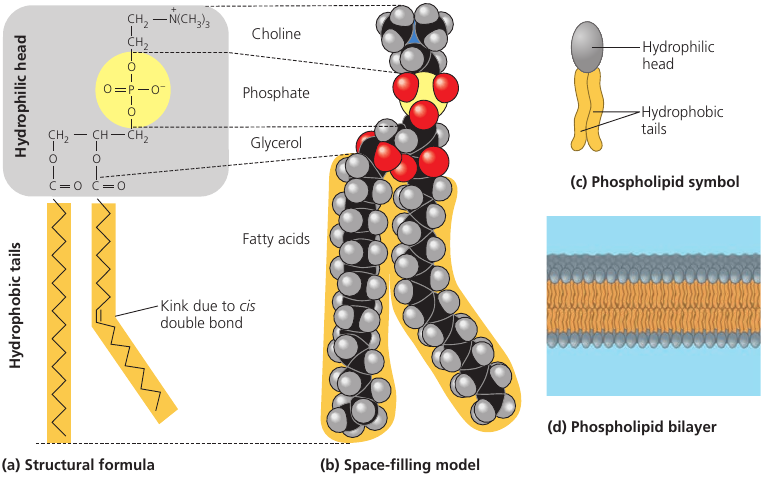

### Амёба

Макрофотография амёбы. В её теле будто целая вселенная заключена.

Амёба кушает.
Она выпускает ложноножки и обхватывает добычу со всех сторон. Удивительно, но изменение формы у неё происходит за счёт быстрого построения внутреннего каркаса из микротрубочек, поддерживающих форму клетки. На видео хорошо видно как перетекает её цитоплазма

### Муравьи стреляют кислотой

В случае опасности сверху, колония древесных муравьёв стреляют муравьиной кислотой в воздух.

Подобная атака вполне способна отпугнуть хищника. Например, птицу

### Как работает героин?
Форма биологической молекулы определяет её функцию в организме: эта форма задаёт то, как биологические молекулы опознают друг друга и как взаимодействуют. Молекулы часто соединяются друг с другом, образуя слабые полярные связи (плюс к минусу), но только если формы этих молекул дополняют друг друга. То есть, если они идеально друг другу подходят по форме.

Например, давайте посмотрим на опиаты, такие как морфин и героин. Они утоляют боль, а также меняют состояние человека. Это происходит из-за того, что они связываются с определёнными молекулами в головном мозге: рецепторами.

Вопрос. Как так получилось, что в головном мозге человека есть рецепторы, которые реагируют на молекулы, произведённые не телом человека, а вообще маковыми растениями? Они-то тут при чём?

В 1975-м году, когда были открыты эндорфины, нашёлся ответ на этот вопрос.
Эндорфины — это сигнальные молекулы, которые производятся гипофизом, и связываются с рецепторами в головном мозге, смягчая боль и вызывая эйфорию во время физических нагрузок. Например, во время бега или тренировки.

Опиаты имеют форму, схожую с эндорфинами, и благодаря этой форме, могут связываться с теми же самыми рецепторами в мозгу. Вот почему опиаты и эндорфины имеют схожее действие на человека.

Иллюстрация. Слева -- молекула эндорфина человека. Справа -- молекула морфия. Квадратиком обведена та часть молекулы, которая является общей, и которая способна благодаря своей форме соединиться с эндорфиновым рецептором.

Иллюстрация. И естественный эндорфин (слева), и морфий (справа), способны соединяться с одним и тем же рецептором. Рецептор встроен во внешнюю мембрану клетки (на изображении: окружность) .
Воздействие на этот рецептор передаёт воздействие внутрь нейрона и вызывает ту реакцию, на которую эта цепочка запрограммирована.

Дима:

> У героинового (и в принципе опиатного) наркомана постепенно прекращается синтез собственных эндорфинов. Организм видит, что аналог эндорфина поступает извне, и перестаёт расходовать ресурсы на создание собственного.
>
> А эндорфин очень нужная штука, на самом деле. Когда мы ходим, стоим, сидим, даже лежим — у нас там кости в суставах трутся, мышцы разные напрягаются и расслабляются, но мы этого не чувствуем. Все эти ощущения гасит эндорфин: он как бы задаёт ватерлинию, ощущения ниже которой мозгом игнорируются. Это так же задаёт болевой порог.
>
> Поэтому, что такое опиатная ломка? Это ощущение своего организма "как есть", чистое ощущение, не убаюканное эндорфином. И это очень и очень страшно и больно в плане ощущений — пережившие говорят, как будто всё тело засунули в мясорубку и проворачивают в фарш.
>
> Но несмотря на жуткие ощущения, опиатная ломка — довольно безопасное для организма состояние. Ничего реально страшного в принципе не происходит: ведь ты просто ощущаешь каждые движения, соприкосновение костей, сокращения и расслабления мышц внутри твоего тела. Но это настолько кошмарные ощущения, что люди кончают с собой от адских мук, и даже понимание процесса им вообще не помогает.

### Жук Бомбардир
У жука-Бомбардира интересный механизм защиты от врагов: в случае опасности он прыскает кипящей жидкостью которая содержит раздражающие химикаты.

Жук хранит реагенты в своём теле в раздельных камерах: когда химикаты разделены, они безопасны. В случае опасности жук сжимает стенки резервуара, химикаты изливаются в общую камеру, и там происходит реакция с выделением тепла. Жидкость нагревается до 100℃, вскипает, и выстреливает из брюшка. Кончик брюшка подвижен и позволяет направлять струю жидкости точно на врага.

### Углеводы: Как Растения И Животные Используют Сахар
Если почитать состав на коробке еды, можно заметить что там есть "углеводы". Углеводы — это класс молекул, которые включают в себя сахара и составные сахара, *полимеры*.

Начнём с того, почему они так называются. Углеводы состоят из атомов углерода (эта цепочка углеродов на изображении называется "углеродный каркас") и водородов. Углерод-вородород. Угле-воды. Отсюда и название.

Однако это не всё. Чтобы попасть в категорию "углеводы", молекула должна так же содержать несколько `—OH` групп, и двойную связь с одним кислородом (выделено красным на рисунке).

Важнейший сахар — глюкоза (картинка): это то самое топливо, которое клетки используют как источник энергии. Всё что в тебе шевелится, шевелится благодаря глюкозе.

Фруктоза — это сахар, дающий сладкий вкус фруктам и ягодам.
Обратите внимание на переместившийся кислород (выделенный красным, картинка). Такое положение говорит, что это так называемый "кетон". Остальная часть молекулы не отличается от глюкозы.

Фруктоза на вкус слаще глюкозы. В 1970-х произошло важное событие: была разработана методика преобразования глюкозы из кукурузного сиропа в более сладкую фруктозу. В результате получился кукурузный сироп с высоким содержанием фруктозы: этот ингридиент слаще, дешевле, и теперь его можно заметить в составе лимонадов и полуфабрикатов.

Сок растений содержит сахар, но это не глюкоза. Там содержится более сложная молекула: глюкоза, соединённая через атом кислорода с фруктозой. Такая молекула называется "сахароза", или наш обычный столовый сахар (картинка). Именно такую молекулу мы получаем из сахарного тростника и сахарной свёклы.

Мальтоза, также известная как "солодовый сахар", используется в пивоварении. Он получается из солода, когда тот побродит в воде. Мальтоза состоит из двух глюкоз, соединённых вместе.

Молоко содержит лактозу: ещё один сахар. В нём глюкоза соединена с галактозой.

Такие составные молекулы не могут использоваться нашим организмом сразу: они должны быть разбиты на более простые сахара. Этим занимаются ферменты.

Например, лактоза — "молочный сахар" — раскладывается на два простых сахара ферментом под названием "лактаза". У некоторых людей нет лактазы, и соответственно, они не могут перерабатывать лактозу. На эту неусваивающуюся лактозу набрасываются кишечные бактерии, которые в результате дают газ и диарею. Так работает непереносимость лактозы.

Люди с непереносимостью лактозы могут есть молочные продукты, но им нужно будет отдельно принять фермент лактазу, чтобы он расщепил лактозу на простые сахара. Существует также молочная продукция, уже обработанная лактазой.

Бывают и намного более длинные цепочки сахаров: они называются *полисахариды*, и состоят из множества соединённых вместе глюкоз. Такой *полимер* может быть длиной сотни и тысячи единиц.

И растения, и животные, складируют глюкозу, потому что это источник энергии, которая может пригодится.

Растения используют **крахмал**: полимер, в котором множество молекул глюкозы соединены в длинные цепочки (верхняя картинка). Растение способно отщипывать кусочки этой цепи если есть потребность в энергии.

Когда мы съедаем овощ, содержащий крахмал, он расщепляется на составляющие, потому что у нас есть ферменты которые этим занимаются.

Животные тоже складируют глюкозу, но в виде **гликогена**: он как крахмал, но сильно ветвится. (Нижняя картинка)

У позвоночных, гликоген откладывается в-основном в печени и в мышечных клетках. Он используется, когда возникает потребность в сахаре. Однако эти запасы невелики: у человека, например, запас гликогена иссякает за день, если его не восполнять приёмом пищи. В этом проблема диет с низким содержанием углеводов: может начаться слабость и усталость.

Сахара используются не только как источник энергии, но так же как стройматериал.

**Целлюлоза** — это крепкий материал, из которого сделаны стенки клеток растений. Он состоит из длинных цепочек глюкозы, в которых, в отличие от крахмала, каждая вторая глюкоза размещена вверх ногами (картинка).

Благодаря такой структуре, волонка целлюлозы получаются очень прямые, и благодаря этому они могут находиться близко друг к другу и прилипать. В итоге получается прочное волокно.

На упаковке еды, "клетчатка" указывает на целлюлозу. Но большинство животных не могут её переваривать: из-за того, что у неё отличается форма, те же самые ферменты уже не способны её обработать. Так что когда мы едим целлюлозу, она проходит насквозь. Однако по пути она стимулирует стенки кишечника на выработку слизи, которая способствует более лёгкому прохождению пищи через желудочно-кишечный тракт.

Коровы могут переваривать целлюлозу: для этого у них в кишечнике живут специальные микроорганизмы, помогающие её расщеплять. Поэтому коровы могут есть траву, а мы — нет.

Насекомые тоже используются сахар как стройматериал: **хитин** — это полимер глюкозы, который членистоногие (насекомые, ракообразные, и др.) используют для своего экзоскелета. Это хитрое химическое соединение кожистое и мягкое, но со временем твердеет благодаря тому, что протеины химически связываются друг с другом.

### Жиры
Жиры состоят из молекулы глицерина (серая, слева на изображении) с тремя присоединёнными к нему жирными кислотами (выделены оранжевым). Глицерин — это основа, которая держит всю молекулу вместе, а длинные "хвосты" углеродов с водородами запасают энергию. В этих "хвостах" запасено столько же энергии сколько в бензине, на котором ездят наши машины.

Один грамм жира хранит в два с лишним раза больше энергии, чем крахмал. Животным нужно носить все свои запасы энергии с собой, поэтому более компактное хранилище имеет смысл. А растениям мобильность не требуется, поэтому им вполне годится такое громоздкое хранилище как крахмал. Однако и растения приспособили компактное запасание энергии там, где требуется мобильность: в семенах. Им же нужно распространяться. Поэтому растительное масло мы отжимаем именно из семян.

Эти длинные углеродно-водородные хвосты (выделенные оранжевым) неполярны: они не имеют областей с электрическим зарядом, и поэтому вся молекула получается *гидрофобной*: она фактически отталкивает воду, потому что вода может "прилипать" только к тем областям, где есть частичный заряд.

Поэтому жидкие жиры, то есть масла, не смешиваются с водой. Они друг к другу "не липнут".

Вы наверняка слышали такие слова как "насыщенные жиры" и "ненасыщенные жиры" из области здорового питания.

Молекула *насыщенного жира* имеет три "хвоста", где каждый углерод связан с максимальным числом атомов водорода: двумя. Такая структура "насыщена" водородом (левое изображение).

Жиры животного происхождения обычно насыщенные. Такие молекулы длинные, стройные, и могут плотно прилегать друг к другу: поэтому насыщенные животные жиры, такие как сало и масло, при комнатной температуре достаточно тверды и не растекаются.

*Ненасыщенный жир* содержит меньше атомов водорода: в них один углерод вместо этого образовал двойную связь с соседом (см. правую картинку). Эта двойная связь также создаёт перегиб в цепи, и форма молекулы уже не получается ровной.

Жиры растений и рыб обычно ненасыщенные. Из-за торчащего перегиба, такие молекулы уже не могут плотно прилегать друг к другу, и при комнатной температуре они остаются в жидкой форме. Такой жир мы называем "масло".

Не все жиры используются как хранилище энергии. Есть жиры в составе клетки: например, **фосфолипиды**.

**Фосфолипид** это молекула жира у которой только две жирные кислоты (на картинке: два хвоста, выделены оранжевым), и группа с фосфором в "голове" этой молекулы (серый).

Фосфор в "голове" молекулы создаёт заряженную область (выделено жёлтым). Из-за такого распределения зарядов, голова получается гидрофильной (притягивается к воде), а ножки -- гидрофобными (отталкиваются от воды).

Когда такие молекулы попадают в воду, они стараются развернуться "головой" к воде и спрятать "ножки" в сторону. В итоге такие молекулы кучкуются и самостоятельно собираются в целое покрывало: двухслойную мембрану, чья внешняя поверхность касается воды "головами" фосфолипидов, в то время как "ножки" отвёрнуты и скрываются внутри мембраны (см. изображение, d).

Такие мембраны составляют внешнюю оболочку клетки, и их функция — отделять внутренность клетки от внешней среды. Если бы не мембраны, клетки вообще бы не смогли существовать.

